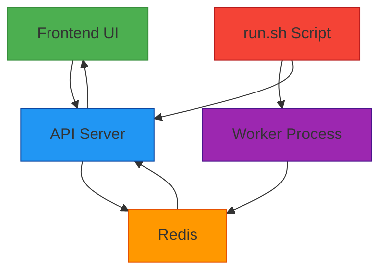
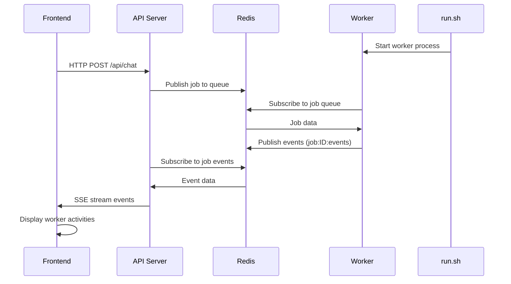
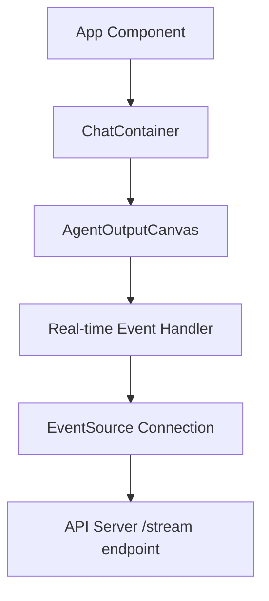

# API Frontend Integration Design Document

## 1. Overview

This document outlines the design for integrating the frontend to display worker activities when using the API on port 3002. The integration ensures that:

1. The frontend displays real-time updates of what the worker is doing
2. Communication between components follows a secure and efficient architecture
3. The system provides a seamless user experience for monitoring AI agent activities

## 2. Architecture

### 2.1 System Components



### 2.2 Component Responsibilities

| Component | Responsibilities |
|-----------|------------------|
| **Frontend UI** | Display real-time worker activities, handle user interactions |
| **API Server** | Handle HTTP requests, manage SSE connections, authenticate clients |
| **Redis** | Message broker for real-time event streaming between worker and API server |
| **Worker Process** | Execute AI agent tasks, publish events to Redis |
| **run.sh Script** | Orchestrate system startup, ensure only one worker runs at a time |

## 3. Data Flow

### 3.1 Worker Activity Streaming



### 3.2 Event Types

The worker publishes various event types to Redis that are consumed by the frontend:

| Event Type | Description | Displayed in Frontend |
|------------|-------------|----------------------|
| `agent_response` | Agent's response content | ✅ Yes |
| `agent_thought` | Agent's internal thinking process | ❌ No (filtered) |
| `tool_use` | Tool execution details | ✅ Yes |
| `tool_result` | Results from tool execution | ✅ Yes |
| `browser.*` | Browser automation events | ✅ Yes |
| `completed` | Job completion notification | ✅ Yes |
| `error` | Error messages | ✅ Yes |
| `chat_header_todo` | Todo list updates | ✅ Yes |

## 4. API Endpoints

### 4.1 Chat Processing

| Endpoint | Method | Description |
|----------|--------|-------------|
| `/api/chat` | POST | Submit a message for processing, returns jobId |
| `/api/chat/stream/:jobId` | GET | Server-Sent Events stream for real-time updates |

### 4.2 Request/Response Examples

#### Submit Chat Message
```http
POST /api/chat
Authorization: Bearer [AUTH_TOKEN]
Content-Type: application/json

{
  "prompt": "Create a React component for a todo list",
  "sessionId": "session-123"
}
```

```http
HTTP/1.1 202 Accepted
Content-Type: application/json

{
  "jobId": "job-456",
  "message": "Traitement en cours"
}
```

#### Stream Events
```http
GET /api/chat/stream/job-456?auth=[AUTH_TOKEN]&sessionId=session-123
Accept: text/event-stream
```

```http
HTTP/1.1 200 OK
Content-Type: text/event-stream
Cache-Control: no-cache
Connection: keep-alive

data: {"type":"tool_use","content":"Using file_operations tool"}
data: {"type":"tool_result","content":"File created successfully"}
data: {"type":"completed","content":"Task finished"}
```

## 5. Worker Management

### 5.1 Singleton Pattern

The system implements a singleton pattern to ensure only one worker runs at a time:

1. **Redis Lock**: Worker acquires a lock in Redis with expiration
2. **Process Verification**: Checks if existing worker processes are still running
3. **Force Termination**: Kills existing workers if needed

### 5.2 run.sh Control

The `run.sh` script is the only authorized way to start workers:

```bash
# Start all services including worker
./run.sh start

# Restart worker only
./run.sh restart-worker

# Stop all services
./run.sh stop
```

## 6. Frontend Integration

### 6.1 EventSource Connection

The frontend uses EventSource for real-time updates:

```javascript
const eventSource = new EventSource(`/api/chat/stream/${jobId}?auth=${authToken}&sessionId=${sessionId}`);

eventSource.onmessage = (event) => {
  const data = JSON.parse(event.data);
  // Update UI with worker activity
  updateUI(data);
};
```

### 6.2 Component Architecture



### 6.3 Display Components

| Component | Purpose |
|-----------|---------|
| **AgentOutputCanvas** | Main display area for worker activities |
| **SubAgentCLIView** | CLI-style view for detailed logs |
| **BrowserLiveView** | Real-time browser automation visualization |
| **ThoughtDisplay** | Agent thinking process visualization |

## 7. Security Considerations

### 7.1 Authentication

- All API endpoints require Bearer token authentication
- Tokens passed as query parameters for SSE (EventSource limitation)
- CORS policies restrict origins to known domains

### 7.2 Process Isolation

- Worker processes run outside Docker containers with full system access
- API server runs in Docker with restricted access
- Redis and PostgreSQL also containerized for security

## 8. Error Handling

### 8.1 Connection Resilience

- Automatic reconnection for WebSocket connections
- Retry mechanisms for failed API calls
- Graceful degradation when services are unavailable

### 8.2 Error Types

| Error Type | Handling |
|------------|----------|
| **Network Errors** | Automatic retry with exponential backoff |
| **Authentication Errors** | Redirect to login |
| **Worker Crashes** | Automatic restart by run.sh |
| **Redis Connection Loss** | Reconnection attempts with circuit breaker |

## 9. Testing Strategy

### 9.1 Unit Tests

- API endpoint validation
- Event streaming format compliance
- Authentication middleware

### 9.2 Integration Tests

- End-to-end message processing
- Real-time event streaming
- Worker lifecycle management

### 9.3 Example Test Cases

```javascript
// Test SSE streaming endpoint
it('should stream formatted SSE data', async () => {
  const jobId = await createTestJob();
  const response = await request(app)
    .get(`/api/chat/stream/${jobId}`)
    .expect(200);
    
  expect(response.headers['content-type']).toContain('text/event-stream');
});
```

## 10. Monitoring and Observability

### 10.1 Health Checks

- `/api/health` endpoint for service status
- Docker health checks for all containers
- Worker process monitoring

### 10.2 Logging

- Structured logging with Pino
- Log levels: debug, info, warn, error
- Centralized log aggregation via Docker

### 10.3 Performance Metrics

- Response time monitoring
- Memory usage tracking
- Concurrent connection limits

## 11. How to Use the API Stream

### 11.1 Prerequisites

Before using the API stream, ensure you have:
- A running instance of the AgenticForge system
- Valid authentication token (AUTH_TOKEN)
- Session ID for tracking conversations
- Job ID from the initial chat request

### 11.2 API Stream Usage

#### JavaScript/TypeScript Implementation

```javascript
// Submit a chat request to get a jobId
const response = await fetch('/api/chat', {
  method: 'POST',
  headers: {
    'Authorization': `Bearer ${AUTH_TOKEN}`,
    'Content-Type': 'application/json'
  },
  body: JSON.stringify({
    prompt: 'Your request here',
    sessionId: 'your-session-id'
  })
});

const { jobId } = await response.json();

// Connect to the streaming endpoint
const eventSource = new EventSource(`/api/chat/stream/${jobId}?auth=${AUTH_TOKEN}&sessionId=your-session-id`);

eventSource.onmessage = (event) => {
  const data = JSON.parse(event.data);
  
  // Handle different event types
  switch (data.type) {
    case 'agent_response':
      console.log('Agent response:', data.content);
      break;
    case 'tool_use':
      console.log('Tool being used:', data.content);
      break;
    case 'tool_result':
      console.log('Tool result:', data.content);
      break;
    case 'completed':
      console.log('Task completed');
      eventSource.close();
      break;
    case 'error':
      console.error('Error occurred:', data.content);
      eventSource.close();
      break;
  }
};

eventSource.onerror = (error) => {
  console.error('Stream error:', error);
};
```

#### Python Implementation

```python
import requests
import json

# Submit a chat request to get a jobId
response = requests.post(
    'http://localhost:3002/api/chat',
    headers={
        'Authorization': f'Bearer {AUTH_TOKEN}',
        'Content-Type': 'application/json'
    },
    json={
        'prompt': 'Your request here',
        'sessionId': 'your-session-id'
    }
)

job_data = response.json()
job_id = job_data['jobId']

# Connect to the streaming endpoint using requests
stream_url = f'http://localhost:3002/api/chat/stream/{job_id}?auth={AUTH_TOKEN}&sessionId=your-session-id'
with requests.get(stream_url, stream=True) as r:
    for line in r.iter_lines():
        if line:
            decoded_line = line.decode('utf-8')
            if decoded_line.startswith('data: '):
                data = json.loads(decoded_line[6:])  # Remove 'data: ' prefix
                
                # Handle different event types
                if data['type'] == 'agent_response':
                    print(f'Agent response: {data["content"]}')
                elif data['type'] == 'tool_use':
                    print(f'Tool being used: {data["content"]}')
                elif data['type'] == 'tool_result':
                    print(f'Tool result: {data["content"]}')
                elif data['type'] == 'completed':
                    print('Task completed')
                    break
                elif data['type'] == 'error':
                    print(f'Error occurred: {data["content"]}')
                    break
```

### 11.3 Event Types

The API stream provides several types of events that inform you about the worker's activities:

| Event Type | Description | Display Recommendation |
|------------|-------------|----------------------|
| `agent_response` | Agent's response content | Display to user |
| `agent_thought` | Agent's internal thinking process | Filter out (not displayed) |
| `tool_use` | Tool execution details | Show as system message |
| `tool_result` | Results from tool execution | Show as system message |
| `browser.*` | Browser automation events | Show as system message |
| `completed` | Job completion notification | Indicate task finished |
| `error` | Error messages | Display error to user |
| `chat_header_todo` | Todo list updates | Update UI elements |

### 11.4 Best Practices

1. **Error Handling**: Always implement proper error handling for network issues and authentication failures
2. **Resource Cleanup**: Close EventSource connections when no longer needed
3. **Rate Limiting**: Implement client-side rate limiting to prevent overwhelming the server
4. **Authentication**: Keep AUTH_TOKEN secure and don't expose it in client-side code
5. **Session Management**: Use consistent session IDs to maintain conversation context

### 11.5 Common Issues and Troubleshooting

1. **Connection Failures**: Verify the API server is running and accessible
2. **Authentication Errors**: Ensure AUTH_TOKEN is valid and properly formatted
3. **No Events Received**: Check if the worker is properly processing the job
4. **Stream Timeout**: Implement reconnection logic for long-running tasks