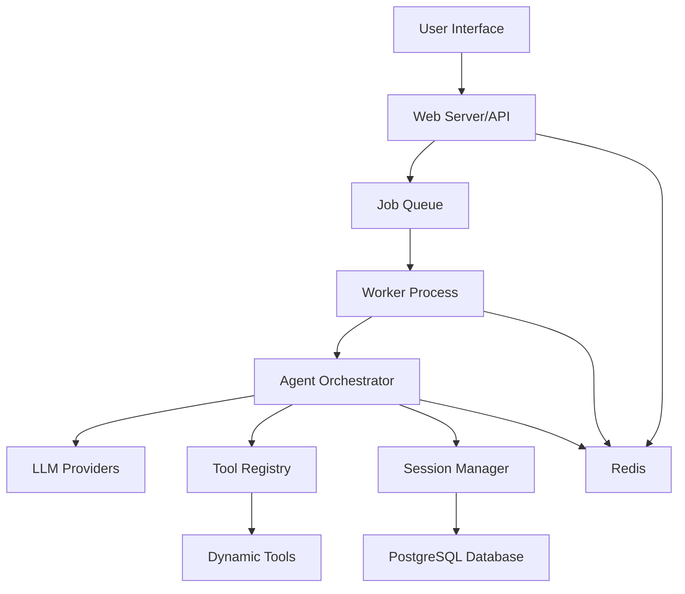
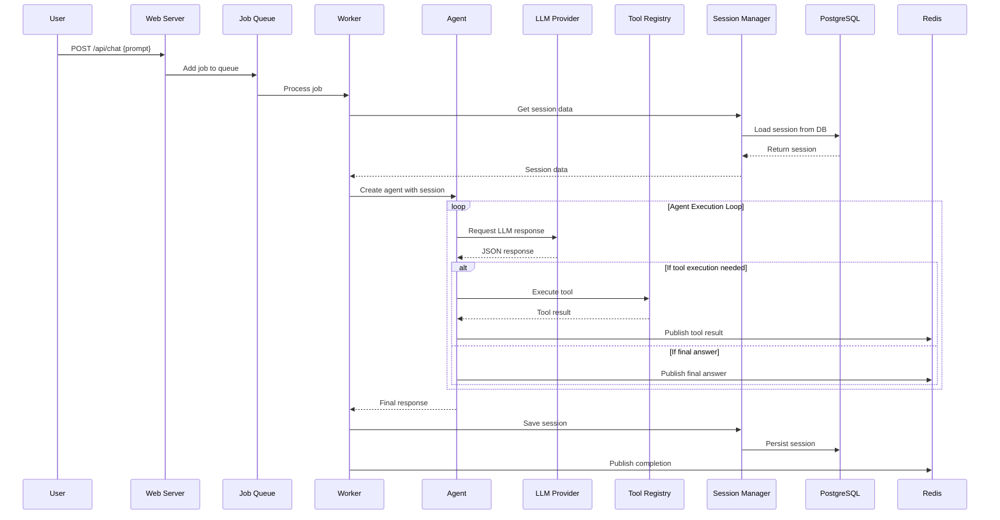

# AgenticForge Code Flow Analysis and Improvement Recommendations

## 1. Overview

AgenticForge is a 100% autonomous, free, and local AI agent platform that forges its own tools, writes code, and executes complex tasks while keeping all data on the user's device. The system uses the Model Context Protocol (MCP) as its foundation for agent-tool communication and implements a multi-stage Docker build with separate core and UI packages.

## 2. Architecture

The system follows a microservices architecture with separate core and UI components:

## 3. Core Components and Data Flow

### 3.1 Main Components

1. **Web Server (webServer.ts)**
   - Handles HTTP requests and authentication
   - Manages API endpoints for chat, sessions, tools, and streaming
   - Uses Express.js framework

2. **Job Queue (queue.ts)**
   - Implements task queuing using BullMQ
   - Manages job distribution to worker processes
   - Uses Redis as the backend

3. **Worker Process (worker.ts)**
   - Processes queued jobs
   - Instantiates agents and manages their execution
   - Communicates results back through Redis

4. **Agent Orchestrator (agent.ts)**
   - Main intelligence component
   - Interacts with LLM providers
   - Executes tools based on LLM responses
   - Manages conversation history and session state

5. **Tool Registry (toolRegistry.ts)**
   - Manages dynamically loaded tools
   - Registers and executes tools
   - Validates tool parameters

6. **Session Manager (sessionManager.ts)**
   - Manages user sessions
   - Persists session data to PostgreSQL
   - Caches active sessions in memory

7. **Tool Loader (toolLoader.ts)**
   - Dynamically loads tools from file system
   - Watches for tool file changes
   - Registers tools with the registry

### 3.2 Data Flow Process

## 4. Identified Issues and Improvement Recommendations

### 4.1 Performance Issues

1. **Agent Execution Loop**
   - The agent has a maximum iteration limit (default 100) which may be too restrictive for complex tasks
   - No dynamic adjustment based on task complexity
   - Recommendation: Implement adaptive iteration limits based on task complexity and progress

2. **History Management**
   - Session history is loaded entirely into memory
   - History summarization happens only when exceeding maximum length
   - Recommendation: Implement sliding window approach for history management

3. **LLM Provider Failover**
   - Current implementation tries providers in a fixed hierarchy
   - No intelligent selection based on provider performance or availability
   - Recommendation: Implement performance-based provider selection with health checks

### 4.2 Scalability Issues

1. **Session Management**
   - Active sessions are cached in memory using a Map
   - No expiration mechanism for inactive sessions
   - Recommendation: Implement LRU cache with TTL for session management

2. **Tool Loading**
   - All tools are loaded at startup
   - No lazy loading or unloading of unused tools
   - Recommendation: Implement lazy loading and unloading based on usage patterns

3. **Worker Concurrency**
   - Fixed worker concurrency configuration
   - No dynamic scaling based on load
   - Recommendation: Implement dynamic worker scaling based on queue depth

### 4.3 Reliability Issues

1. **Error Handling**
   - Limited error recovery mechanisms
   - Some errors cause complete agent termination
   - Recommendation: Implement more granular error recovery and retry mechanisms

2. **Loop Detection**
   - Basic loop detection based on command repetition
   - No sophisticated pattern recognition
   - Recommendation: Implement advanced loop detection using ML-based pattern recognition

3. **Timeout Handling**
   - Fixed timeouts for various operations
   - No adaptive timeout based on task complexity
   - Recommendation: Implement adaptive timeouts based on historical performance data

### 4.4 Security Issues

1. **Authentication**
   - Single static authentication token
   - No user management or role-based access control
   - Recommendation: Implement proper user management with RBAC

2. **Input Validation**
   - Basic input validation for API endpoints
   - Limited validation for tool parameters
   - Recommendation: Implement comprehensive input validation and sanitization

3. **Session Security**
   - Session IDs are UUIDs but no additional security measures
   - Recommendation: Implement session security measures like IP binding and user agent validation

### 4.5 Maintainability Issues

1. **Code Organization**
   - Large monolithic agent.ts file (1000+ lines)
   - Tight coupling between components
   - Recommendation: Refactor into smaller, more focused modules

2. **Configuration Management**
   - Configuration scattered across multiple files
   - No centralized configuration management
   - Recommendation: Implement centralized configuration management with validation

3. **Logging**
   - Inconsistent logging practices
   - No structured logging for analytics
   - Recommendation: Implement structured logging with consistent formatting

## 5. Detailed Improvement Proposals

### 5.1 Performance Improvements

#### 5.1.1 Adaptive Agent Iteration Limits
Current implementation uses a fixed maximum iteration count. This can be improved by:

1. Analyzing task complexity at the beginning
2. Dynamically adjusting iteration limits based on:
   - Task type (simple query vs. complex workflow)
   - Historical performance data
   - Resource availability

#### 5.1.2 Intelligent History Management
Instead of simple truncation and summarization:

1. Implement sliding window approach for recent context
2. Use vector embeddings for semantic search in historical context
3. Implement tiered storage (hot/warm/cold) for history data

#### 5.1.3 Smart LLM Provider Selection
Enhance the current failover mechanism:

1. Track provider performance metrics (latency, success rate)
2. Implement health checks for all providers
3. Use machine learning to predict optimal provider for specific tasks

### 5.2 Scalability Improvements

#### 5.2.1 Session Management Optimization
Current in-memory session cache lacks expiration:

1. Implement LRU cache with configurable TTL
2. Add session eviction policies based on usage patterns
3. Implement session clustering for distributed deployments

#### 5.2.2 Dynamic Tool Loading
Current approach loads all tools at startup:

1. Implement lazy loading based on agent requirements
2. Add tool usage analytics for optimization
3. Implement tool versioning and dependency management

#### 5.2.3 Auto-scaling Worker Processes
Fixed concurrency limits don't adapt to load:

1. Monitor queue depth and processing times
2. Dynamically scale worker processes
3. Implement resource-aware scaling based on system capacity

### 5.3 Reliability Improvements

#### 5.3.1 Enhanced Error Recovery
Current error handling is basic:

1. Implement circuit breaker pattern for external services
2. Add retry mechanisms with exponential backoff
3. Implement graceful degradation for non-critical failures

#### 5.3.2 Advanced Loop Detection
Current implementation only detects exact repetitions:

1. Use NLP techniques to detect semantic loops
2. Implement behavioral pattern recognition
3. Add proactive loop prevention mechanisms

#### 5.3.3 Adaptive Timeout Management
Fixed timeouts don't account for task complexity:

1. Implement historical performance-based timeout calculation
2. Add dynamic adjustment during execution
3. Implement early termination for stuck processes

### 5.4 Security Improvements

#### 5.4.1 Enhanced Authentication System
Current single-token approach is limited:

1. Implement multi-user support with proper authentication
2. Add role-based access control (RBAC)
3. Implement session security measures (IP binding, user agent validation)

#### 5.4.2 Comprehensive Input Validation
Current validation is minimal:

1. Implement comprehensive input sanitization
2. Add rate limiting and abuse detection
3. Implement content filtering for sensitive data

#### 5.4.3 Session Security Enhancements
Basic session management lacks security features:

1. Add session encryption at rest
2. Implement session activity monitoring
3. Add automatic session invalidation for suspicious activity

### 5.5 Maintainability Improvements

#### 5.5.1 Modular Architecture Refactoring
Large monolithic files make maintenance difficult:

1. Break down agent.ts into focused modules
2. Implement clear separation of concerns
3. Add comprehensive unit testing for each module

#### 5.5.2 Centralized Configuration Management
Scattered configuration makes management complex:

1. Implement single source of truth for configuration
2. Add configuration validation and documentation
3. Implement environment-specific configuration profiles

#### 5.5.3 Structured Logging Implementation
Inconsistent logging hampers debugging:

1. Implement structured logging with consistent fields
2. Add log level-based filtering
3. Implement centralized log aggregation for distributed deployments

## 6. Implementation Priorities

### Phase 1: Critical Reliability and Performance (High Priority)
1. Enhanced error recovery mechanisms
2. Adaptive timeout management
3. Improved loop detection
4. Session cache optimization

### Phase 2: Scalability and Security (Medium Priority)
1. Dynamic worker scaling
2. Enhanced authentication system
3. Input validation improvements
4. Lazy tool loading

### Phase 3: Maintainability and Advanced Features (Low Priority)
1. Modular architecture refactoring
2. Centralized configuration management
3. Structured logging implementation
4. Advanced LLM provider selection

## 7. Risk Assessment

### High Risk
- Refactoring large monolithic components
- Changing session management approach
- Modifying core agent execution flow

### Medium Risk
- Implementing dynamic scaling mechanisms
- Enhancing authentication systems
- Adding advanced error recovery

### Low Risk
- Improving logging practices
- Adding configuration validation
- Optimizing tool loading

## 8. Monitoring and Metrics

To effectively implement and measure improvements, the following metrics should be tracked:

1. **Performance Metrics**
   - Average agent execution time
   - LLM response latency
   - Tool execution time

2. **Reliability Metrics**
   - Success/failure rates
   - Error recovery effectiveness
   - System uptime

3. **Scalability Metrics**
   - Worker utilization
   - Queue processing times
   - Memory/CPU usage

4. **User Experience Metrics**
   - Response quality scores
   - User satisfaction ratings
   - Task completion rates