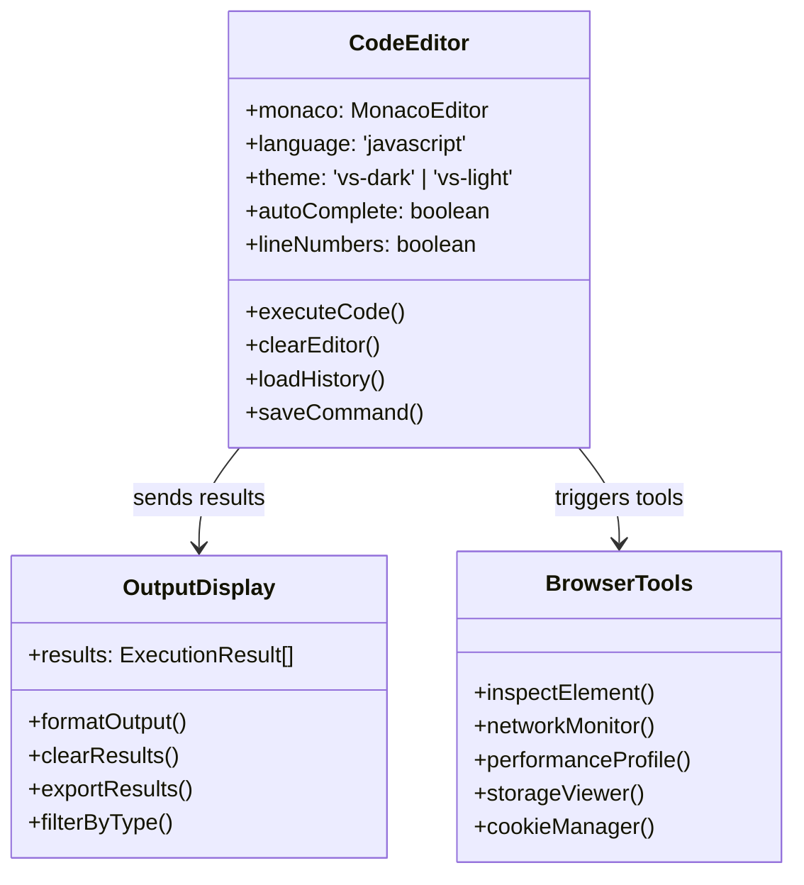
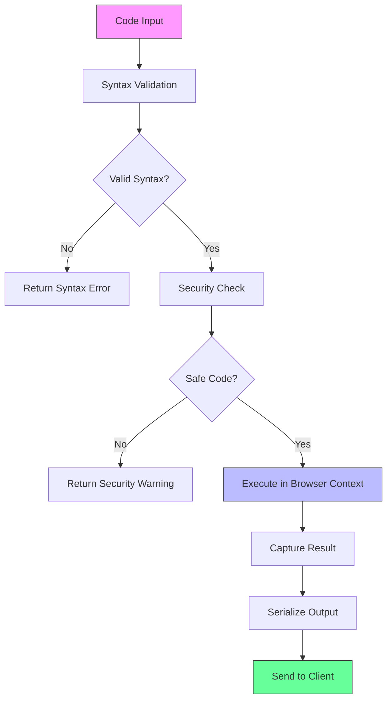

# Developer Console Server Integration Design

## Overview

This design document outlines the integration of a browser-based developer console accessible through a dedicated route on the AgenticForge server (port 3002). The solution will provide direct access to the browser's JavaScript console and development tools through a web interface, enabling real-time debugging and code execution within the browser environment.

## Architecture

### System Integration Pattern

```mermaid
graph TB
    subgraph "AgenticForge Server (Port 3002)"
        A[Express Server] --> B[Static File Handler]
        A --> C[Console API Routes]
        A --> D[WebSocket Handler]
        
        C --> E[/api/dev-console/*]
        D --> F[Real-time Communication]
    end
    
    subgraph "Developer Console Interface"
        G[Console HTML Page] --> H[JavaScript Console UI]
        H --> I[Code Editor Component]
        H --> J[Output Display]
        H --> K[Browser Tools Integration]
    end
    
    subgraph "Browser Environment"
        L[Window Object] --> M[Console API]
        L --> N[DOM Manipulation]
        L --> O[Performance Monitoring]
        L --> P[Storage Access]
    end
    
    B --> G
    F --> H
    E --> M
    
    style A fill:#f9f,stroke:#333
    style H fill:#bbf,stroke:#333
    style M fill:#6f9,stroke:#333
```

### Component Architecture

The developer console integration consists of three main layers:

**Server Layer (Port 3002)**
- Express route handler for `/dev-console` endpoint
- Static file serving for console interface
- API endpoints for code execution and result retrieval
- WebSocket connection for real-time communication

**Interface Layer**
- HTML/CSS/JavaScript console interface
- Code editor with syntax highlighting
- Output display with formatting
- Browser tools integration panel

**Execution Layer**
- Browser JavaScript engine integration
- Console API wrapper
- Error handling and security sandboxing
- Result serialization and transmission

## API Endpoints Reference

### Console Access Route

| Endpoint | Method | Description | Response |
|----------|--------|-------------|----------|
| `/dev-console` | GET | Serves the developer console interface | HTML page with embedded console |
| `/api/dev-console/execute` | POST | Executes JavaScript code in browser context | Execution result or error |
| `/api/dev-console/history` | GET | Retrieves command history | Array of previous commands |
| `/api/dev-console/clear` | DELETE | Clears console history | Success confirmation |

### Request/Response Schema

**Execute Code Request**
```typescript
interface ExecuteRequest {
  code: string;
  context?: 'window' | 'document' | 'global';
  async?: boolean;
  timeout?: number;
}
```

**Execute Code Response**
```typescript
interface ExecuteResponse {
  success: boolean;
  result?: any;
  error?: string;
  type: 'string' | 'number' | 'object' | 'function' | 'undefined';
  executionTime: number;
}
```

### Authentication Requirements

The developer console will use the same authentication mechanism as the existing AgenticForge system:
- Bearer token authentication for API endpoints
- Session-based access control
- CORS configuration for cross-origin requests

## Console Interface Components

### Code Editor Component



### Browser Integration Features

**Console API Access**
- Direct access to `console.log`, `console.error`, `console.warn`
- Custom logging levels and filtering
- Stack trace capture and display

**DOM Manipulation**
- Element inspector and selector
- Real-time DOM modification
- Event listener management

**Performance Monitoring**
- Execution time measurement
- Memory usage tracking
- Network request monitoring

**Storage Management**
- localStorage and sessionStorage access
- Cookie viewing and modification
- IndexedDB browser interface

## Business Logic Layer

### Code Execution Engine



### Security Implementation

**Code Sandboxing**
- Restricted access to sensitive APIs
- Whitelist of allowed operations
- Timeout mechanism for long-running code
- Memory limit enforcement

**Input Validation**
- JavaScript syntax verification
- Malicious code pattern detection
- Length limits on code input
- Rate limiting for execution requests

## Middleware & Interceptors

### Console Request Middleware

```typescript
interface ConsoleMiddleware {
  validateAuth: (req: Request) => boolean;
  sanitizeCode: (code: string) => string;
  logExecution: (command: string, result: any) => void;
  enforceRateLimit: (sessionId: string) => boolean;
}
```

### Error Handling Interceptor

- Capture and format JavaScript errors
- Network request error handling
- Timeout error management
- User-friendly error messages

## Console Interface Implementation

### HTML Structure

```html
<!DOCTYPE html>
<html lang="en">
<head>
    <meta charset="UTF-8">
    <meta name="viewport" content="width=device-width, initial-scale=1.0">
    <title>AgenticForge Developer Console</title>
    <link rel="stylesheet" href="/dev-console/styles.css">
</head>
<body>
    <div class="console-container">
        <div class="console-header">
            <h1>Developer Console</h1>
            <div class="console-controls">
                <button id="clear-btn">Clear</button>
                <button id="settings-btn">Settings</button>
            </div>
        </div>
        
        <div class="console-content">
            <div class="code-editor" id="code-editor"></div>
            <div class="output-panel" id="output-panel"></div>
        </div>
        
        <div class="browser-tools">
            <div class="tool-tabs">
                <button class="tab-btn active" data-tab="console">Console</button>
                <button class="tab-btn" data-tab="elements">Elements</button>
                <button class="tab-btn" data-tab="network">Network</button>
                <button class="tab-btn" data-tab="storage">Storage</button>
            </div>
            <div class="tool-content" id="tool-content"></div>
        </div>
    </div>
    
    <script src="/dev-console/console.js"></script>
</body>
</html>
```

### JavaScript Console Implementation

```typescript
class DeveloperConsole {
  private editor: MonacoEditor;
  private outputPanel: HTMLElement;
  private commandHistory: string[] = [];
  
  constructor() {
    this.initializeEditor();
    this.setupEventListeners();
    this.loadCommandHistory();
  }
  
  async executeCode(code: string): Promise<void> {
    try {
      const response = await fetch('/api/dev-console/execute', {
        method: 'POST',
        headers: {
          'Content-Type': 'application/json',
          'Authorization': `Bearer ${this.getAuthToken()}`
        },
        body: JSON.stringify({ code })
      });
      
      const result = await response.json();
      this.displayResult(result);
      this.saveToHistory(code);
    } catch (error) {
      this.displayError(error);
    }
  }
  
  private displayResult(result: ExecuteResponse): void {
    const resultElement = document.createElement('div');
    resultElement.className = 'console-result';
    resultElement.innerHTML = this.formatResult(result);
    this.outputPanel.appendChild(resultElement);
  }
}
```

## Server Route Implementation

### Express Route Handler

```typescript
// Route handler in webServer.ts
app.get('/dev-console', (req: Request, res: Response) => {
  const consolePath = path.join(__dirname, 'static', 'dev-console', 'index.html');
  res.sendFile(consolePath);
});

app.use('/dev-console/static', express.static(
  path.join(__dirname, 'static', 'dev-console')
));

// API routes for console functionality
app.post('/api/dev-console/execute', async (req: Request, res: Response) => {
  try {
    const { code, context = 'window' } = req.body;
    
    // Validate and sanitize code
    const sanitizedCode = sanitizeJavaScript(code);
    
    // Execute code through existing client console mechanism
    const result = await executeInBrowserContext(sanitizedCode, context);
    
    res.json({
      success: true,
      result: result.output,
      type: typeof result.output,
      executionTime: result.executionTime
    });
  } catch (error) {
    res.status(400).json({
      success: false,
      error: error.message
    });
  }
});
```

## Testing Strategy

### Unit Testing

**Code Execution Tests**
- Valid JavaScript execution
- Syntax error handling
- Security restriction enforcement
- Result serialization accuracy

**API Endpoint Tests**
- Authentication validation
- Request/response format verification
- Error handling scenarios
- Rate limiting functionality

**Interface Component Tests**
- Code editor functionality
- Output display formatting
- Browser tools integration
- User interaction handling

### Integration Testing

**Browser Integration Tests**
- Console API access verification
- DOM manipulation capabilities
- Storage access functionality
- Performance monitoring accuracy

**Security Testing**
- Malicious code prevention
- Privilege escalation attempts
- Cross-site scripting protection
- Resource consumption limits

### Performance Testing

**Execution Performance**
- Code execution latency
- Memory usage monitoring
- Concurrent user handling
- Large result set processing

## Security Considerations

### Code Execution Security

**Restricted Operations**
- No file system access
- Limited network requests
- No process manipulation
- Restricted global variable access

**Sandboxing Mechanisms**
- Content Security Policy enforcement
- iframe isolation for code execution
- Timeout mechanisms for infinite loops
- Memory limit enforcement

### Authentication and Authorization

**Access Control**
- Same authentication as main application
- Role-based access to console features
- Session timeout management
- Audit logging for console usage

## Browser Compatibility

### Supported Browsers

| Browser | Version | Console Features | Browser Tools |
|---------|---------|------------------|---------------|
| Chrome | 80+ | Full Support | Complete |
| Firefox | 75+ | Full Support | Complete |
| Safari | 13+ | Partial Support | Limited |
| Edge | 80+ | Full Support | Complete |

### Feature Detection

```typescript
interface BrowserCapabilities {
  hasConsoleAPI: boolean;
  hasPerformanceAPI: boolean;
  hasStorageAPI: boolean;
  hasDOM: boolean;
  supportsES6: boolean;
}

function detectBrowserCapabilities(): BrowserCapabilities {
  return {
    hasConsoleAPI: typeof console !== 'undefined',
    hasPerformanceAPI: typeof performance !== 'undefined',
    hasStorageAPI: typeof localStorage !== 'undefined',
    hasDOM: typeof document !== 'undefined',
    supportsES6: typeof Symbol !== 'undefined'
  };
}
```