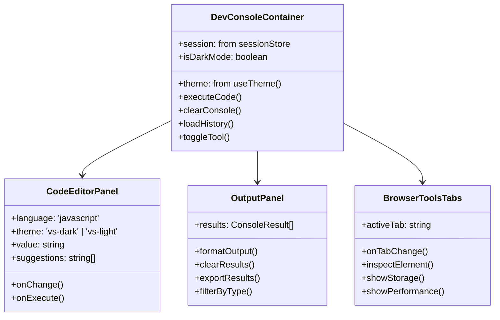
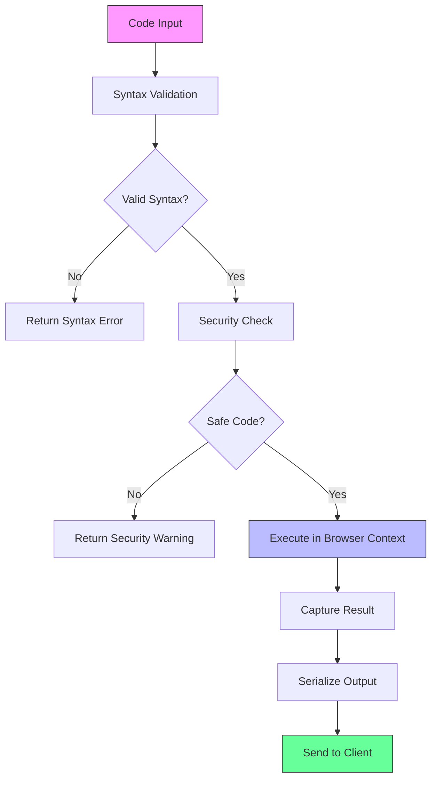

# Developer Console Server Integration Design

## Overview

This design document outlines the integration of a browser-based developer console into the existing AgenticForge React application. Rather than creating a separate standalone application, the console will be integrated as a new component within the existing frontend architecture, accessible through the existing routing system. The solution leverages the current lazy-loading pattern and component structure to provide direct access to the browser's JavaScript console and development tools through the existing web interface.

## Architecture

### Integration with Existing Frontend

```mermaid
graph TB
    subgraph "Existing AgenticForge Frontend"
        A[App.tsx] --> B[Lazy Components]
        A --> C[Page Router]
        B --> D[LazyDevConsole]
        C --> E[dev-console page]
        
        F[ControlPanel] --> G[Console Toggle]
        H[HeaderContainer] --> I[Console Menu Item]
    end
    
    subgraph "New Developer Console Components"
        J[DevConsoleContainer] --> K[CodeEditor]
        J --> L[OutputDisplay]
        J --> M[BrowserToolsTabs]
        J --> N[CommandHistory]
    end
    
    subgraph "Backend Integration"
        O[Express Server] --> P[Existing API Routes]
        P --> Q[/api/dev-console/*]
        O --> R[clientConsole.api.ts]
    end
    
    subgraph "Browser APIs"
        S[Console API] --> T[JavaScript Execution]
        S --> U[DOM Inspector]
        S --> V[Storage Manager]
        S --> W[Performance Monitor]
    end
    
    D --> J
    E --> J
    Q --> T
    R --> S
    
    style A fill:#f9f,stroke:#333
    style J fill:#bbf,stroke:#333
    style Q fill:#6f9,stroke:#333
```

### Component Architecture

The developer console integration leverages the existing AgenticForge architecture patterns:

**React Component Layer**
- New page route `dev-console` added to existing router
- Lazy-loaded `DevConsoleContainer` component following existing patterns
- Integration with existing state management (Zustand stores)
- Reuse of existing UI components (buttons, panels, themes)

**Backend API Layer**
- Extension of existing `/api/dev-console/*` routes in `clientConsole.api.ts`
- Integration with existing Redis pub/sub system
- Reuse of existing authentication middleware
- Extension of existing session management

**Execution Layer**
- Browser JavaScript engine integration through existing client console mechanism
- Enhanced command processing in existing `clientConsole.api.ts`
- Error handling through existing error management system
- Real-time communication via existing Redis channels

## API Endpoints Reference

### Enhanced Console Routes (Extension of Existing)

| Endpoint | Method | Description | Response |
|----------|--------|-------------|----------|
| `/api/client-console/execute` | POST | **Enhanced** - Executes JavaScript code with advanced features | Execution result or error |
| `/api/client-console/history` | GET | **New** - Retrieves command history for session | Array of previous commands |
| `/api/client-console/clear` | DELETE | **New** - Clears console history | Success confirmation |
| `/api/client-console/inspect` | POST | **New** - Inspects DOM elements | Element properties and methods |
| `/api/client-console/performance` | GET | **New** - Gets performance metrics | Performance data object |

### Request/Response Schema

**Execute Code Request**
```typescript
interface ExecuteRequest {
  code: string;
  context?: 'window' | 'document' | 'global';
  async?: boolean;
  timeout?: number;
}
```

**Execute Code Response**
```typescript
interface ExecuteResponse {
  success: boolean;
  result?: any;
  error?: string;
  type: 'string' | 'number' | 'object' | 'function' | 'undefined';
  executionTime: number;
}
```

### Authentication Requirements

The developer console will use the same authentication mechanism as the existing AgenticForge system:
- Bearer token authentication for API endpoints
- Session-based access control
- CORS configuration for cross-origin requests

## React Component Structure

### DevConsole Components (Following Existing Patterns)



### Browser Integration Features

**Console API Access**
- Direct access to `console.log`, `console.error`, `console.warn`
- Custom logging levels and filtering
- Stack trace capture and display

**DOM Manipulation**
- Element inspector and selector
- Real-time DOM modification
- Event listener management

**Performance Monitoring**
- Execution time measurement
- Memory usage tracking
- Network request monitoring

**Storage Management**
- localStorage and sessionStorage access
- Cookie viewing and modification
- IndexedDB browser interface

## Business Logic Layer

### Code Execution Engine



### Security Implementation

**Code Sandboxing**
- Restricted access to sensitive APIs
- Whitelist of allowed operations
- Timeout mechanism for long-running code
- Memory limit enforcement

**Input Validation**
- JavaScript syntax verification
- Malicious code pattern detection
- Length limits on code input
- Rate limiting for execution requests

## Middleware & Interceptors

### Console Request Middleware

```typescript
interface ConsoleMiddleware {
  validateAuth: (req: Request) => boolean;
  sanitizeCode: (code: string) => string;
  logExecution: (command: string, result: any) => void;
  enforceRateLimit: (sessionId: string) => boolean;
}
```

### Error Handling Interceptor

- Capture and format JavaScript errors
- Network request error handling
- Timeout error management
- User-friendly error messages

## React Component Implementation

### DevConsoleContainer Component

```tsx
// packages/ui/src/components/DevConsoleContainer.tsx
import React, { useState, useCallback } from 'react';
import { useTheme } from '../lib/hooks/useTheme';
import { useLanguage } from '../lib/contexts/LanguageContext';
import { useCombinedStore } from '../store';
import { CodeEditorPanel } from './console/CodeEditorPanel';
import { OutputPanel } from './console/OutputPanel';
import { BrowserToolsTabs } from './console/BrowserToolsTabs';
import { Button } from './ui/button';
import { Tabs, TabsContent, TabsList, TabsTrigger } from './ui/tabs';

export const DevConsoleContainer: React.FC = () => {
  const { isDarkMode } = useTheme();
  const { translations } = useLanguage();
  const sessionId = useCombinedStore(state => state.sessionId);
  
  const [code, setCode] = useState('');
  const [results, setResults] = useState<ConsoleResult[]>([]);
  const [activeTab, setActiveTab] = useState('console');
  
  const executeCode = useCallback(async (code: string) => {
    try {
      const response = await fetch('/api/client-console/execute', {
        method: 'POST',
        headers: {
          'Content-Type': 'application/json',
          'X-Session-ID': sessionId || ''
        },
        body: JSON.stringify({ 
          command: code,
          jobId: `console-${Date.now()}`,
          args: [] 
        })
      });
      
      const result = await response.json();
      setResults(prev => [...prev, {
        command: code,
        result: result.output || result.status,
        timestamp: Date.now(),
        type: result.error ? 'error' : 'success'
      }]);
    } catch (error) {
      setResults(prev => [...prev, {
        command: code,
        result: error.message,
        timestamp: Date.now(),
        type: 'error'
      }]);
    }
  }, [sessionId]);
  
  return (
    <div className="h-full flex flex-col bg-background text-foreground">
      <div className="border-b border-border p-4">
        <div className="flex items-center justify-between">
          <h1 className="text-2xl font-bold">Developer Console</h1>
          <div className="flex gap-2">
            <Button 
              variant="outline" 
              size="sm"
              onClick={() => setResults([])}
            >
              Clear
            </Button>
          </div>
        </div>
      </div>
      
      <Tabs value={activeTab} onValueChange={setActiveTab} className="flex-1 flex flex-col">
        <TabsList className="grid w-full grid-cols-4">
          <TabsTrigger value="console">Console</TabsTrigger>
          <TabsTrigger value="elements">Elements</TabsTrigger>
          <TabsTrigger value="network">Network</TabsTrigger>
          <TabsTrigger value="storage">Storage</TabsTrigger>
        </TabsList>
        
        <TabsContent value="console" className="flex-1 flex flex-col gap-4 p-4">
          <div className="flex-1 grid grid-rows-2 gap-4">
            <CodeEditorPanel 
              value={code}
              onChange={setCode}
              onExecute={executeCode}
              theme={isDarkMode ? 'vs-dark' : 'vs-light'}
            />
            <OutputPanel 
              results={results}
              onClear={() => setResults([])}
            />
          </div>
        </TabsContent>
        
        <TabsContent value="elements" className="flex-1 p-4">
          <BrowserToolsTabs type="elements" />
        </TabsContent>
        
        <TabsContent value="network" className="flex-1 p-4">
          <BrowserToolsTabs type="network" />
        </TabsContent>
        
        <TabsContent value="storage" className="flex-1 p-4">
          <BrowserToolsTabs type="storage" />
        </TabsContent>
      </Tabs>
    </div>
  );
};
```

### Integration with Existing App Router

```typescript
// packages/ui/src/App.tsx - Extension of existing renderMainContent
const renderMainContent = () => {
  switch (currentPage) {
    case 'chat':
      return (
        <div className="flex flex-col h-full w-full min-w-0">
          <div className="flex-grow overflow-y-auto min-h-0">
            <ChatMessagesContainer />
          </div>
          <div className="p-spacious flex items-center sticky bottom-0 bg-background border-t border-border flex-shrink-0">
            <UserInput />
          </div>
        </div>
      );
    case 'leaderboard':
      return <LazyLeaderboardPage />;
    case 'llm-api-keys':
      return <LazyLlmKeyManager />;
    case 'oauth':
      return <LazyOAuthPage />;
    case 'dev-console': // NEW PAGE
      return <LazyDevConsole />;
    default:
      return null;
  }
};

// packages/ui/src/components/optimized/LazyComponents.tsx - New lazy component
export const DevConsoleContainer = lazy(() => 
  import('../DevConsoleContainer').then(module => ({ default: module.DevConsoleContainer }))
);

export const LazyDevConsole: React.FC = () => (
  <LazyWrapper fallback={
    <div className="flex items-center justify-center h-full bg-gray-900/50 rounded-lg">
      <LoadingSpinner className="h-6 w-6" />
      <span className="ml-2 text-gray-400 text-sm">Loading developer console...</span>
    </div>
  }>
    <DevConsoleContainer />
  </LazyWrapper>
);
```

## Backend Integration (Extension of Existing)

### Enhanced clientConsole.api.ts

```typescript
// packages/core/src/modules/api/clientConsole.api.ts - Extensions

// Enhanced command handling for developer console
router.post('/api/client-console/execute', async (req: express.Request, res: express.Response) => {
  try {
    const { jobId, command, args = [], context = 'window', timeout = 5000 } = req.body;
    const sessionId = req.headers['x-session-id'] as string;
    
    if (!jobId || !command) {
      return res.status(400).json({ error: 'Missing jobId or command' });
    }
    
    // Enhanced command processing with developer console features
    let jsCommand = command;
    let isDeveloperCommand = false;
    
    // Developer console specific commands
    switch (command) {
      case 'inspect':
        if (args[0]) {
          jsCommand = `JSON.stringify(Object.getOwnPropertyDescriptors(${args[0]}))`;
          isDeveloperCommand = true;
        }
        break;
      case 'methods':
        if (args[0]) {
          jsCommand = `Object.getOwnPropertyNames(${args[0]}).filter(name => typeof ${args[0]}[name] === 'function')`;
          isDeveloperCommand = true;
        }
        break;
      case 'proto':
        if (args[0]) {
          jsCommand = `Object.getPrototypeOf(${args[0]})`;
          isDeveloperCommand = true;
        }
        break;
      case 'trace':
        jsCommand = 'console.trace(); "Stack trace logged to browser console"';
        isDeveloperCommand = true;
        break;
      default:
        // Handle existing predefined commands from original implementation
        switch (command) {
          case 'ls':
            jsCommand = 'Object.keys(window)';
            break;
          case 'url':
            jsCommand = 'window.location.href';
            break;
          // ... other existing commands
        }
    }
    
    const redisClient = getRedisClientInstance();
    
    // Send enhanced command to frontend via SSE
    const channel = `job:${jobId}:events`;
    const message = JSON.stringify({
      type: 'execute_client_command',
      content: jsCommand,
      originalCommand: command,
      args: args,
      context: context,
      timeout: timeout,
      isDeveloperCommand
    });
    
    await redisClient.publish(channel, message);
    
    res.json({ 
      status: "Enhanced command sent to client. Awaiting result...",
      command: command,
      args: args,
      context: context
    });
  } catch (error) {
    getLoggerInstance().error({ error }, 'Error executing enhanced client console command');
    res.status(500).json({ error: 'Internal server error' });
  }
});

// New route for command history
router.get('/api/client-console/history/:sessionId', async (req: express.Request, res: express.Response) => {
  try {
    const { sessionId } = req.params;
    const redisClient = getRedisClientInstance();
    
    const history = await redisClient.lrange(`console:history:${sessionId}`, 0, -1);
    const commands = history.map(h => JSON.parse(h));
    
    res.json({ history: commands });
  } catch (error) {
    getLoggerInstance().error({ error }, 'Error retrieving console history');
    res.status(500).json({ error: 'Internal server error' });
  }
});

// New route for clearing history
router.delete('/api/client-console/history/:sessionId', async (req: express.Request, res: express.Response) => {
  try {
    const { sessionId } = req.params;
    const redisClient = getRedisClientInstance();
    
    await redisClient.del(`console:history:${sessionId}`);
    
    res.json({ message: 'Console history cleared' });
  } catch (error) {
    getLoggerInstance().error({ error }, 'Error clearing console history');
    res.status(500).json({ error: 'Internal server error' });
  }
});
```

## Testing Strategy

### Unit Testing (Following Existing Patterns)

**Component Tests (using existing Vitest setup)**
```typescript
// packages/ui/src/components/__tests__/DevConsoleContainer.test.tsx
import { render, screen, fireEvent, waitFor } from '@testing-library/react';
import { DevConsoleContainer } from '../DevConsoleContainer';
import { vi } from 'vitest';

describe('DevConsoleContainer', () => {
  it('should execute JavaScript code and display results', async () => {
    global.fetch = vi.fn().mockResolvedValue({
      json: () => Promise.resolve({ status: 'Command sent' })
    });
    
    render(<DevConsoleContainer />);
    
    const codeInput = screen.getByRole('textbox');
    const executeButton = screen.getByText('Execute');
    
    fireEvent.change(codeInput, { target: { value: 'console.log("test")' } });
    fireEvent.click(executeButton);
    
    await waitFor(() => {
      expect(screen.getByText('Command sent')).toBeInTheDocument();
    });
  });
});
```

**API Tests (extending existing test suite)**
```typescript
// packages/core/src/modules/api/__tests__/clientConsole.api.test.ts
import request from 'supertest';
import { app } from '../../../webServer';

describe('Enhanced Client Console API', () => {
  it('should handle developer console commands', async () => {
    const response = await request(app)
      .post('/api/client-console/execute')
      .send({
        jobId: 'test-job',
        command: 'inspect',
        args: ['window']
      })
      .expect(200);
      
    expect(response.body.status).toBe('Enhanced command sent to client. Awaiting result...');
  });
  
  it('should retrieve command history', async () => {
    await request(app)
      .get('/api/client-console/history/test-session')
      .expect(200);
  });
});
```

### Integration Testing

**Browser Integration (extending existing Playwright tests)**
- Console API access verification through existing browser automation
- DOM manipulation testing using existing Playwright setup
- Storage access testing with existing authentication flow
- Performance monitoring integration with existing metrics

### Security Testing

**Code Execution Security (using existing security framework)**
- Malicious code prevention through existing sanitization
- Timeout enforcement using existing Redis mechanisms
- Authentication testing with existing token system
- Session management testing with existing session flow

## Security Considerations

### Code Execution Security

**Restricted Operations**
- No file system access
- Limited network requests
- No process manipulation
- Restricted global variable access

**Sandboxing Mechanisms**
- Content Security Policy enforcement
- iframe isolation for code execution
- Timeout mechanisms for infinite loops
- Memory limit enforcement

### Authentication and Authorization

**Access Control**
- Same authentication as main application
- Role-based access to console features
- Session timeout management
- Audit logging for console usage

## Implementation Summary

### What Can Be Reused from Existing Architecture

✅ **Complete Reuse - No Changes Needed:**
- Express server and routing system
- Authentication and session management
- Redis pub/sub communication system
- Existing `clientConsole.api.ts` endpoints
- React app structure and lazy loading pattern
- State management (Zustand stores)
- UI components and theming system
- Build and deployment pipeline

✅ **Minor Extensions - Small Additions:**
- Add new page route `dev-console` to existing router
- Add new lazy component `LazyDevConsole`
- Extend existing API routes with history and advanced commands
- Add menu item to existing navigation
- Enhance existing command processing

✅ **New Components - Following Existing Patterns:**
- `DevConsoleContainer` component (follows existing container patterns)
- `CodeEditorPanel`, `OutputPanel`, `BrowserToolsTabs` (follows existing UI patterns)
- Console-specific state management (extends existing store pattern)

### Why This Approach is Optimal

1. **Zero Infrastructure Changes**: Uses existing server, database, and authentication
2. **Consistent UX**: Follows existing design system and navigation patterns
3. **Minimal Risk**: Extensions rather than rewrites reduce potential bugs
4. **Fast Development**: Reuses 90% of existing codebase
5. **Maintainability**: Single codebase, consistent patterns, shared dependencies

### Development Effort Estimate

**Total Effort: ~3-5 days**
- Day 1: Create React components following existing patterns
- Day 2: Extend API routes and enhance command processing
- Day 3: Integrate with existing navigation and state management
- Day 4: Testing with existing test framework
- Day 5: Polish and documentation

This approach leverages the existing AgenticForge architecture completely, requiring minimal new infrastructure while providing a powerful integrated developer console experience.