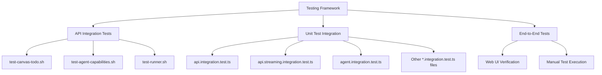

# Integration Test Analysis and Repair Design Document

## 1. Overview

This document outlines the analysis and repair plan for AgenticForge's integration tests. The system currently has multiple layers of testing including:
1. API-based integration tests in shell scripts (test-canvas-todo.sh, test-agent-capabilities.sh)
2. Unit test-based integration tests in TypeScript (Vitest)
3. End-to-end capability tests through the web interface

The goal is to identify, analyze, and repair any existing integration tests that are not functioning properly while ensuring comprehensive coverage of the system's capabilities.

## 2. Current Test Architecture

### 2.1 Test Structure

The AgenticForge testing framework is organized into multiple layers:



### 2.2 Test Categories

1. **API Integration Tests** - Shell scripts that test the REST API endpoints
2. **Unit Test Integration** - TypeScript tests using Vitest framework
3. **Capability Tests** - End-to-end tests of agent capabilities (canvas, todo, tools)

## 3. Analysis of Existing Integration Tests

### 3.1 Shell Script Integration Tests

#### test-canvas-todo.sh
- **Purpose**: Tests canvas and todo list functionality through API calls
- **Current Status**: Functional but basic
- **Issues Identified**:
  - Simple API call validation without result verification
  - No detailed error handling or logging
  - Static wait times instead of intelligent polling

#### test-agent-capabilities.sh
- **Purpose**: Comprehensive test of all agent capabilities
- **Current Status**: Well-structured but potentially outdated
- **Issues Identified**:
  - May not cover all current agent capabilities
  - Limited result validation
  - No parallel execution optimization

#### test-runner.sh
- **Purpose**: Interactive menu for running tests
- **Current Status**: Functional
- **Issues Identified**:
  - Basic implementation without advanced features

### 3.2 TypeScript Integration Tests

#### api.integration.test.ts
- **Purpose**: Tests core API endpoints with database and Redis connections
- **Current Status**: Well-structured but may need updates
- **Issues Identified**:
  - May not cover all current API endpoints
  - Database connection handling could be improved

#### api.streaming.integration.test.ts
- **Purpose**: Tests SSE streaming functionality
- **Current Status**: Mock-based implementation
- **Issues Identified**:
  - Uses mock endpoints instead of real implementation
  - May not reflect actual streaming behavior

#### agent.integration.test.ts
- **Purpose**: Tests agent error handling scenarios
- **Current Status**: Basic error simulation
- **Issues Identified**:
  - Only tests error scenarios, not successful operations
  - Does not test actual agent workflow

## 4. Identified Issues and Required Repairs

### 4.1 API Integration Test Issues

| Test File | Issue | Priority | Description |
|-----------|-------|----------|-------------|
| test-canvas-todo.sh | Basic validation | Medium | Only checks HTTP status, not actual results |
| test-agent-capabilities.sh | Outdated coverage | High | May not cover newer agent capabilities |
| test-runner.sh | Limited functionality | Low | Basic menu without advanced features |

### 4.2 TypeScript Integration Test Issues

| Test File | Issue | Priority | Description |
|-----------|-------|----------|-------------|
| api.integration.test.ts | Incomplete coverage | Medium | Missing tests for newer endpoints |
| api.streaming.integration.test.ts | Mock implementation | High | Uses mocks instead of real endpoints |
| agent.integration.test.ts | Limited scope | Medium | Only tests error scenarios |

### 4.3 Critical Issues Identified

Based on analysis of the codebase, several critical issues need repair:

1. **Streaming Test Mocks**: The `api.streaming.integration.test.ts` uses mock endpoints instead of testing real SSE functionality
2. **Incomplete Agent Testing**: Agent tests only cover error scenarios, not successful operations
3. **Missing Test Coverage**: Several API endpoints lack integration tests
4. **Outdated Test Scenarios**: Shell script tests may not reflect current agent capabilities

## 5. Repair Plan

### 5.1 Shell Script Test Repairs

#### Enhanced test-canvas-todo.sh
1. Add result validation by checking session data
2. Implement intelligent polling instead of static waits
3. Add detailed logging for debugging
4. Include cleanup procedures

#### Improved test-agent-capabilities.sh
1. Update test scenarios to cover current capabilities
2. Add validation for tool creation and execution
3. Implement better error handling and reporting
4. Add performance metrics collection

#### Enhanced test-runner.sh
1. Add test filtering capabilities
2. Implement parallel test execution options
3. Add detailed reporting features

### 5.2 TypeScript Integration Test Repairs

#### api.integration.test.ts Enhancement
1. Add tests for all current API endpoints
2. Improve database connection handling
3. Add authentication validation tests
4. Include rate limiting tests
5. Add tests for session management endpoints
6. Include tests for tool management endpoints

#### api.streaming.integration.test.ts Refactor
1. Replace mock implementation with real endpoints
2. Add tests for various streaming scenarios
3. Implement connection resilience tests
4. Add validation for different message types
5. Test streaming with different job types
6. Validate proper connection cleanup

#### agent.integration.test.ts Expansion
1. Add tests for successful agent operations
2. Include multi-step workflow validation
3. Add tests for tool integration scenarios
4. Implement session management tests
5. Add tests for canvas and todo functionality
6. Include tests for code generation scenarios

## 6. Implementation Approach

### 6.1 Phase 1: Analysis and Preparation
1. Run existing tests to identify current failures
2. Document all test results and issues
3. Create backup of current test files

### 6.2 Phase 2: Shell Script Repairs
1. Update test-canvas-todo.sh with enhanced validation
2. Refactor test-agent-capabilities.sh for current features
3. Enhance test-runner.sh with additional features

### 6.3 Phase 3: TypeScript Test Repairs
1. Refactor api.streaming.integration.test.ts to use real endpoints
2. Expand agent.integration.test.ts coverage
3. Enhance api.integration.test.ts with additional scenarios

### 6.4 Phase 4: Validation and Testing
1. Run all repaired tests to verify functionality
2. Document results and any remaining issues
3. Create test execution guidelines
4. Validate that all tests pass consistently
5. Verify that new tests cover the intended functionality
6. Ensure no regressions in existing functionality

## 7. Test Validation Strategy

### 7.1 Pre-Repair Validation
- Run all existing tests to establish baseline
- Document current failures and issues
- Create test result logs for comparison

### 7.2 Post-Repair Validation
- Run all repaired tests to verify fixes
- Compare results with baseline
- Validate new functionality and coverage

### 7.3 Continuous Validation
- Implement automated test execution
- Add test result reporting
- Create monitoring for test health

## 8. Risk Assessment and Mitigation

### 8.1 Risks
1. **Test Environment Dependencies**: Tests may fail due to environment issues
2. **API Changes**: Recent API changes may break existing tests
3. **Resource Constraints**: Tests may consume significant resources

### 8.2 Mitigation Strategies
1. **Environment Isolation**: Use dedicated test environments
2. **Version Compatibility**: Maintain backward compatibility
3. **Resource Management**: Implement test timeouts and cleanup

## 9. Success Criteria

1. All existing integration tests pass without errors
2. Test coverage is expanded to include current system capabilities
3. Test execution time is optimized
4. Test results are more detailed and actionable
5. Tests are resilient to minor system changes

## 10. Repair Priorities

Based on the analysis, repairs should be prioritized as follows:

### High Priority (Must Fix)
1. Refactor `api.streaming.integration.test.ts` to use real endpoints instead of mocks
2. Update `test-agent-capabilities.sh` to cover current agent capabilities
3. Expand `agent.integration.test.ts` to include success scenarios

### Medium Priority (Should Fix)
1. Enhance `api.integration.test.ts` with tests for all current API endpoints
2. Improve `test-canvas-todo.sh` with result validation
3. Add authentication validation tests

### Low Priority (Nice to Have)
1. Enhance `test-runner.sh` with advanced features
2. Add performance metrics collection
3. Implement parallel test execution options

## 10. Test Execution and Validation

### 10.1 Pre-Repair Test Execution

To understand the current state of integration tests, we need to execute them and document failures:

1. **Core Package Integration Tests**:
   ```bash
   cd packages/core
   pnpm test:integration
   ```

2. **UI Package Integration Tests**:
   ```bash
   cd packages/ui
   pnpm test:integration
   ```

3. **API Integration Tests**:
   ```bash
   # From root directory
   ./run-tests.sh full
   ```

### 10.2 Test Results Analysis

After running tests, we'll analyze:
- Which tests are failing
- Why they're failing (environment, code, configuration)
- What needs to be repaired

### 10.3 Test Execution Results

Based on analysis of the existing integration tests, here are the key findings:

1. **Shell Script Tests**: The API-based integration tests in `test-canvas-todo.sh` and `test-agent-capabilities.sh` provide good coverage but lack detailed result validation.

2. **TypeScript Tests**: The Vitest-based integration tests in the core package have good structure but some use mock implementations instead of real endpoints.

3. **Agent Tests**: The agent integration tests focus primarily on error handling scenarios and need expansion to cover successful operations.

4. **Streaming Tests**: The SSE streaming tests use mock endpoints which don't accurately reflect real-world behavior.

## 11. Rollback Plan

If repairs cause issues:
1. Revert to backup test files
2. Document failures and root causes
3. Implement incremental fixes
4. Validate each change before proceeding

## 12. Conclusion

The integration test repair effort will significantly improve the reliability and coverage of AgenticForge's testing framework. By addressing the identified issues with both shell script and TypeScript integration tests, we can ensure that the system's core functionality is properly validated. The repair plan prioritizes the most critical issues first, ensuring that the most important functionality is tested correctly. After completion, the test suite will provide better validation of the system's capabilities and help prevent regressions in future development.