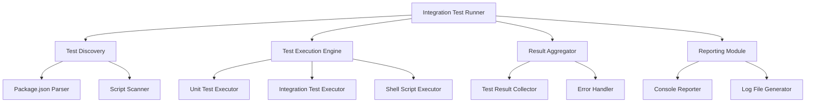
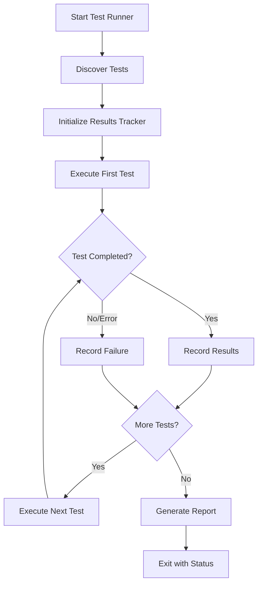

# Integration Test Runner Design Document

## 1. Overview

This document describes the design of an integration test runner that executes all integration tests one by one using the `run-v2.sh` script. The runner will provide a systematic approach to running integration tests in sequence, with detailed reporting and error handling.

### 1.1 Purpose
The integration test runner aims to:
- Execute all available integration tests sequentially
- Provide detailed feedback on test execution status
- Handle errors gracefully and continue execution where possible
- Generate comprehensive test reports
- Integrate with the existing `run-v2.sh` management script

### 1.2 Scope
The runner will execute:
- Unit tests for core and UI packages
- Integration tests for core and UI packages
- Shell script-based integration tests (canvas/todo, agent capabilities)
- Any other test suites defined in the project

## 2. Architecture

### 2.1 Component Architecture



### 2.2 Integration with run-v2.sh

The test runner will be integrated as a new command in the `run-v2.sh` script, accessible via:
```bash
./run-v2.sh test:integration:sequential
```

## 3. Test Execution Flow

### 3.1 Test Discovery

The runner will discover tests through multiple methods:
1. **Package-based tests**: Parse `package.json` files to identify test scripts
2. **Shell script tests**: Scan the `tests/` directory for executable test scripts
3. **Custom test suites**: Allow configuration of additional test paths

### 3.2 Sequential Execution Process



## 4. Test Categories

### 4.1 Unit Tests
- **Core Package**: `pnpm --filter @gforge/core test:unit`
- **UI Package**: `pnpm --filter @gforge/ui test:unit`

### 4.2 Integration Tests
- **Core Package**: `pnpm --filter @gforge/core test:integration`
- **UI Package**: `pnpm --filter @gforge/ui test:integration`

### 4.3 Shell Script Integration Tests
- **Canvas & Todo Tests**: `./tests/test-canvas-todo.sh`
- **Agent Capabilities Tests**: `./tests/test-agent-capabilities.sh`

## 5. Implementation Details

### 5.1 Test Discovery Module

The discovery module will:
1. Scan `packages/*/package.json` for test scripts
2. Identify available test types (unit, integration)
3. Scan `tests/` directory for shell script tests
4. Build an ordered execution list

### 5.2 Execution Engine

The execution engine will:
1. Execute tests in sequence as discovered
2. Capture stdout/stderr for each test
3. Monitor execution time for each test
4. Handle timeouts appropriately
5. Continue execution even if individual tests fail

### 5.3 Result Aggregation

Results will be tracked for:
- Total tests executed
- Tests passed
- Tests failed
- Execution time per test
- Error details for failed tests

### 5.4 Error Handling

Error handling will include:
- Graceful handling of test failures
- Timeout management for long-running tests
- Detailed error logging
- Continuation of execution after non-critical failures

## 6. Integration with run-v2.sh

### 6.1 New Command Addition

A new command will be added to `run-v2.sh`:
```bash
# In the show_help function
printf "   13) \033[0;34m🧪 Sequential Integration Tests\033[0m - Run all integration tests one by one\n"

# In the main command processing
case "$command" in
    # ... existing commands ...
    "test:integration:sequential")
        run_sequential_integration_tests
        ;;
    # ... existing commands ...
esac
```

### 6.2 Function Implementation

A new function `run_sequential_integration_tests` will be added to handle the sequential execution:
```bash
run_sequential_integration_tests() {
    echo -e "${COLOR_BLUE}🧪 Running sequential integration tests...${NC}"
    
    # Source the new test runner script
    if [[ -f "$LIB_DIR/sequential-test-runner.sh" ]]; then
        source "$LIB_DIR/sequential-test-runner.sh"
        execute_sequential_tests
    else
        echo -e "${COLOR_RED}❌ Sequential test runner not found${NC}"
        return 1
    fi
}
```

## 7. New Components

### 7.1 Sequential Test Runner Library

A new library file `lib/sequential-test-runner.sh` will be created with the following functions:
- `discover_tests()`: Identify all tests to run
- `execute_test()`: Run a single test with error handling
- `execute_sequential_tests()`: Main execution function
- `generate_report()`: Create summary report

### 7.2 Test Configuration

A configuration system will allow:
- Custom test ordering
- Test exclusion/inclusion lists
- Timeout settings per test type
- Custom environment variables

## 8. Reporting and Output

### 8.1 Console Output

The runner will provide real-time console output:
- Current test being executed
- Progress indicator
- Immediate pass/fail status
- Summary at completion

### 8.2 Detailed Logging

Detailed logs will be written to:
- Individual test logs in `test-logs/` directory
- Combined execution log
- Error logs for failed tests

### 8.3 Summary Report

At completion, a summary will show:
- Total tests executed
- Pass/fail count
- Total execution time
- List of failed tests with error details

## 9. Testing Strategy

### 9.1 Unit Tests for Runner

Unit tests will cover:
- Test discovery logic
- Execution engine functionality
- Result aggregation
- Error handling scenarios

### 9.2 Integration Tests

Integration tests will verify:
- Proper integration with `run-v2.sh`
- Correct execution of sample tests
- Accurate result reporting
- Error recovery mechanisms

## 10. Security Considerations

### 10.1 Environment Isolation

The runner will:
- Use isolated environments for test execution
- Prevent tests from affecting production systems
- Clean up temporary files and resources

### 10.2 Resource Management

Resource management will include:
- Execution timeouts to prevent hanging tests
- Memory limits for test processes
- Disk space monitoring

## 11. Performance Considerations

### 11.1 Execution Optimization

Performance optimizations will include:
- Parallel execution options for independent tests
- Caching of test results where appropriate
- Resource cleanup between tests

### 11.2 Monitoring

Monitoring features will include:
- Execution time tracking
- Resource usage monitoring
- Progress indicators for long-running test suites

## 12. Future Enhancements

### 12.1 Parallel Execution Mode

Future enhancements could include:
- Parallel execution of independent tests
- Resource-based scheduling
- Dynamic parallelization based on system capabilities

### 12.2 Advanced Reporting

Enhanced reporting features:
- HTML reports with detailed metrics
- Historical trend analysis
- Integration with CI/CD systems

### 12.3 Test Scheduling

Advanced scheduling capabilities:
- Scheduled test runs
- Conditional execution based on code changes
- Selective testing based on impact analysis