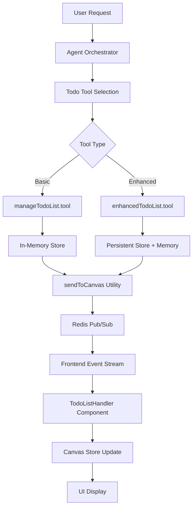
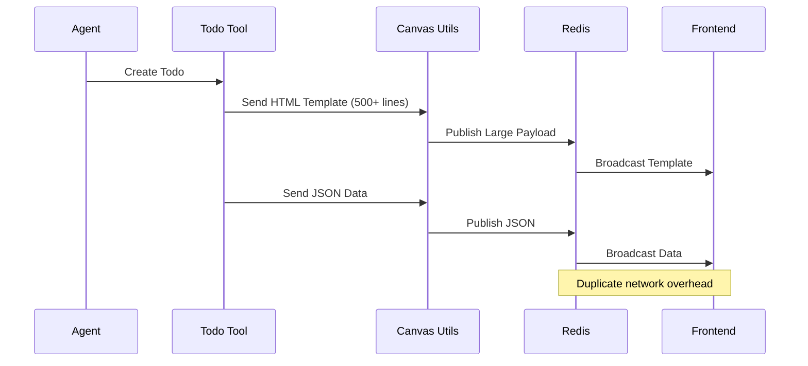
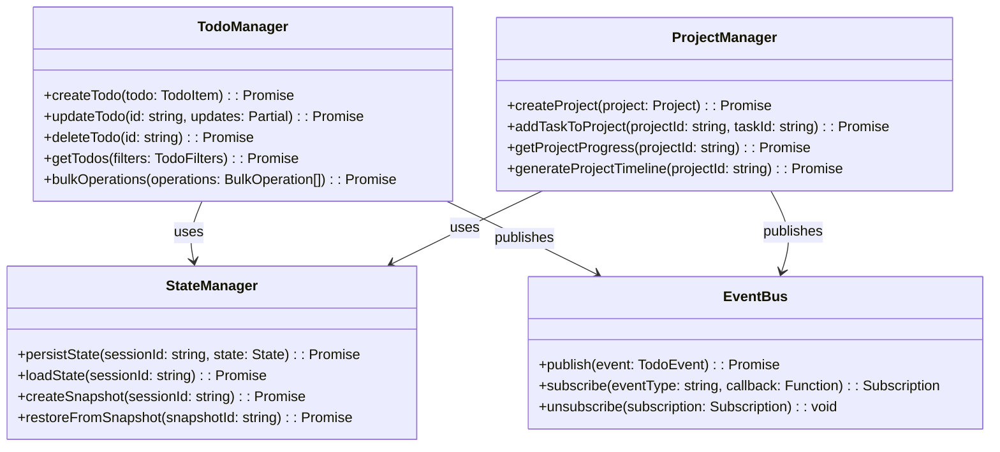

# Mission Control Todo List - Improvements & Security Analysis

## Overview

This document outlines critical improvements and security vulnerabilities identified in the AgenticForge mission control todo list functionality. The current implementation suffers from architectural limitations, security gaps, and optimization issues that significantly impact user experience and system reliability.

## Current Architecture Analysis

### Component Structure



### Data Flow Problems

The current system has several architectural flaws:

1. **Dual Tool Redundancy**: Both `manageTodoList.tool` and `enhancedTodoList.tool` exist with overlapping functionality
2. **Inconsistent State Management**: Mixed approach between in-memory stores and persistent storage
3. **Fragmented Event Handling**: Multiple event types with different processing paths
4. **UI Coupling Issues**: Direct dependency on message events instead of proper state management


## Performance Optimization Issues

### 1. Inefficient Template Generation



**Problems:**
- 500+ line HTML template sent for every todo operation
- Redundant template transmission
- No compression or caching strategy

### 2. State Synchronization Bottlenecks

```typescript
// INEFFICIENT: Multiple state updates per operation
switch (args.action) {
  case 'create_task':
    // 1. Update memory store
    taskStore.set(sessionKey, newTasks);
    // 2. Update persistent storage
    await saveProjectState(sessionKey, state);
    // 3. Send to canvas
    await sendToCanvas(jobId, data, 'text');
    // 4. Publish to Redis
    await redis.publish(channel, message);
}
```

### 3. Lack of Real-time Optimization

- No WebSocket-based real-time updates
- Polling-based UI updates causing delay
- No optimistic UI updates

## Functional Limitations

### 1. Basic Task Management

Current tools only support:
- Simple CRUD operations
- Basic status tracking (pending, in_progress, completed)
- Minimal metadata (priority, category)

**Missing Features:**
- Task dependencies and hierarchies
- Time tracking and estimation
- Collaborative features
- Advanced filtering and search
- Bulk operations

### 2. Limited Project Management

```typescript
// CURRENT: Basic project structure
interface Project {
  id: string;
  name: string;
  status: 'planning' | 'in_progress' | 'completed';
  // Missing advanced project features
}
```

**Missing Capabilities:**
- Resource allocation
- Timeline management
- Risk assessment
- Progress analytics
- Team assignment

### 3. Poor User Experience

- No drag-and-drop functionality
- Limited keyboard shortcuts
- No offline capability
- Inconsistent UI feedback

## Proposed Improvements


### 2. Architecture Redesign

#### Unified Todo Management System



#### Real-time Communication Layer

```typescript
interface TodoWebSocketManager {
  // Real-time updates
  onTodoUpdate: (callback: (todo: TodoItem) => void) => void;
  onProjectUpdate: (callback: (project: Project) => void) => void;
  
  // Collaborative features
  onUserJoined: (callback: (user: User) => void) => void;
  onUserLeft: (callback: (userId: string) => void) => void;
  
  // Optimistic updates
  optimisticUpdate: (todo: Partial<TodoItem>) => void;
  rollbackUpdate: (todoId: string) => void;
}
```

### 3. Enhanced Data Models

#### Advanced Todo Structure

```typescript
interface EnhancedTodoItem {
  id: string;
  content: string;
  description?: string;
  status: 'pending' | 'in_progress' | 'completed' | 'blocked' | 'cancelled';
  priority: 'low' | 'medium' | 'high' | 'critical';
  
  // Metadata
  createdAt: number;
  updatedAt: number;
  dueDate?: number;
  completedAt?: number;
  
  // Relationships
  projectId?: string;
  parentId?: string;
  dependencies: string[];
  subtasks: string[];
  
  // Tracking
  estimatedTime?: number;
  actualTime?: number;
  timeSpent: number;
  
  // Collaboration
  assignedTo?: string[];
  watchers: string[];
  comments: Comment[];
  
  // Organization
  tags: string[];
  labels: Label[];
  category?: string;
  
  // Automation
  automationRules: AutomationRule[];
  triggers: Trigger[];
}
```

#### Project Management Enhancement

```typescript
interface EnhancedProject {
  id: string;
  name: string;
  description: string;
  status: 'planning' | 'active' | 'on_hold' | 'completed' | 'cancelled';
  
  // Timeline
  startDate?: number;
  endDate?: number;
  actualStartDate?: number;
  actualEndDate?: number;
  
  // Progress tracking
  progress: number;
  milestones: Milestone[];
  phases: ProjectPhase[];
  
  // Resources
  budget?: number;
  resources: Resource[];
  team: TeamMember[];
  
  // Risk management
  risks: Risk[];
  dependencies: ProjectDependency[];
  
  // Analytics
  velocity: number;
  burndownData: BurndownPoint[];
  metrics: ProjectMetrics;
}
```

### 4. Performance Optimizations

#### Template Caching Strategy

```typescript
class TemplateManager {
  private cache = new Map<string, CachedTemplate>();
  
  async getTemplate(type: string, version: string): Promise<string> {
    const cacheKey = `${type}:${version}`;
    
    if (this.cache.has(cacheKey)) {
      return this.cache.get(cacheKey)!.content;
    }
    
    const template = await this.generateTemplate(type);
    const compressed = await this.compressTemplate(template);
    
    this.cache.set(cacheKey, {
      content: compressed,
      lastModified: Date.now(),
      accessCount: 1
    });
    
    return compressed;
  }
}
```

#### Event Streaming Optimization

```typescript
class OptimizedEventStream {
  private batch: Event[] = [];
  private batchTimer?: NodeJS.Timeout;
  
  publish(event: Event) {
    this.batch.push(event);
    
    if (this.batch.length >= BATCH_SIZE) {
      this.flushBatch();
    } else if (!this.batchTimer) {
      this.batchTimer = setTimeout(() => this.flushBatch(), BATCH_TIMEOUT);
    }
  }
  
  private flushBatch() {
    if (this.batch.length > 0) {
      redis.publish(EVENTS_CHANNEL, JSON.stringify(this.batch));
      this.batch = [];
    }
    
    if (this.batchTimer) {
      clearTimeout(this.batchTimer);
      this.batchTimer = undefined;
    }
  }
}
```

### 5. User Experience Enhancements

#### Modern React Components

```typescript
interface TodoListProps {
  sessionId: string;
  projectId?: string;
  filters?: TodoFilters;
  onTodoUpdate?: (todo: TodoItem) => void;
}

const ModernTodoList: React.FC<TodoListProps> = ({
  sessionId,
  projectId,
  filters,
  onTodoUpdate
}) => {
  const { todos, loading, error } = useTodos(sessionId, filters);
  const { optimisticUpdate, rollback } = useOptimisticUpdates();
  
  return (
    <DragDropContext onDragEnd={handleDragEnd}>
      <VirtualizedList
        items={todos}
        renderItem={({ item, index }) => (
          <TodoItem
            key={item.id}
            todo={item}
            onUpdate={optimisticUpdate}
            onError={rollback}
          />
        )}
      />
    </DragDropContext>
  );
};
```

#### Offline Support

```typescript
class OfflineTodoManager {
  private indexedDB: IDBDatabase;
  private syncQueue: SyncOperation[] = [];
  
  async createTodoOffline(todo: TodoItem): Promise<void> {
    // Store locally
    await this.storeInIndexedDB(todo);
    
    // Queue for sync
    this.syncQueue.push({
      type: 'CREATE',
      data: todo,
      timestamp: Date.now()
    });
    
    // Attempt immediate sync if online
    if (navigator.onLine) {
      await this.processSyncQueue();
    }
  }
}
```

## Implementation Roadmap

### Phase 1: Architecture Refactoring (Priority 1)
1. Consolidate todo tools into unified system
2. Implement proper state management
3. Add event bus architecture
4. Optimize template system

### Phase 2: Feature Enhancement (Priority 2)
1. Advanced task management features
2. Project management capabilities
3. Real-time collaboration
4. Advanced analytics

### Phase 3: User Experience (Priority 3)
1. Modern React components
2. Offline support
3. Mobile optimization
4. Accessibility improvements

## Testing Strategy

### Functional Testing
- Unit tests for all todo operations
- Integration tests for state management
- End-to-end workflow testing
- Real-time synchronization testing

### Performance Testing
- Template caching efficiency
- Event streaming latency
- Memory usage monitoring
- Concurrent user handling