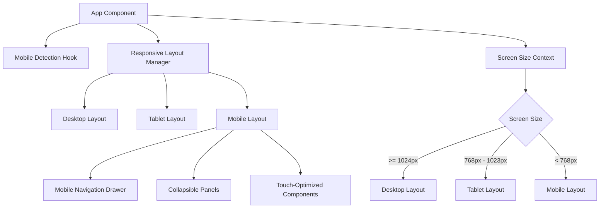
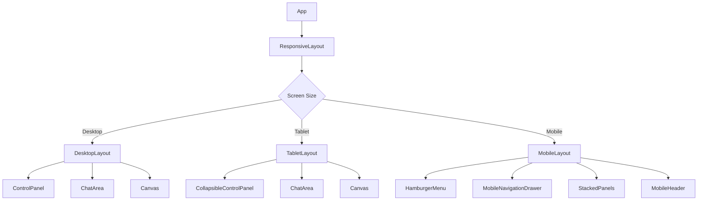
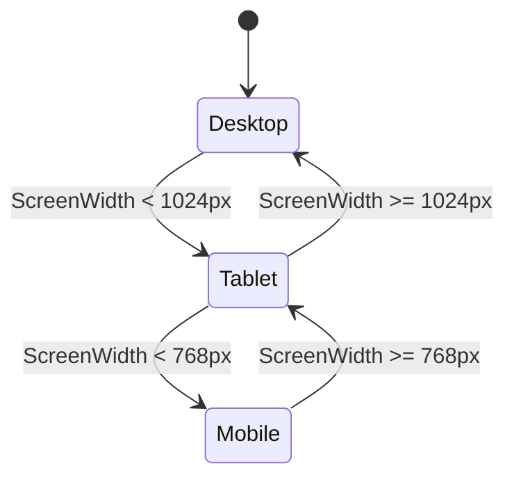
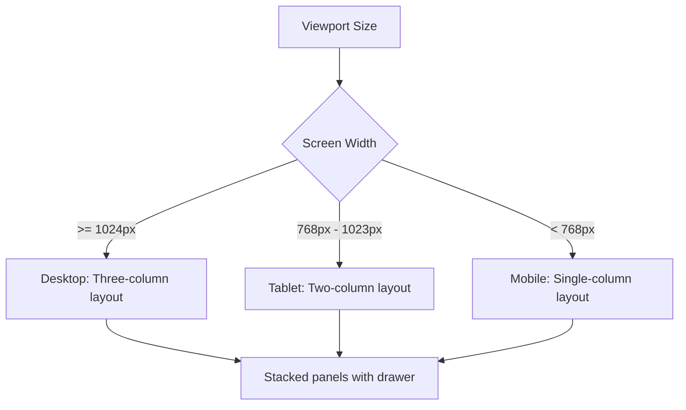

# Mobile Frontend Enhancement Design Document

## 1. Overview

### 1.1 Purpose
This document outlines the design and implementation plan for enhancing the AgenticForge frontend to provide an optimized mobile user experience. The current UI is primarily designed for desktop use, and this enhancement will make the application fully responsive and mobile-friendly.

### 1.2 Current State Analysis
The existing frontend is built with React, TypeScript, and Tailwind CSS, featuring:
- A complex layout with control panel, chat area, and canvas
- Responsive design with some mobile considerations (limited @media queries)
- Desktop-focused interaction patterns
- Complex component hierarchy with multiple side panels

Analysis of the current codebase shows:
- Limited responsive design with only basic @media queries in CSS files
- No dedicated mobile navigation system
- Desktop-oriented component layouts that don't adapt well to small screens
- Touch interactions not optimized for mobile devices

### 1.3 Goals
- Implement a mobile-first responsive design
- Create an adaptive layout that works well on all screen sizes
- Optimize touch interactions for mobile devices
- Maintain all core functionality while improving usability on mobile
- Ensure performance is acceptable on mobile devices
- Provide an intuitive mobile user experience that matches the desktop experience

## 2. Architecture

### 2.1 Current Frontend Architecture
The current architecture follows a component-based structure with:
- Main App component orchestrating the layout
- Zustand for state management
- Tailwind CSS for styling
- Framer Motion for animations
- Responsive breakpoints at 768px

Current layout structure:
- Fixed width control panel (250px-400px)
- Main chat area
- Resizable canvas panel (300px-800px)
- Floating action buttons
- Horizontal header with multiple action buttons

Limitations:
- Layout does not adapt well to small screens
- No mobile navigation pattern
- Fixed panel widths not suitable for mobile
- Touch interactions not optimized

### 2.2 Proposed Mobile Enhancement Architecture


### 2.3 Component Hierarchy Changes


## 3. Component Architecture

### 3.1 Mobile Navigation System
#### 3.1.1 Hamburger Menu Component
A new hamburger menu component will be implemented for mobile navigation:
- Replaces the horizontal button bar on mobile
- Provides access to all main application sections
- Uses Radix UI dropdown menu primitives for accessibility
- Integrated with existing Header component
- Responsive visibility (hidden on desktop, visible on mobile)

Implementation details:
```typescript
const HamburgerMenu: React.FC = () => {
  const [isOpen, setIsOpen] = useState(false);
  
  return (
    <div className="md:hidden">
      <button 
        onClick={() => setIsOpen(true)}
        className="p-2 rounded-md text-foreground"
        aria-label="Open menu"
      >
        <Menu className="h-6 w-6" />
      </button>
      
      <MobileDrawer isOpen={isOpen} onClose={() => setIsOpen(false)} />
    </div>
  );
};
```

#### 3.1.2 Mobile Navigation Drawer
A slide-in navigation drawer for mobile:
- Contains all main navigation options
- Includes user profile and settings
- Smooth animation using Framer Motion
- Backdrop overlay for focus
- Swipe-to-close functionality
- Keyboard navigation support

Implementation with Framer Motion:
```typescript
const MobileDrawer: React.FC<{isOpen: boolean, onClose: () => void}> = ({isOpen, onClose}) => {
  return (
    <AnimatePresence>
      {isOpen && (
        <>
          <motion.div
            className="fixed inset-0 bg-black bg-opacity-50 z-40"
            initial={{ opacity: 0 }}
            animate={{ opacity: 1 }}
            exit={{ opacity: 0 }}
            onClick={onClose}
          />
          <motion.div
            className="fixed left-0 top-0 h-full w-64 bg-background z-50 shadow-lg"
            initial={{ x: -300 }}
            animate={{ x: 0 }}
            exit={{ x: -300 }}
            transition={{ type: "spring", damping: 20 }}
          >
            {/* Drawer content */}
          </motion.div>
        </>
      )}
    </AnimatePresence>
  );
};
```

### 3.2 Responsive Layout Components
#### 3.2.1 Layout Manager
A new layout manager component that:
- Detects screen size and orientation
- Switches between desktop, tablet, and mobile layouts
- Manages component visibility based on screen size
- Uses CSS media queries and JavaScript-based detection
- Implements a context provider for screen size information

Implementation approach:
```typescript
// ScreenSizeContext.tsx
export const ScreenSizeContext = createContext<{
  isMobile: boolean;
  isTablet: boolean;
  isDesktop: boolean;
  width: number;
  height: number;
}>({ isMobile: false, isTablet: false, isDesktop: true, width: 0, height: 0 });

export const ScreenSizeProvider: React.FC<{children: ReactNode}> = ({ children }) => {
  const [screenSize, setScreenSize] = useState({
    width: window.innerWidth,
    height: window.innerHeight,
    isMobile: window.innerWidth < 768,
    isTablet: window.innerWidth >= 768 && window.innerWidth < 1024,
    isDesktop: window.innerWidth >= 1024
  });

  useEffect(() => {
    const handleResize = debounce(() => {
      setScreenSize({
        width: window.innerWidth,
        height: window.innerHeight,
        isMobile: window.innerWidth < 768,
        isTablet: window.innerWidth >= 768 && window.innerWidth < 1024,
        isDesktop: window.innerWidth >= 1024
      });
    }, 250);

    window.addEventListener('resize', handleResize);
    return () => window.removeEventListener('resize', handleResize);
  }, []);

  return (
    <ScreenSizeContext.Provider value={screenSize}>
      {children}
    </ScreenSizeContext.Provider>
  );
};
```

#### 3.2.2 Collapsible Panels
Enhanced panel components that:
- Collapse into expandable sections on mobile
- Use accordion patterns for space efficiency
- Maintain state across device rotations
- Animate transitions for better UX
- Preserve content state when collapsed/expanded

Implementation with Framer Motion:
```typescript
const CollapsiblePanel: React.FC<{title: string, children: ReactNode}> = ({ title, children }) => {
  const [isOpen, setIsOpen] = useState(false);
  
  return (
    <div className="border rounded-lg mb-2">
      <button 
        className="w-full p-4 text-left flex justify-between items-center"
        onClick={() => setIsOpen(!isOpen)}
      >
        <span>{title}</span>
        <motion.div
          animate={{ rotate: isOpen ? 180 : 0 }}
          transition={{ duration: 0.2 }}
        >
          <ChevronDown className="h-5 w-5" />
        </motion.div>
      </button>
      
      <AnimatePresence>
        {isOpen && (
          <motion.div
            initial={{ height: 0, opacity: 0 }}
            animate={{ height: 'auto', opacity: 1 }}
            exit={{ height: 0, opacity: 0 }}
            transition={{ duration: 0.3 }}
            className="overflow-hidden"
          >
            <div className="p-4 border-t">
              {children}
            </div>
          </motion.div>
        )}
      </AnimatePresence>
    </div>
  );
};
```

### 3.3 Touch-Optimized Components
#### 3.3.1 Touch-Friendly Buttons
- Increased touch target size (minimum 44px)
- Improved spacing between interactive elements
- Visual feedback for touch interactions
- Ripple effects for tactile feedback
- Proper focus states for accessibility

Implementation example:
```tsx
const TouchButton: React.FC<ButtonProps> = ({ children, className, ...props }) => {
  return (
    <button
      className={`min-h-[44px] min-w-[44px] flex items-center justify-center ${className}`}
      {...props}
    >
      {children}
    </button>
  );
};
```

#### 3.3.2 Gesture Support
- Swipe gestures for panel navigation
- Long press for contextual actions
- Pinch-to-zoom for canvas content
- Double tap for quick actions
- Drag and drop for reordering
- Pull-to-refresh for content updates

Gesture implementation using React hooks:
```tsx
const useSwipe = (onSwipeLeft: () => void, onSwipeRight: () => void) => {
  const [touchStart, setTouchStart] = useState(0);
  const [touchEnd, setTouchEnd] = useState(0);
  
  const minSwipeDistance = 50;
  
  const onTouchStart = (e: React.TouchEvent) => {
    setTouchEnd(0);
    setTouchStart(e.targetTouches[0].clientX);
  };
  
  const onTouchMove = (e: React.TouchEvent) => {
    setTouchEnd(e.targetTouches[0].clientX);
  };
  
  const onTouchEnd = () => {
    if (!touchStart || !touchEnd) return;
    
    const distance = touchStart - touchEnd;
    const isLeftSwipe = distance > minSwipeDistance;
    const isRightSwipe = distance < -minSwipeDistance;
    
    if (isLeftSwipe) onSwipeLeft();
    if (isRightSwipe) onSwipeRight();
  };
  
  return { onTouchStart, onTouchMove, onTouchEnd };
};
```

## 4. State Management

### 4.1 Mobile State Considerations
The existing Zustand state management will be extended to handle mobile-specific states:
- Screen size and orientation
- Navigation drawer open/closed state
- Panel visibility states for mobile
- Touch interaction states
- Mobile-specific UI preferences

New hooks to implement:
- `useScreenSize()` - Detects and provides screen size information
- `useMobileNavigation()` - Manages mobile navigation drawer state
- `useCollapsiblePanels()` - Handles panel collapse/expand states

### 4.2 Responsive State Patterns


### 4.3 Screen Size Context
A new React context will be created to provide screen size information throughout the application:
- Uses window.matchMedia for efficient screen size detection
- Debounced resize event handling for performance
- Provides screen size categories (mobile, tablet, desktop)
- Includes orientation information (portrait/landscape)

## 5. UI/UX Design

### 5.1 Mobile-First Design Principles
- Progressive disclosure of features
- Vertical stacking of components
- Minimalist interface with essential elements
- Contextual actions based on current view
- Optimized information hierarchy for small screens

### 5.2 Touch Interaction Design
- Larger touch targets for all interactive elements (minimum 44px)
- Gestural navigation patterns
- Visual feedback for all interactions
- Reduced dependency on hover states
- Contextual menus for complex actions
- Haptic feedback where appropriate

### 5.3 Adaptive Layout System


### 5.4 Component-Specific Mobile Adaptations

#### Header Component
- Replace button bar with hamburger menu on mobile
- Simplified logo and title for small screens
- Contextual action buttons based on current view

#### Control Panel
- Collapsible drawer on mobile
- Tab-based navigation for sections
- Search functionality optimized for touch

#### Chat Area
- Full-width message bubbles
- Simplified input area with integrated actions
- Attachment options in contextual menu

#### Canvas
- Full-screen mode as default on mobile
- Simplified toolbar with essential actions
- Gesture-based navigation (pinch, swipe)

## 6. Performance Optimization

### 6.1 Mobile Performance Considerations
- Lazy loading of non-essential components
- Optimized bundle size for mobile networks
- Reduced animations on low-end devices
- Efficient touch event handling
- Image optimization for mobile screens
- Conditional rendering based on screen size
- Memory management for long sessions
- Virtualized lists for large data sets
- Efficient state updates to prevent unnecessary re-renders

### 6.2 Code Splitting Strategy
- Separate mobile-specific components into lazy-loaded bundles
- Conditional loading based on screen size
- Preloading critical mobile components
- Dynamic imports for heavy features
- Route-based code splitting for mobile views

Implementation with React.lazy:
```tsx
const MobileNavigationDrawer = React.lazy(() => 
  import('./components/MobileNavigationDrawer')
);

// In component
<Suspense fallback={<div>Loading...</div>}>
  <MobileNavigationDrawer />
</Suspense>
```

### 6.3 Network Optimization
- Implement service worker for offline capability
- Cache static assets for faster loading
- Optimize API calls for mobile network conditions
- Implement request batching for better performance
- Compress data payloads
- Implement progressive loading for large content
- Use efficient data formats (Protocol Buffers, etc.)

### 6.4 Battery and Resource Optimization
- Reduce CPU-intensive operations on mobile
- Optimize animations for battery efficiency
- Implement smart polling for real-time updates
- Use passive event listeners for scroll/touch events
- Minimize background processes

## 7. Testing Strategy

### 7.1 Mobile Testing Approach
- Device simulation across various screen sizes
- Touch interaction testing
- Performance testing on mobile networks
- Accessibility testing for mobile users
- Orientation change testing
- Cross-browser compatibility testing
- Real device testing on popular models

### 7.2 Browser Compatibility
- Mobile Safari (iOS)
- Chrome for Android
- Samsung Internet
- Firefox for Android

### 7.3 Testing Tools and Frameworks
- Jest and React Testing Library for unit tests
- Cypress for end-to-end testing
- BrowserStack or similar for cross-device testing
- Lighthouse for performance auditing
- WebPageTest for network performance
- axe-core for accessibility testing
- Percy for visual regression testing

### 7.4 Automated Testing
- Visual regression testing for UI changes
- Performance benchmarking
- Accessibility scanning
- Responsive design validation

### 7.5 Testing Matrix

| Device Category | Screen Sizes | Test Scenarios | Priority |
|----------------|--------------|----------------|----------|
| Small Mobile | 320px - 480px | Basic functionality, touch interactions | High |
| Large Mobile | 481px - 768px | All features, orientation changes | High |
| Tablet | 769px - 1024px | Multi-panel layouts, responsive behavior | Medium |
| Desktop | 1025px+ | Full feature set, edge cases | Low |

### 7.6 Performance Testing Metrics
- First Contentful Paint (FCP) < 2.0 seconds
- Largest Contentful Paint (LCP) < 2.5 seconds
- Cumulative Layout Shift (CLS) < 0.1
- Time to Interactive (TTI) < 3.0 seconds
- Bundle size < 200KB for critical path

### 7.7 Accessibility Testing
- Screen reader compatibility
- Keyboard navigation on mobile (external keyboards)
- Color contrast ratios
- Focus management
- ARIA attributes for dynamic content

## 8. Implementation Roadmap

### 8.1 Phase 1: Foundation (Week 1-2)
- Implement mobile detection hook (`useScreenSize`)
- Create responsive layout manager
- Develop mobile navigation drawer
- Add basic responsive breakpoints
- Create ScreenSizeContext provider

### 8.2 Phase 2: Component Optimization (Week 3-4)
- Optimize touch interactions
- Implement collapsible panels
- Create mobile-friendly forms
- Enhance visual feedback
- Adapt Header component for mobile
- Modify Control Panel for mobile

### 8.3 Phase 3: Advanced Features (Week 5-6)
- Add gesture support
- Implement adaptive layouts
- Optimize performance for mobile
- Conduct comprehensive testing
- Implement service worker for offline support
- Add progressive web app capabilities

### 8.4 Phase 4: Polish and Release (Week 7)
- Final UI/UX refinements
- Performance optimization
- Cross-device testing
- Documentation and release
- User acceptance testing
- Performance benchmarking

## 9. Implementation Checklist

### Core Components
- [ ] Screen size detection hook
- [ ] Responsive layout manager
- [ ] Mobile navigation drawer
- [ ] Hamburger menu component
- [ ] Collapsible panels
- [ ] Touch-optimized buttons

### Layout Adaptations
- [ ] Header component mobile adaptation
- [ ] Control panel mobile layout
- [ ] Chat area mobile optimization
- [ ] Canvas mobile interface
- [ ] Todo list mobile view

### Interaction Enhancements
- [ ] Touch gesture support
- [ ] Visual feedback improvements
- [ ] Keyboard navigation
- [ ] Focus management

### Performance Optimizations
- [ ] Code splitting for mobile
- [ ] Lazy loading implementation
- [ ] Bundle size optimization
- [ ] Service worker integration

### Testing and Quality Assurance
- [ ] Unit tests for mobile components
- [ ] Cross-browser testing
- [ ] Performance benchmarking
- [ ] Accessibility compliance
- [ ] Visual regression testing

## 10. Success Metrics

- Mobile page load time under 3 seconds
- Touch interaction response time under 100ms
- 90+ Lighthouse score for mobile
- 100% core functionality available on mobile
- Positive user feedback on mobile experience

## 11. Risks and Mitigations

### Technical Risks
- **Complex state management**: Mitigate by extending existing Zustand patterns
- **Performance on low-end devices**: Address through code splitting and optimization
- **Browser compatibility issues**: Test across target browsers and versions

### Timeline Risks
- **Feature scope creep**: Maintain focus on core mobile experience
- **Testing delays**: Allocate buffer time for cross-device testing
- **Integration challenges**: Implement in phases with thorough testing

## 12. Conclusion

This mobile frontend enhancement will transform the AgenticForge UI from a desktop-focused application to a fully responsive, mobile-friendly experience. By implementing a mobile-first approach with adaptive layouts, touch-optimized interactions, and performance considerations, we will ensure that users can access all core functionality seamlessly across devices.

The phased implementation approach allows for iterative development and testing, reducing risk while delivering value incrementally. The enhancements will not only improve the mobile experience but also strengthen the overall architecture by introducing more flexible, responsive design patterns that benefit all users.