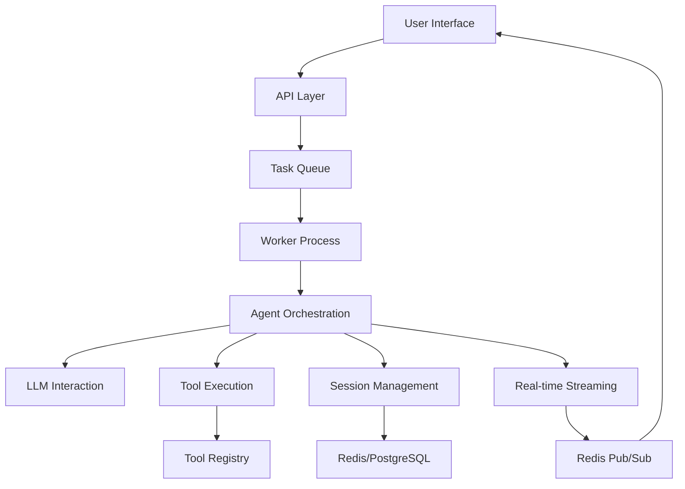

# Quest Function Analysis in AgenticForge

## Overview

AgenticForge implements a task processing system that functions similarly to a "quest" system, where users can submit prompts that are processed as autonomous tasks by AI agents. The system handles these tasks through a multi-layered architecture that includes job queuing, agent orchestration, tool execution, and real-time communication with the user interface.

## Architecture

The task processing system in AgenticForge follows a microservices-inspired architecture with the following key components:

1. **API Layer**: Receives user requests and creates jobs in the task queue
2. **Task Queue**: Manages job processing using BullMQ with Redis as the message broker
3. **Worker Processes**: Execute jobs by creating agent instances
4. **Agent Orchestration**: Processes tasks through a reasoning loop with LLM interactions
5. **Tool System**: Provides modular tools that agents can use to complete tasks
6. **Session Management**: Maintains conversation state and history
7. **Real-time Communication**: Streams results back to the UI via Redis pub/sub



## Task Processing Lifecycle

### 1. Task Submission
- User submits a prompt through the UI
- API layer receives the request and creates a job in the BullMQ task queue
- Job contains the user prompt, session ID, and other context

### 2. Job Queuing
- Tasks are queued in Redis using BullMQ
- Jobs are processed asynchronously by worker processes
- System supports concurrent processing with configurable worker concurrency

### 3. Worker Processing
- Worker processes pick up jobs from the queue
- For each job, a new Agent instance is created
- Agent is initialized with session data, available tools, and LLM configuration

### 4. Agent Orchestration Loop
The agent processes tasks through an iterative reasoning loop:

1. **Prompt Construction**: Builds a comprehensive prompt including system instructions, conversation history, and available tools
2. **LLM Interaction**: Sends the prompt to an LLM and receives a response
3. **Response Parsing**: Parses the LLM response according to a strict schema
4. **Action Execution**: Executes any commands/tools specified in the response
5. **Loop Continuation**: Repeats until a final answer is provided or maximum iterations reached

### 5. Tool Execution
- Agents can execute tools from the tool registry
- Tools are executed in isolated contexts with proper error handling
- Results are streamed back to the UI in real-time

### 6. Result Streaming
- Agent thoughts, tool outputs, and final answers are published to Redis channels
- UI subscribes to these channels to receive real-time updates
- Different content types (text, markdown, HTML) are supported

## Data Models

### Session Data
```typescript
interface SessionData {
  id: string;
  history: Message[];
  activeLlmProvider: string;
  // Other session properties
}
```

### Message Types
- `user`: User prompts
- `agent_thought`: Agent thinking process
- `agent_response`: Final agent responses
- `tool_call`: Tool execution requests
- `tool_result`: Tool execution results
- `agent_canvas_output`: Visual content output
- `error`: Error messages

### Job Data
```typescript
interface JobData {
  prompt: string;
  sessionId: string;
  llmApiKey?: string;
  llmModelName?: string;
  llmProvider?: string;
}
```

## Business Logic Layer

### Agent Class
The core of the task processing system is the `Agent` class which implements the reasoning loop:

1. **Initialization**: Sets up the agent with session data, tools, and LLM configuration
2. **Run Method**: Main entry point that executes the reasoning loop
3. **LLM Interaction**: Handles communication with various LLM providers with failover capabilities
4. **Response Parsing**: Validates and parses LLM responses using Zod schemas
5. **Tool Execution**: Executes tools requested by the LLM
6. **Loop Detection**: Prevents infinite loops in agent behavior
7. **State Management**: Maintains session state throughout the task execution

### Task Queue Management
- Uses BullMQ for job queue management
- Implements dead letter queues for failed jobs
- Supports job prioritization and concurrency control
- Provides job progress tracking

### Session Management
- Stores session data in both PostgreSQL (persistent) and Redis (cache)
- Manages conversation history with size limits
- Handles session persistence and retrieval

## Middleware & Interceptors

### Error Handling
- Comprehensive error handling with specific error types (LlmError, FinishToolSignal)
- Graceful degradation when LLM providers fail
- Retry mechanisms for transient failures

### Progress Reporting
- Real-time progress updates through Redis pub/sub
- Streaming of tool outputs as they are generated
- Status updates for long-running tasks

### Security
- API key management with failover between providers
- Input validation and sanitization
- Secure session management

## API Endpoints Reference

### Task Submission
```
POST /api/chat
Content-Type: application/json

{
  "prompt": "User task description",
  "sessionId": "session-identifier"
}
```

### Response
```json
{
  "jobId": "unique-job-identifier"
}
```

### Event Streaming
- Events are streamed through Server-Sent Events (SSE)
- Clients subscribe to job-specific channels
- Different event types for thoughts, tool outputs, and final responses

## Testing Strategy

### Unit Testing
- Agent class functionality
- Response parsing and validation
- Tool execution logic
- Error handling scenarios

### Integration Testing
- End-to-end task processing workflows
- LLM provider failover mechanisms
- Tool registry integration
- Session management persistence

### Performance Testing
- Concurrent task processing
- LLM response times
- Memory usage during long-running tasks