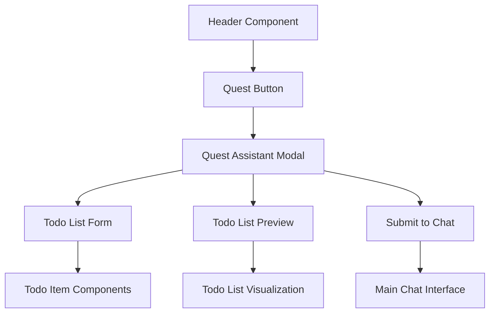
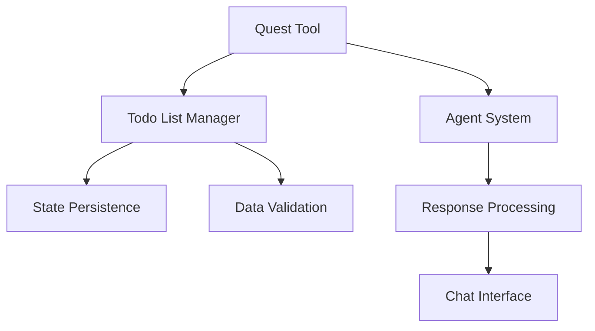

# Quest Todo Assistant Feature Design

## 1. Overview

The Quest Todo Assistant feature will allow users to initiate a specialized assistant for creating and managing todo lists directly from the main header. This feature will be accessible through a dedicated button in the header that launches an assistant interface, enabling users to build comprehensive todo lists that can be submitted to AgenticForge for processing.

Based on the existing codebase structure, this feature will integrate with the existing Unified Todo List system and leverage the agent tool architecture.

## 2. Feature Requirements

### 2.1 User Interface Requirements
- Add a new "Quest" button to the main header
- Create a modal/panel interface for the todo assistant
- Provide an intuitive form for creating todo items
- Allow users to submit completed todo lists to the main chat

### 2.2 Backend Requirements
- Create a new tool for the agent to handle quest/todo list creation
- Implement state management for todo lists
- Enable persistence of todo list data
- Provide integration with existing todo list systems

### 2.3 Integration Requirements
- Seamless integration with existing header component
- Compatibility with current todo list management system
- Proper communication with the agent system

## 3. Architecture Design

### 3.1 Frontend Architecture



The frontend implementation will leverage existing components from the UI package, particularly the UnifiedTodoListPanel component which already provides comprehensive todo list functionality. The Quest Assistant will be a specialized version of this panel focused on creating new todo lists.

### 3.2 Component Structure

1. **Header Integration**
   - Add Quest button to existing header button configuration in `Header.tsx`
   - Manage visibility state using existing UI store (`useUIStore`)
   - Follow existing pattern of other header buttons (e.g., TodoList button)

2. **Quest Assistant Modal**
   - Main container for the todo creation assistant
   - Form for adding todo items with priority, tags, and other metadata
   - Preview of the todo list using existing UnifiedTodoListPanel components
   - Submission functionality to send todo list to agent

3. **Todo Item Components**
   - Leverage existing todo item components from `UnifiedTodoListPanel.tsx`
   - Reuse existing interfaces like `UnifiedTodoItem` for consistency
   - Implement specialized form components for quest creation

### 3.3 Backend Architecture



The backend implementation will follow the existing tool pattern established in the codebase. The Quest tool will be implemented as a new system tool similar to `unifiedTodoList.tool.ts` and integrated with the existing `toolRegistry`. It will leverage the existing todo data models and persistence mechanisms.

## 4. API Design

### 4.1 Frontend API

#### Header Component Modifications
- Add new button to buttonConfig array in `Header.tsx`
- Add state management for Quest assistant visibility using `useUIStore`
- Implement toggle function for Quest assistant following existing patterns

#### Quest Assistant Component
```typescript
interface QuestAssistantProps {
  isVisible: boolean;
  onClose: () => void;
  onSubmit: (todoList: UnifiedTodoData) => void;
}

// Reuse existing interfaces from UnifiedTodoListPanel
interface UnifiedTodoItem {
  id: string;
  content: string;
  status: 'pending' | 'in_progress' | 'completed' | 'blocked' | 'cancelled';
  priority: 'low' | 'medium' | 'high' | 'critical';
  category?: string;
  projectId?: string;
  parentId?: string;
  dependencies?: string[];
  estimatedTime?: number;
  actualTime?: number;
  createdAt: number;
  updatedAt: number;
  assignedTo?: string;
  tags?: string[];
  notes?: string;
}

interface UnifiedTodoData {
  type: 'unified_todo';
  title: string;
  timestamp: number;
  tasks?: UnifiedTodoItem[];
  stats: {
    pending: number;
    in_progress: number;
    completed: number;
    blocked: number;
    cancelled: number;
    total: number;
  };
}
```

### 4.2 Backend API

#### Quest Tool Definition
```typescript
// Following the pattern of existing tools in /packages/core/src/modules/tools/definitions/system/

// Parameters based on existing unifiedTodoParameters
const questTodoParameters = z.object({
  action: z.enum([
    'create_quest',
    'update_quest',
    'submit_quest',
    'display_quest',
    'clear_quest'
  ]).describe('Action to perform on the quest todo list'),
  
  questData: z.object({
    title: z.string().describe('Title of the quest todo list'),
    description: z.string().optional().describe('Description of the quest'),
    items: z.array(unifiedTodoItemSchema).optional().describe('Todo items in the quest'),
  }).optional().describe('Quest data for create/update operations'),
  
  questId: z.string().optional().describe('ID of specific quest to operate on'),
  
  title: z.string().optional().describe('Custom title for display'),
});

// Output schema
const questTodoOutput = z.union([
  z.object({
    message: z.string(),
    operation: z.string().optional(),
    success: z.boolean(),
    questId: z.string().optional(),
    questData: z.any().optional(),
  }),
  z.object({
    error: z.string(),
  }),
]);
```

## 5. Implementation Plan

### 5.1 Frontend Implementation

#### Phase 1: Header Integration
1. Modify `/packages/ui/src/components/Header.tsx` to add Quest button following existing button patterns
2. Add state management for Quest assistant visibility using existing UI store (`useUIStore`)
3. Implement button click handler following existing patterns

#### Phase 2: Quest Assistant Component
1. Create `/packages/ui/src/components/QuestAssistant.tsx` component
2. Implement todo list form reusing components from `UnifiedTodoListPanel.tsx`
3. Add preview functionality using existing todo list visualization components
4. Implement submission to chat using existing message sending mechanisms

#### Phase 3: Integration
1. Connect Quest assistant to existing todo list system through the agent
2. Implement proper state management using existing zustand stores
3. Add persistence layer leveraging existing Redis-based persistence

### 5.2 Backend Implementation

#### Phase 1: Tool Creation
1. Create `/packages/core/src/modules/tools/definitions/system/questTodo.tool.ts` file following the pattern of existing tools
2. Define tool parameters and response schemas using Zod validation based on existing patterns
3. Implement tool execution logic leveraging existing todo list management functions

#### Phase 2: Integration
1. Register quest tool with tool registry in `/packages/core/src/modules/tools/toolRegistry.ts`
2. Integrate with existing todo management systems by extending the unified todo list functionality
3. Implement persistence layer using existing Redis-based persistence mechanisms

## 6. Data Models

### 6.1 Todo Item Model
The todo item model will reuse the existing `UnifiedTodoItem` interface from `UnifiedTodoListPanel.tsx` to ensure consistency with the existing todo list system:

```typescript
// Reuse existing UnifiedTodoItem from UnifiedTodoListPanel.tsx
interface UnifiedTodoItem {
  id: string;
  content: string;
  status: 'pending' | 'in_progress' | 'completed' | 'blocked' | 'cancelled';
  priority: 'low' | 'medium' | 'high' | 'critical';
  category?: string;
  projectId?: string;
  parentId?: string;
  dependencies?: string[];
  estimatedTime?: number;
  actualTime?: number;
  createdAt: number;
  updatedAt: number;
  assignedTo?: string;
  tags?: string[];
  notes?: string;
  comments?: TaskComment[];
  executionHistory?: TaskExecution[];
  resources?: TaskResource[];
  agentActions?: AgentAction[];
  progress?: number; // 0-100 for multi-step tasks
}
```

### 6.2 Quest Data Model
The quest data model will extend the existing `UnifiedTodoData` interface:

```typescript
// Extended from existing UnifiedTodoData interface
interface QuestTodoData extends UnifiedTodoData {
  type: 'unified_todo';
  title: string;
  description?: string;
  timestamp: number;
  tasks?: UnifiedTodoItem[];
  stats: {
    pending: number;
    in_progress: number;
    completed: number;
    blocked: number;
    cancelled: number;
    total: number;
  };
  status: 'draft' | 'submitted' | 'processing' | 'completed';
}
```

## 7. State Management

### 7.1 UI State
The UI state will be managed using the existing zustand stores:
- Quest assistant visibility (`useUIStore` similar to `isUnifiedTodoListVisible`)
- Current todo list data (local component state with React hooks)
- Form validation state (React hook form or similar)
- Submission status (local component state)

### 7.2 Application State
- Quest data persistence using existing Redis-based persistence mechanisms
- Integration with existing todo list system through the unified todo list tool
- Communication with agent system through existing tool execution pathways

## 8. Security Considerations

- Input validation for all user-provided data
- Proper authentication for todo list operations
- Secure communication between frontend and backend
- Protection against malicious data injection

## 9. Testing Strategy

### 9.1 Unit Tests
- Header component modifications in `Header.tsx`
- Quest assistant component functionality in `QuestAssistant.tsx`
- Quest tool execution logic in `questTodo.tool.ts`

### 9.2 Integration Tests
- Header to quest assistant integration
- Quest assistant to todo list system integration through agent tools
- End-to-end workflow testing from button click to todo list submission

### 9.3 UI Tests
- Button visibility and functionality following existing header button patterns
- Modal behavior and responsiveness using existing modal components
- Form validation and error handling reusing existing form components

## 10. Deployment Considerations

### 10.1 Build Process
- The new components will be included in the existing build process for the UI package
- The new tool will be automatically registered through the existing tool system

### 10.2 Environment Variables
- No new environment variables required as the feature uses existing infrastructure

### 10.3 Backward Compatibility
- The feature is additive and does not break existing functionality
- Existing todo list functionality remains unchanged

## 11. Performance Considerations

### 11.1 Frontend Performance
- Leverage existing component optimizations from the UI package
- Implement lazy loading for the quest assistant modal
- Use efficient state management with zustand stores

### 11.2 Backend Performance
- Reuse existing persistence mechanisms to minimize database load
- Implement efficient data validation using Zod schemas
- Follow existing patterns for tool execution to maintain performance