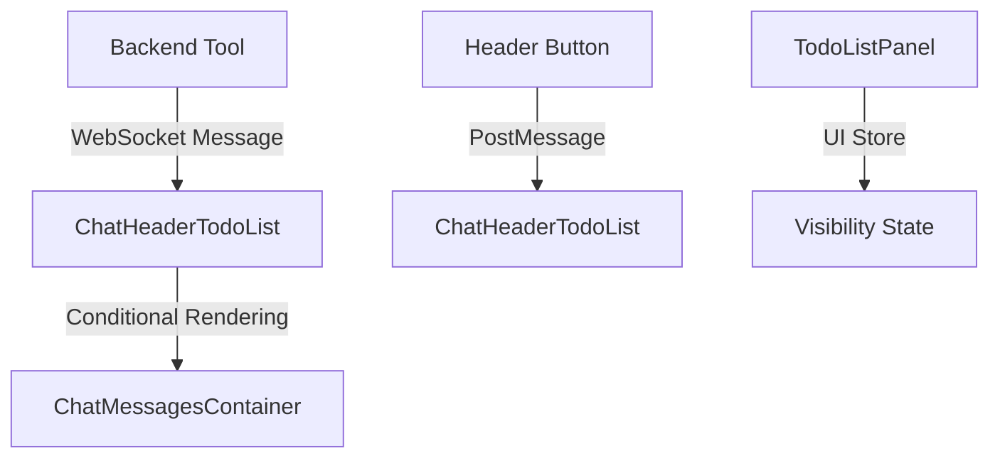
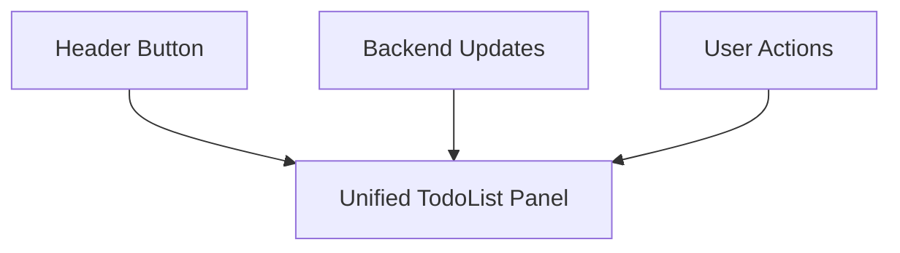

# Unified Todo List Header Panel - Design Document

## 1. Overview

This document outlines the redesign of the Todo List functionality in the AgenticForge application, unifying the two separate todo list interfaces into a single cohesive panel within the header area. The goal is to eliminate user confusion and provide a streamlined todo list management experience directly accessible from the header.

## 2. Current Architecture

### 2.1 Component Structure

The current implementation involves several components that work together to provide todo list functionality:

1. **Header Component** (`Header.tsx`) - Contains the UI button for toggling the todo list visibility
2. **ChatHeaderTodoList Component** (`ChatHeaderTodoList.tsx`) - Displays todo list data in the chat header area
3. **TodoListPanel Component** (`TodoListPanel.tsx`) - A separate panel for full todo list management
4. **Backend Tool** (`manageTodoList.tool.ts`) - Manages todo list data and sends updates to the frontend

### 2.2 Data Flow



### 2.3 Backend Integration

The backend `manageTodoList.tool.ts` sends WebSocket messages with todo data that components listen for. The message format includes:
- Type identifier (`chat_header_todo`)
- Todo data with tasks and statistics
- Timestamp for data freshness

## 3. Identified Issues

### 3.1 Confusion in Header Control

The header contains a "List" button that sends a `toggle_chat_todo_list` message, but this doesn't directly control the visibility of the `ChatHeaderTodoList` component. Instead, the component's visibility is controlled by:

1. Whether todo data has been received via WebSocket messages
2. Its own internal state management

### 3.2 Multiple Todo List Interfaces

There are two distinct todo list interfaces that create user confusion:
1. **Chat Header Todo List** - A compact display in the chat area
2. **Todo List Panel** - A full-featured management panel in a separate floating window

Users are confused about which interface to use and how they relate to each other.

## 4. Proposed Solution

### 4.1 Unified Todo List Panel

Unify the two separate todo list interfaces into a single comprehensive panel that:
1. Appears in the header area when toggled
2. Provides both compact summary and full management capabilities
3. Is directly controlled by the header button

### 4.2 Simplified Architecture



### 4.3 Component Responsibilities

| Component | Responsibility |
|-----------|----------------|
| Header Button | Toggle Unified Todo List Panel visibility |
| Unified TodoList Panel | Display todo summary and provide full management interface |
| Backend Tool | Manage todo list data and send updates |

## 5. Implementation Plan

### 5.1 Header Component Changes

Modify the Header component to directly control the Unified Todo List Panel:

```typescript
{
  icon: List,
  onClick: () => {
    // Toggle the Unified Todo List Panel
    setIsUnifiedTodoListVisible(!isUnifiedTodoListVisible);
  },
  label: "Afficher/Masquer la TodoList",
  ariaLabel: "Toggle TodoList",
  active: isUnifiedTodoListVisible
}
```

### 5.2 Create Unified TodoList Component

Create a new UnifiedTodoListPanel component that combines:
1. The compact summary view from ChatHeaderTodoList
2. The full management interface from TodoListPanel
3. Toggle functionality between summary and detailed views

The component structure should include:
- Header with title, view toggle, and close button
- Stats summary section
- Task list with filtering capabilities
- Task focus view for highlighting selected tasks
- Current task indicator showing which task is being worked on
- Task detail panel that appears when a task is focused
- Add task form
- Project progress visualization (when applicable)

The task detail panel should display:
- Full task description with markdown support
- Priority level with visual indicator
- Status with change options
- Creation and update timestamps
- Category and tags (if applicable)
- Estimated vs. actual time (if tracked) with progress visualization
- Related tasks or dependencies (if applicable) with visual mapping
- Quick action buttons (mark complete, edit, delete)
- Comments or notes section (if applicable)
- Task execution history and timeline
- Resource links and references
- Context-aware suggestions for next steps
- Integration with agent workflow to show current agent actions
- Visual progress indicators for multi-step tasks
- Time tracking controls with start/stop functionality

### 5.3 Position Component in Header

Position the UnifiedTodoListPanel directly below the header when visible:

```jsx
<header>
  {/* Header content */}
</header>
{isUnifiedTodoListVisible && (
  <UnifiedTodoListPanel />
)}
```

### 5.4 Component Styling

The UnifiedTodoListPanel should use:
- Consistent styling with the existing UI design system
- Dark mode support matching the application theme
- Responsive layout that works on different screen sizes
- Smooth transitions for showing/hiding and view toggling
- Proper z-index to appear above other content but below modals

Task focus styling should include:
- Highlighted border or background for focused tasks
- Visual distinction for the current task (different color or animation)
- Smooth transitions when focusing/unfocusing tasks
- Clear visual hierarchy between focused task and other tasks
- Task detail panel that appears when a task is focused

### 5.5 Streamlined Data Flow

The Unified TodoList Panel will respond to both:
1. WebSocket messages from the backend tool for data updates
2. UI control messages from the Header for visibility toggling

## 6. Data Models

### 6.1 Todo Item Structure

```typescript
interface TodoItem {
  id: string;
  content: string;
  status: 'pending' | 'in_progress' | 'completed' | 'blocked' | 'cancelled';
  priority: 'low' | 'medium' | 'high' | 'critical';
  category?: string;
  projectId?: string;
  parentId?: string;
  dependencies?: string[];
  estimatedTime?: number;
  actualTime?: number;
  createdAt: number;
  updatedAt: number;
  assignedTo?: string;
  tags?: string[];
  notes?: string;
  comments?: TaskComment[];
  executionHistory?: TaskExecution[];
  resources?: TaskResource[];
  agentActions?: AgentAction[];
  progress?: number; // 0-100 for multi-step tasks
}

interface TaskComment {
  id: string;
  content: string;
  author: string;
  timestamp: number;
}

interface TaskExecution {
  id: string;
  startTime: number;
  endTime?: number;
  status: 'started' | 'paused' | 'completed' | 'failed';
  notes?: string;
}

interface TaskResource {
  id: string;
  title: string;
  url: string;
  type: 'document' | 'link' | 'file';
}

interface AgentAction {
  id: string;
  action: string;
  timestamp: number;
  status: 'pending' | 'executing' | 'completed' | 'failed';
  result?: string;
}
```

### 6.2 Unified Todo Data Structure

```typescript
interface UnifiedTodoData {
  type: 'unified_todo';
  title: string;
  timestamp: number;
  project?: {
    id: string;
    name: string;
    description: string;
    progress: number;
  };
  tasks?: TodoItem[];
  stats: {
    pending: number;
    in_progress: number;
    completed: number;
    blocked: number;
    cancelled: number;
    total: number;
  };
  agentContext?: {
    currentAgent?: string;
    agentThoughts?: AgentThought[];
    toolExecutions?: ToolExecution[];
    executionProgress?: ExecutionProgress;
  };
  collaborators?: Collaborator[];
}

interface AgentThought {
  id: string;
  agentId: string;
  content: string;
  timestamp: number;
  type: 'reasoning' | 'planning' | 'reflection';
}

interface ToolExecution {
  id: string;
  toolName: string;
  parameters: Record<string, any>;
  result?: any;
  status: 'pending' | 'executing' | 'completed' | 'failed';
  startTime: number;
  endTime?: number;
}

interface ExecutionProgress {
  taskId: string;
  step: number;
  totalSteps: number;
  description: string;
  timestamp: number;
}

interface Collaborator {
  id: string;
  name: string;
  avatar?: string;
  status: 'online' | 'offline' | 'busy';
  currentTaskId?: string;
}
```

### 6.3 Component State Structure

```typescript
interface UnifiedTodoListState {
  isVisible: boolean;
  viewMode: 'summary' | 'detailed';
  todoData: UnifiedTodoData | null;
  filter: 'all' | 'pending' | 'in_progress' | 'completed';
  searchQuery: string;
  isAddingTask: boolean;
  newTaskContent: string;
  newTaskPriority: 'low' | 'medium' | 'high' | 'critical';
  focusedTaskId: string | null;
  currentTaskId: string | null;
  agentViewState: {
    showThoughts: boolean;
    showToolExecution: boolean;
    showProgress: boolean;
  };
  collaborationState: {
    showCollaborators: boolean;
    showPresence: boolean;
  };
  realtimeUpdates: boolean;
}

interface TaskFocusActions {
  setFocusedTask: (taskId: string | null) => void;
  setCurrentTask: (taskId: string | null) => void;
  clearFocus: () => void;
  focusNextTask: () => void;
  focusPreviousTask: () => void;
}

interface AgentIntegrationActions {
  toggleAgentThoughts: () => void;
  toggleToolExecution: () => void;
  toggleProgressView: () => void;
  refreshAgentContext: () => void;
}

interface CollaborationActions {
  toggleCollaborators: () => void;
  togglePresence: () => void;
}
```

## 7. State Management

### 7.1 UI Store Integration

Add new state management to the UI store for the Unified Todo List Panel:

```typescript
interface UIState {
  // ... existing state
  isUnifiedTodoListVisible: boolean;
  setIsUnifiedTodoListVisible: (visible: boolean) => void;
}

// In store implementation
isUnifiedTodoListVisible: false,
setIsUnifiedTodoListVisible: (visible) => set({ isUnifiedTodoListVisible: visible }),
```

### 7.2 Task Focus State Management

Add task focus functionality to the component state:

```typescript
const [focusedTaskId, setFocusedTaskId] = useState<string | null>(null);
const [currentTaskId, setCurrentTaskId] = useState<string | null>(null);

const focusTask = (taskId: string) => {
  setFocusedTaskId(taskId);
  // Scroll to task or highlight it visually
  scrollToTask(taskId);
};

const clearFocus = () => {
  setFocusedTaskId(null);
};

const setCurrentTask = (taskId: string) => {
  setCurrentTaskId(taskId);
  // Optionally also focus the current task
  setFocusedTaskId(taskId);
};
```

### 7.3 WebSocket Communication

The Unified TodoList Panel should receive updates via WebSocket messages from the backend tool:

```typescript
useEffect(() => {
  const handleMessage = (event: MessageEvent) => {
    if (event.data && (event.data.type === 'chat_header_todo' || event.data.type === 'unified_todo')) {
      // Update todo data state
      setTodoData(event.data.data);
      // Optionally show panel when new data arrives
      if (!isUnifiedTodoListVisible) {
        setIsUnifiedTodoListVisible(true);
      }
      
      // Check if a current task is indicated in the data
      if (event.data.data.currentTaskId) {
        setCurrentTaskId(event.data.data.currentTaskId);
      }
    }
  };
  
  window.addEventListener('message', handleMessage);
  return () => window.removeEventListener('message', handleMessage);
}, [isUnifiedTodoListVisible]);
```

## 8. User Experience Improvements

### 8.1 Clear Visual Indicators

- Header button shows active state when Unified Todo List Panel is visible
- Unified Todo List Panel provides both summary and detailed views with clear toggle
- Consistent location directly below header for all todo list interactions
- Visual distinction between summary and detailed modes
- Badges showing task counts on header button
- Clear visual indication of focused tasks
- Distinct styling for current task
- Animated status indicators for real-time updates
- Heatmap visualization for task priority and urgency
- Color-coded categories with consistent palette
- Glowing effects for high-priority current tasks

### 8.2 Consistent Behavior

- Header button consistently toggles the Unified Todo List Panel
- Unified Todo List Panel visibility is directly controlled by user action
- Panel automatically shows when new todo data arrives (with option to disable)
- No conflicting control mechanisms or multiple interfaces
- Smooth animations for panel appearance/disappearance
- Consistent task focus behavior across different views
- Real-time synchronization across multiple devices
- Intelligent caching for offline access
- Automatic conflict resolution for collaborative edits

### 8.3 Enhanced Interaction

- Toggle between summary and detailed views within the same panel
- Direct task management without switching interfaces
- Persistent state across sessions
- Keyboard shortcuts for quick access
- Drag-and-drop task reordering
- Task filtering and search capabilities
- Task focus mode: Clicking on a task highlights it and shows extended details
- Current task tracking: Visual indication of the task currently being worked on
- Task context display: Show related information when a task is focused
- Quick actions for focused tasks (mark as complete, edit, delete)
- Keyboard navigation for task focus (arrow keys, Enter to focus, Esc to clear)
- Real-time progress indicators for in-progress tasks
- Interactive task timeline visualization
- Task dependency mapping and visualization
- Auto-suggestion for task priorities based on deadlines
- Smart task grouping by project, priority, or deadline
- Live collaboration indicators showing who is working on what
- Task execution playback showing step-by-step progress
- AI-powered task insights and suggestions
- Voice command integration for hands-free task management
- Gesture controls for touch devices

### 8.4 Advanced Current Task Display

- Dedicated current task section with prominent positioning
- Real-time progress tracking with animated indicators
- Task execution timer for time management
- Context-aware suggestions for next steps
- Integration with agent workflow to show current agent actions
- Visual connection between current task and related tasks
- Quick access to task resources and references
- Inline editing capabilities for current task details
- Live agent thought stream integration
- Real-time tool execution visualization
- Dynamic task refinement based on agent insights
- Interactive progress breakdown by sub-tasks
- Visual timeline of task evolution and modifications
- Side-by-side comparison of planned vs actual progress
- Predictive completion time estimation
- Automated task checkpoint validation

### 8.5 Responsive Design

- Panel adapts to different screen sizes
- Summary view optimized for narrow screens
- Detailed view optimized for wider screens
- Touch-friendly controls for mobile devices
- Task focus view adapts to screen size
- Current task indicator visible on all screen sizes
- Collapsible sections for better space utilization
- Adaptive layout for task detail views

## 9. Testing Strategy

### 9.1 Unit Tests

1. Test Header button toggles Unified Todo List Panel visibility
2. Test Unified Todo List Panel renders with proper data
3. Test Unified Todo List Panel toggles between summary and detailed views
4. Test task management functionality (add, update, delete)
5. Test filtering and search capabilities
6. Test task focus functionality when clicking on tasks
7. Test current task tracking and visual indication
8. Test agent thought stream integration
9. Test tool execution visualization
10. Test real-time collaboration features

### 9.2 Integration Tests

1. Test complete flow from backend tool to Unified Todo List Panel
2. Test WebSocket message handling
3. Test UI store state management for unified panel
4. Test backward compatibility with existing backend messages
5. Test automatic panel showing when new data arrives
6. Test task focus state persistence
7. Test agent context synchronization
8. Test real-time updates propagation
9. Test conflict resolution in collaborative editing

### 9.3 End-to-End Tests

1. Test user workflow from header button to task management
2. Test responsive design on different screen sizes
3. Test dark mode support
4. Test keyboard navigation and shortcuts
5. Test task focus and current task visualization
6. Test task selection and focus mode behavior
7. Test agent integration features with live data
8. Test real-time collaboration with multiple users
9. Test offline functionality and synchronization
10. Test performance under high load conditions

### 9.4 AI/Agent Integration Tests

1. Test agent thought stream visualization
2. Test tool execution tracking and display
3. Test dynamic task refinement based on agent insights
4. Test predictive completion time estimation
5. Test automated checkpoint validation
6. Test context-aware suggestion generation

## 10. Migration Plan

### 10.1 Phase 1: Create Unified TodoList Panel

1. Create new UnifiedTodoListPanel component
2. Implement both summary and detailed views
3. Add state management for view mode toggling
4. Implement task management functionality
5. Add UI store integration for visibility control
6. Implement responsive design
7. Add dark mode support

### 10.2 Phase 2: Update Header Component

1. Modify the Header button to control Unified Todo List Panel visibility
2. Remove postMessage communication to separate panels
3. Update button active state logic
4. Position UnifiedTodoListPanel directly below header
5. Add task count badges to header button

### 10.3 Phase 3: Migrate Data Handling

1. Update message event listeners to work with unified component
2. Ensure WebSocket messages properly update unified state
3. Maintain backward compatibility with existing backend messages
4. Add automatic panel showing when new data arrives
5. Update backend tool to support new unified component if needed
6. Ensure proper error handling for data updates

### 10.4 Phase 4: Implement Enhanced Features

1. Add task filtering and search capabilities
2. Implement drag-and-drop task reordering
3. Add keyboard shortcuts
4. Implement animations and transitions
5. Add task focus functionality
6. Implement current task tracking
7. Create task detail view for focused tasks
8. Integrate agent workflow visualization
9. Add live collaboration features
10. Implement AI-powered task insights

### 10.5 Phase 5: Advanced Agent Integration

1. Integrate live agent thought stream
2. Implement real-time tool execution visualization
3. Add dynamic task refinement based on agent insights
4. Create interactive progress breakdown
5. Implement predictive completion time estimation
6. Add automated task checkpoint validation

### 10.6 Phase 6: Remove Redundant Components

1. Remove separate ChatHeaderTodoList and TodoListPanel components
2. Clean up unused CSS and dependencies
3. Update imports throughout the application
4. Remove unused state from UI store

### 10.7 Phase 7: Testing and Refinement

1. Test all functionality in unified panel
2. Verify header button behavior
3. Test WebSocket message handling
4. Validate responsive design
5. Test dark mode support
6. Validate keyboard navigation
7. Test agent integration features
8. Validate real-time collaboration

### 10.8 Phase 8: Update Documentation

1. Update component documentation for unified panel
2. Clarify user interaction patterns with single interface
3. Provide clear examples of expected behavior
4. Update screenshots and diagrams
5. Document agent integration features

## 11. Conclusion

The unified todo list panel with advanced interactive features and agent integration will provide users with a powerful, intuitive task management experience. By combining the functionality of multiple separate panels into a single cohesive interface, users will have clearer control over their tasks while benefiting from real-time agent insights and collaboration features. The enhanced current task display with live agent thought stream integration will give users unprecedented visibility into the task execution process, making it easier to understand and guide the AI assistant's work.

