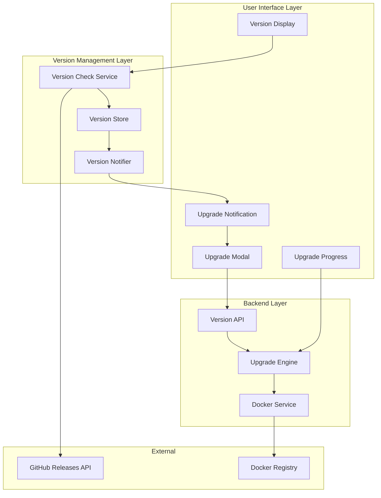
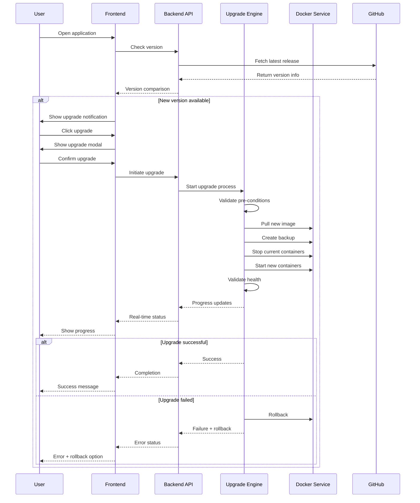

# Version Upgrade System Design

## Overview

This design document outlines the implementation of an automated version upgrade system for AgenticForge. The system will enable users to receive notifications when new versions are available and provide mechanisms to upgrade their distribution directly from the web interface.

## Architecture

The upgrade system consists of three main components:



## Component Architecture

### 1. Version Detection System

#### Version Check Service
```typescript
interface VersionCheckService {
  checkForUpdates(): Promise<VersionInfo>
  getCurrentVersion(): Promise<string>
  compareVersions(current: string, latest: string): VersionComparison
  schedulePeriodicCheck(interval: number): void
}

interface VersionInfo {
  current: string
  latest: string
  hasUpdate: boolean
  releaseNotes: string
  releaseDate: Date
  severity: 'patch' | 'minor' | 'major'
  downloadUrl: string
}
```

#### Version Storage
- Local storage for current version cache
- Redis cache for version check results (TTL: 1 hour)
- PostgreSQL for upgrade history and user preferences

### 2. User Interface Components

#### Enhanced Version Display
Extends the existing `VersionDisplay` component:
```typescript
interface VersionDisplayProps {
  showUpdateIndicator: boolean
  onUpdateClick: () => void
  position: 'bottom-right' | 'header' | 'sidebar'
}
```

#### Upgrade Notification System
```typescript
interface UpgradeNotification {
  version: string
  severity: 'patch' | 'minor' | 'major'
  features: string[]
  bugFixes: string[]
  breakingChanges?: string[]
  estimatedDowntime: number
}
```

#### Upgrade Modal Interface
- Version comparison table
- Release notes preview
- Upgrade options (immediate, scheduled, dismiss)
- Progress tracking
- Rollback options

### 3. Backend Upgrade Engine

#### Upgrade Orchestration
```typescript
interface UpgradeEngine {
  initiateUpgrade(version: string, options: UpgradeOptions): Promise<UpgradeSession>
  monitorUpgrade(sessionId: string): Promise<UpgradeStatus>
  rollbackUpgrade(sessionId: string): Promise<RollbackResult>
  validatePreConditions(): Promise<ValidationResult>
}

interface UpgradeOptions {
  immediate: boolean
  scheduledTime?: Date
  backupEnabled: boolean
  rollbackOnFailure: boolean
}
```

#### Docker Service Integration
- Image pulling and verification
- Container replacement strategy
- Volume and data migration
- Health check validation

## Data Models

### Version Entity
```typescript
interface Version {
  id: string
  version: string
  releaseDate: Date
  releaseNotes: string
  dockerImage: string
  severity: 'patch' | 'minor' | 'major'
  preRequisites: string[]
  migrationScripts?: string[]
}
```

### Upgrade Session
```typescript
interface UpgradeSession {
  id: string
  userId: string
  fromVersion: string
  toVersion: string
  status: 'pending' | 'running' | 'completed' | 'failed' | 'rolled_back'
  startTime: Date
  endTime?: Date
  progress: number
  logs: UpgradeLog[]
  rollbackAvailable: boolean
}
```

## API Endpoints Reference

### Version Management
- `GET /api/version/current` - Get current version
- `GET /api/version/latest` - Check for latest version
- `GET /api/version/check` - Compare current vs latest
- `GET /api/version/releases` - List available releases

### Upgrade Operations
- `POST /api/upgrade/initiate` - Start upgrade process
- `GET /api/upgrade/{sessionId}/status` - Get upgrade status
- `POST /api/upgrade/{sessionId}/rollback` - Rollback upgrade
- `GET /api/upgrade/history` - Get upgrade history

### Configuration
- `GET /api/upgrade/settings` - Get user preferences
- `PUT /api/upgrade/settings` - Update user preferences

## Business Logic Layer

### Version Comparison Logic
```typescript
class VersionComparator {
  static compare(v1: string, v2: string): -1 | 0 | 1
  static isNewer(current: string, latest: string): boolean
  static getSeverity(current: string, latest: string): 'patch' | 'minor' | 'major'
  static getUpgradePath(from: string, to: string): Version[]
}
```

### Upgrade Strategy Selection
- **Zero-downtime**: Rolling update for non-breaking changes
- **Maintenance window**: Scheduled downtime for major updates
- **Blue-green deployment**: For critical production environments

### Safety Mechanisms
- Pre-upgrade validation checks
- Automatic backup creation
- Rollback capability within 24 hours
- Data migration validation

## Upgrade Process Flow



## User Experience Design

### Notification Behavior
- **Subtle indicator**: Small badge on version display for minor updates
- **Prominent notification**: Modal or banner for major updates
- **Configurable frequency**: User can set notification preferences

### Upgrade Options
1. **Immediate upgrade**: Execute upgrade now
2. **Scheduled upgrade**: Set maintenance window
3. **Remind later**: Postpone notification (1 day, 1 week, 1 month)
4. **Skip version**: Ignore this specific version

### Progress Tracking
- Real-time progress indicator
- Detailed logs in collapsible section
- Estimated time remaining
- Current step description

## Testing Strategy

### Unit Testing
- Version comparison logic
- Upgrade state management
- API endpoint validation
- UI component behavior

### Integration Testing
- Version check service integration
- Docker service communication
- Database transaction handling
- WebSocket real-time updates

### End-to-End Testing
```typescript
describe('Version Upgrade Flow', () => {
  it('should detect new version and show notification', async () => {
    // Mock new version available
    // Verify notification appears
    // Test upgrade modal functionality
  })
  
  it('should complete upgrade successfully', async () => {
    // Initiate upgrade process
    // Monitor progress updates
    // Verify successful completion
  })
  
  it('should rollback on upgrade failure', async () => {
    // Simulate upgrade failure
    // Verify automatic rollback
    // Confirm system restoration
  })
})
```

## Configuration Management

### Environment Variables
```bash
# Version check settings
VERSION_CHECK_ENABLED=true
VERSION_CHECK_INTERVAL=3600000  # 1 hour in ms
VERSION_CHECK_URL=https://api.github.com/repos/user/AgenticForge/releases/latest

# Upgrade settings
UPGRADE_ENABLED=true
UPGRADE_BACKUP_ENABLED=true
UPGRADE_ROLLBACK_TIMEOUT=86400000  # 24 hours in ms
UPGRADE_MAX_RETRIES=3
```

### User Preferences
```typescript
interface UpgradePreferences {
  autoCheckEnabled: boolean
  notificationFrequency: 'immediate' | 'daily' | 'weekly'
  autoBackupEnabled: boolean
  allowMajorUpgrades: boolean
  maintenanceWindow?: {
    start: string  // HH:mm format
    end: string
    timezone: string
  }
}
```

## Security Considerations

### Upgrade Authentication
- Require admin token for upgrade operations
- Implement upgrade session tokens with expiration
- Log all upgrade attempts with user identification

### Image Verification
- Verify Docker image signatures
- Check image SHA256 hashes
- Validate source registry authenticity

### Data Protection
- Automatic backup before upgrade
- Encrypted backup storage
- Secure cleanup of old versions

## Current Issues & Solutions

### Issue: Version Display Not Working
The current `VersionDisplay` component attempts to fetch `/VERSION.md` directly, but this file is not served by the web server.

#### Root Cause Analysis
1. Frontend tries to fetch `/VERSION.md` via HTTP request
2. No API endpoint exists to serve version information
3. The VERSION.md file is not accessible from the web interface
4. Missing backend integration for version management

#### Immediate Fix Required
```typescript
// Current broken implementation in VersionDisplay.tsx
const response = await fetch('/VERSION.md'); // This fails

// Fixed implementation should use API endpoint
const response = await fetch('/api/version/current', {
  headers: {
    'Authorization': `Bearer ${authToken}`
  }
});
```

### Solution: Enhanced Version System

#### 1. Backend API Endpoint Implementation
Add version endpoint to `webServer.ts`:
```typescript
// Version API endpoint
app.get('/api/version/current', 
  async (req: express.Request, res: express.Response) => {
    try {
      const packageJson = await import('../package.json', { assert: { type: 'json' } });
      const version = packageJson.default.version;
      
      const versionInfo = {
        current: version,
        buildDate: new Date().toISOString(),
        services: {
          web: 'http://localhost:3002',
          api: 'http://localhost:8080'
        }
      };
      
      res.json(versionInfo);
    } catch (error) {
      next(error);
    }
  }
);
```

#### 2. Fixed VersionDisplay Component
```typescript
import { useEffect, useState } from 'react';
import { clientConfig } from '../config';

interface VersionInfo {
  current: string;
  buildDate: string;
  services: {
    web: string;
    api: string;
  };
}

export function VersionDisplay() {
  const [versionInfo, setVersionInfo] = useState<VersionInfo | null>(null);
  const [error, setError] = useState<string | null>(null);

  useEffect(() => {
    const fetchVersion = async () => {
      try {
        const response = await fetch('/api/version/current', {
          headers: {
            'Authorization': `Bearer ${clientConfig.AUTH_TOKEN}`,
            'Content-Type': 'application/json'
          }
        });
        
        if (response.ok) {
          const data = await response.json();
          setVersionInfo(data);
          setError(null);
        } else {
          throw new Error(`HTTP ${response.status}: ${response.statusText}`);
        }
      } catch (err) {
        console.error('Error fetching version:', err);
        setError(err instanceof Error ? err.message : 'Unknown error');
        // Fallback to package.json version if API fails
        setVersionInfo({
          current: '1.0.303', // From package.json
          buildDate: new Date().toISOString(),
          services: { web: 'localhost:3002', api: 'localhost:8080' }
        });
      }
    };

    fetchVersion();
  }, []);

  if (error && !versionInfo) {
    return (
      <div className="fixed bottom-4 right-4 text-xs text-red-500 bg-background/80 backdrop-blur-sm px-2 py-1 rounded">
        Version unavailable
      </div>
    );
  }

  if (!versionInfo) {
    return null;
  }

  return (
    <div className="fixed bottom-4 right-4 text-xs text-muted-foreground bg-background/80 backdrop-blur-sm px-2 py-1 rounded hover:bg-background/90 transition-colors">
      <div className="flex items-center gap-2">
        <span>v{versionInfo.current}</span>
        {error && (
          <span className="text-yellow-500" title={error}>⚠</span>
        )}
      </div>
    </div>
  );
}
```

#### 3. Environment Configuration
Ensure proper Vite configuration for AUTH_TOKEN access:
```typescript
// In vite.config.ts
define: {
  'import.meta.env.VITE_AUTH_TOKEN': JSON.stringify(rootEnv.AUTH_TOKEN || process.env.AUTH_TOKEN || ''),
}
```

## Implementation Timeline

### Phase 0: Critical Fix (Immediate - 2 hours)
- Fix VersionDisplay component to use API endpoint
- Add `/api/version/current` endpoint to backend
- Test version display functionality

### Phase 1: Core Infrastructure (2 weeks)
- Version check service implementation
- GitHub API integration for latest releases
- Database schema setup for upgrade tracking

### Phase 2: User Interface (1.5 weeks)
- Enhanced version display component with update indicators
- Upgrade notification system
- Basic upgrade modal with release notes

### Phase 3: Upgrade Engine (2.5 weeks)
- Docker service integration
- Upgrade orchestration logic
- Progress tracking system

### Phase 4: Advanced Features (1 week)
- Scheduled upgrades
- Rollback mechanism
- User preferences

### Phase 5: Testing & Polish (1 week)
- Comprehensive testing
- Error handling refinement
- Documentation updates

## Quick Implementation Guide

### Step 1: Complete Backend Implementation

#### 1.1 Version API Endpoints (Backend - webServer.ts)
```typescript
// Add these imports at the top of webServer.ts
import fs from 'fs';
import path from 'path';
import { fileURLToPath } from 'url';

// Add after existing API routes
// Get current version info
app.get('/api/version/current', 
  async (req: express.Request, res: express.Response, next: express.NextFunction) => {
    try {
      // Get package.json from core package
      const packageJsonPath = path.join(process.cwd(), 'packages', 'core', 'package.json');
      const packageJson = JSON.parse(fs.readFileSync(packageJsonPath, 'utf8'));
      
      // Get root package.json for monorepo info
      const rootPackageJsonPath = path.join(process.cwd(), 'package.json');
      const rootPackageJson = JSON.parse(fs.readFileSync(rootPackageJsonPath, 'utf8'));
      
      const versionInfo = {
        current: packageJson.version,
        name: packageJson.name,
        description: packageJson.description,
        rootName: rootPackageJson.name,
        buildDate: fs.statSync(packageJsonPath).mtime.toISOString(),
        services: {
          web: `http://localhost:${process.env.WEB_PORT || 3002}`,
          api: `http://localhost:${config.PORT || 3001}`,
          postgres: `${config.POSTGRES_HOST}:${config.POSTGRES_PORT}`,
          redis: `${config.REDIS_HOST}:${config.REDIS_PORT}`
        },
        environment: process.env.NODE_ENV || 'development',
        repository: rootPackageJson.repository?.url || '',
        homepage: rootPackageJson.homepage || ''
      };
      
      getLoggerInstance().info({ version: versionInfo.current }, 'Version info requested');
      res.json(versionInfo);
    } catch (error) {
      getLoggerInstance().error({ error }, 'Failed to get version info');
      next(error);
    }
  }
);

// Check for updates against GitHub releases
app.get('/api/version/check',
  async (req: express.Request, res: express.Response, next: express.NextFunction) => {
    try {
      const versionService = new VersionService();
      const current = await versionService.getCurrentVersion();
      
      let latestRelease;
      try {
        latestRelease = await versionService.getLatestRelease();
      } catch (githubError) {
        getLoggerInstance().warn({ error: githubError }, 'GitHub API unavailable, using cached data');
        // Return current version info without update check
        return res.json({
          current,
          latest: current,
          hasUpdate: false,
          error: 'Unable to check for updates',
          lastChecked: new Date().toISOString()
        });
      }
      
      const comparison = versionService.compareVersions(current, latestRelease.tag_name.replace(/^v/, ''));
      
      const result = {
        current,
        latest: latestRelease.tag_name.replace(/^v/, ''),
        hasUpdate: comparison.hasUpdate,
        severity: comparison.severity,
        releaseNotes: latestRelease.body,
        releaseDate: latestRelease.published_at,
        downloadUrl: `https://github.com/${versionService.getRepositoryPath()}/releases/tag/${latestRelease.tag_name}`,
        lastChecked: new Date().toISOString()
      };
      
      // Cache result in Redis for 1 hour
      const redisClient = getRedisClientInstance();
      await redisClient.setex('version:check:result', 3600, JSON.stringify(result));
      
      res.json(result);
    } catch (error) {
      getLoggerInstance().error({ error }, 'Failed to check version updates');
      next(error);
    }
  }
);

// Get release history
app.get('/api/version/releases',
  async (req: express.Request, res: express.Response, next: express.NextFunction) => {
    try {
      const versionService = new VersionService();
      const releases = await versionService.getReleases(10); // Get last 10 releases
      
      const formattedReleases = releases.map(release => ({
        version: release.tag_name.replace(/^v/, ''),
        name: release.name,
        notes: release.body,
        date: release.published_at,
        prerelease: release.prerelease,
        downloadUrl: `https://github.com/${versionService.getRepositoryPath()}/releases/tag/${release.tag_name}`
      }));
      
      res.json(formattedReleases);
    } catch (error) {
      getLoggerInstance().error({ error }, 'Failed to get release history');
      next(error);
    }
  }
);
```

#### 1.2 Enhanced Version Service Implementation
```typescript
// packages/core/src/modules/version/versionService.ts
import { z } from 'zod';
import fs from 'fs';
import path from 'path';
import { getLoggerInstance } from '../../logger.js';
import { getRedisClientInstance } from '../redis/redisClient.js';

const GitHubReleaseSchema = z.object({
  tag_name: z.string(),
  name: z.string(),
  body: z.string(),
  published_at: z.string(),
  prerelease: z.boolean(),
  draft: z.boolean(),
  assets: z.array(z.object({
    name: z.string(),
    download_count: z.number(),
    browser_download_url: z.string()
  })).optional()
});

const GitHubReleasesSchema = z.array(GitHubReleaseSchema);

export class VersionService {
  private readonly githubRepo: string;
  private readonly logger = getLoggerInstance();
  private readonly redis = getRedisClientInstance();

  constructor() {
    // Try to get repository info from package.json
    try {
      const rootPackageJsonPath = path.join(process.cwd(), 'package.json');
      const rootPackageJson = JSON.parse(fs.readFileSync(rootPackageJsonPath, 'utf8'));
      
      if (rootPackageJson.repository?.url) {
        // Extract owner/repo from GitHub URL
        const match = rootPackageJson.repository.url.match(/github\.com[/:]([^/]+)\/([^/.]+)/);
        if (match) {
          this.githubRepo = `${match[1]}/${match[2]}`;
        } else {
          this.githubRepo = 'Jboner-Corvus/AgenticForge'; // Fallback
        }
      } else {
        this.githubRepo = 'Jboner-Corvus/AgenticForge'; // Fallback
      }
    } catch (error) {
      this.logger.warn({ error }, 'Could not determine repository from package.json');
      this.githubRepo = 'Jboner-Corvus/AgenticForge'; // Fallback
    }
  }

  getRepositoryPath(): string {
    return this.githubRepo;
  }

  async getCurrentVersion(): Promise<string> {
    try {
      const packageJsonPath = path.join(process.cwd(), 'packages', 'core', 'package.json');
      const packageJson = JSON.parse(fs.readFileSync(packageJsonPath, 'utf8'));
      return packageJson.version;
    } catch (error) {
      this.logger.error({ error }, 'Failed to get current version');
      return '0.0.0';
    }
  }

  async getLatestRelease() {
    // Check cache first
    const cacheKey = 'github:latest_release';
    const cached = await this.redis.get(cacheKey);
    
    if (cached) {
      try {
        return GitHubReleaseSchema.parse(JSON.parse(cached));
      } catch (parseError) {
        this.logger.warn({ error: parseError }, 'Invalid cached release data');
      }
    }

    // Fetch from GitHub API
    const url = `https://api.github.com/repos/${this.githubRepo}/releases/latest`;
    const response = await fetch(url, {
      headers: {
        'Accept': 'application/vnd.github.v3+json',
        'User-Agent': 'AgenticForge-VersionChecker'
      }
    });
    
    if (!response.ok) {
      throw new Error(`GitHub API error: ${response.status} ${response.statusText}`);
    }
    
    const data = await response.json();
    const release = GitHubReleaseSchema.parse(data);
    
    // Cache for 30 minutes
    await this.redis.setex(cacheKey, 1800, JSON.stringify(release));
    
    return release;
  }

  async getReleases(limit: number = 10) {
    const cacheKey = `github:releases:${limit}`;
    const cached = await this.redis.get(cacheKey);
    
    if (cached) {
      try {
        return GitHubReleasesSchema.parse(JSON.parse(cached));
      } catch (parseError) {
        this.logger.warn({ error: parseError }, 'Invalid cached releases data');
      }
    }

    const url = `https://api.github.com/repos/${this.githubRepo}/releases?per_page=${limit}`;
    const response = await fetch(url, {
      headers: {
        'Accept': 'application/vnd.github.v3+json',
        'User-Agent': 'AgenticForge-VersionChecker'
      }
    });
    
    if (!response.ok) {
      throw new Error(`GitHub API error: ${response.status} ${response.statusText}`);
    }
    
    const data = await response.json();
    const releases = GitHubReleasesSchema.parse(data);
    
    // Cache for 15 minutes
    await this.redis.setex(cacheKey, 900, JSON.stringify(releases));
    
    return releases;
  }

  compareVersions(current: string, latest: string): VersionComparison {
    const parseVersion = (v: string) => {
      const cleaned = v.replace(/^v/, '').replace(/-.*$/, ''); // Remove 'v' prefix and suffix
      return cleaned.split('.').map(part => {
        const num = parseInt(part, 10);
        return isNaN(num) ? 0 : num;
      });
    };
    
    const currentParts = parseVersion(current);
    const latestParts = parseVersion(latest);
    const maxLength = Math.max(currentParts.length, latestParts.length);

    for (let i = 0; i < maxLength; i++) {
      const currentPart = currentParts[i] || 0;
      const latestPart = latestParts[i] || 0;
      
      if (currentPart < latestPart) {
        return {
          hasUpdate: true,
          severity: i === 0 ? 'major' : i === 1 ? 'minor' : 'patch',
          current,
          latest
        };
      } else if (currentPart > latestPart) {
        return { hasUpdate: false, severity: 'none', current, latest };
      }
    }
    
    return { hasUpdate: false, severity: 'none', current, latest };
  }
}

interface VersionComparison {
  hasUpdate: boolean;
  severity: 'major' | 'minor' | 'patch' | 'none';
  current: string;
  latest: string;
}

// Export singleton instance
export const versionService = new VersionService();
```

#### 1.3 Module Export Configuration
```typescript
// packages/core/src/modules/version/index.ts
export { VersionService, versionService } from './versionService.js';
export type { VersionComparison } from './versionService.js';
```

#### 1.4 Update webServer.ts imports
```typescript
// Add to existing imports in webServer.ts
import { VersionService } from './modules/version/index.js';
```

2. **Update VersionDisplay Component** (Frontend):
```typescript
// Replace existing VersionDisplay.tsx content
import { useEffect, useState } from 'react';
import { clientConfig } from '../config';

interface VersionInfo {
  current: string;
  name: string;
  buildDate: string;
  services: Record<string, string>;
  environment: string;
}

export function VersionDisplay() {
  const [versionInfo, setVersionInfo] = useState<VersionInfo | null>(null);
  const [isLoading, setIsLoading] = useState(true);
  const [error, setError] = useState<string | null>(null);

  useEffect(() => {
    const fetchVersion = async () => {
      setIsLoading(true);
      try {
        const response = await fetch('/api/version/current', {
          headers: {
            'Authorization': `Bearer ${clientConfig.AUTH_TOKEN}`,
            'Content-Type': 'application/json'
          }
        });
        
        if (response.ok) {
          const data = await response.json();
          setVersionInfo(data);
          setError(null);
        } else {
          throw new Error(`Version API error: ${response.status}`);
        }
      } catch (err) {
        console.error('Version fetch error:', err);
        setError(err instanceof Error ? err.message : 'Unknown error');
        // Graceful fallback
        setVersionInfo({
          current: '1.0.303',
          name: '@gforge/core',
          buildDate: new Date().toISOString(),
          services: {},
          environment: 'unknown'
        });
      } finally {
        setIsLoading(false);
      }
    };

    fetchVersion();
  }, []);

  if (isLoading) {
    return (
      <div className="fixed bottom-4 right-4 text-xs text-muted-foreground bg-background/80 backdrop-blur-sm px-2 py-1 rounded animate-pulse">
        Loading...
      </div>
    );
  }

  if (!versionInfo) {
    return null;
  }

  return (
    <div className="fixed bottom-4 right-4 text-xs text-muted-foreground bg-background/80 backdrop-blur-sm px-2 py-1 rounded hover:bg-background/90 transition-all duration-200 cursor-pointer group"
         title={`Build: ${new Date(versionInfo.buildDate).toLocaleString()}\nEnvironment: ${versionInfo.environment}${error ? `\nWarning: ${error}` : ''}`}>
      <div className="flex items-center gap-2">
        <span className="font-mono">v{versionInfo.current}</span>
        {versionInfo.environment === 'development' && (
          <span className="text-blue-400 text-[10px]">DEV</span>
        )}
        {error && (
          <span className="text-yellow-500 opacity-70 group-hover:opacity-100" title={error}>⚠</span>
        )}
      </div>
    </div>
  );
}
```

### Step 2: Enhanced Version System Components

#### Version Check Service
```typescript
// packages/core/src/modules/version/versionService.ts
import { z } from 'zod';
import { getLoggerInstance } from '../../logger.js';

const GitHubReleaseSchema = z.object({
  tag_name: z.string(),
  name: z.string(),
  body: z.string(),
  published_at: z.string(),
  prerelease: z.boolean(),
  draft: z.boolean()
});

export class VersionService {
  private readonly githubRepo = 'user/AgenticForge'; // Update with actual repo
  private readonly logger = getLoggerInstance();

  async getCurrentVersion(): Promise<string> {
    try {
      const packageJson = await import('../../package.json', { assert: { type: 'json' } });
      return packageJson.default.version;
    } catch (error) {
      this.logger.error({ error }, 'Failed to get current version');
      return '0.0.0';
    }
  }

  async getLatestRelease() {
    try {
      const response = await fetch(`https://api.github.com/repos/${this.githubRepo}/releases/latest`);
      if (!response.ok) {
        throw new Error(`GitHub API error: ${response.status}`);
      }
      
      const data = await response.json();
      return GitHubReleaseSchema.parse(data);
    } catch (error) {
      this.logger.error({ error }, 'Failed to fetch latest release');
      throw error;
    }
  }

  compareVersions(current: string, latest: string): VersionComparison {
    const parseVersion = (v: string) => v.replace(/^v/, '').split('.').map(Number);
    const currentParts = parseVersion(current);
    const latestParts = parseVersion(latest);

    for (let i = 0; i < Math.max(currentParts.length, latestParts.length); i++) {
      const currentPart = currentParts[i] || 0;
      const latestPart = latestParts[i] || 0;
      
      if (currentPart < latestPart) {
        return {
          hasUpdate: true,
          severity: i === 0 ? 'major' : i === 1 ? 'minor' : 'patch',
          current,
          latest
        };
      } else if (currentPart > latestPart) {
        return { hasUpdate: false, severity: 'none', current, latest };
      }
    }
    
    return { hasUpdate: false, severity: 'none', current, latest };
  }
}

interface VersionComparison {
  hasUpdate: boolean;
  severity: 'major' | 'minor' | 'patch' | 'none';
  current: string;
  latest: string;
}
```

#### Frontend Version Store
```typescript
// packages/ui/src/store/versionStore.ts
import { create } from 'zustand';
import { clientConfig } from '../config';

interface VersionState {
  currentVersion: string | null;
  latestVersion: string | null;
  hasUpdate: boolean;
  isChecking: boolean;
  lastChecked: Date | null;
  error: string | null;
  
  // Actions
  checkForUpdates: () => Promise<void>;
  dismissUpdate: () => void;
  reset: () => void;
}

export const useVersionStore = create<VersionState>((set, get) => ({
  currentVersion: null,
  latestVersion: null,
  hasUpdate: false,
  isChecking: false,
  lastChecked: null,
  error: null,

  checkForUpdates: async () => {
    set({ isChecking: true, error: null });
    
    try {
      const response = await fetch('/api/version/check', {
        headers: {
          'Authorization': `Bearer ${clientConfig.AUTH_TOKEN}`,
          'Content-Type': 'application/json'
        }
      });
      
      if (!response.ok) {
        throw new Error(`Version check failed: ${response.status}`);
      }
      
      const data = await response.json();
      
      set({
        currentVersion: data.current,
        latestVersion: data.latest,
        hasUpdate: data.hasUpdate,
        lastChecked: new Date(),
        isChecking: false,
        error: null
      });
    } catch (error) {
      set({
        isChecking: false,
        error: error instanceof Error ? error.message : 'Version check failed'
      });
    }
  },

  dismissUpdate: () => {
    set({ hasUpdate: false });
  },

  reset: () => {
    set({
      currentVersion: null,
      latestVersion: null,
      hasUpdate: false,
      isChecking: false,
      lastChecked: null,
      error: null
    });
  }
}));
```

## Monitoring and Analytics

### Metrics Collection
- Upgrade success/failure rates
- Average upgrade duration
- User adoption of new versions
- Rollback frequency

### Error Tracking
- Upgrade failure reasons
- Performance bottlenecks
- User experience issues

### Alerting
- Failed upgrades notification
- System health degradation
- Unusual upgrade patterns

## GitHub Distribution Configuration

### Repository Setup Requirements

#### 1. Release Workflow Configuration
```yaml
# .github/workflows/release.yml
name: Release

on:
  push:
    tags:
      - 'v*'
  workflow_dispatch:
    inputs:
      version_type:
        description: 'Version type (patch, minor, major)'
        required: true
        default: 'patch'
        type: choice
        options:
          - patch
          - minor
          - major

jobs:
  build-and-release:
    runs-on: ubuntu-latest
    permissions:
      contents: write
      packages: write
    
    steps:
      - name: Checkout code
        uses: actions/checkout@v4
        with:
          fetch-depth: 0
      
      - name: Setup Node.js
        uses: actions/setup-node@v4
        with:
          node-version: '20'
          cache: 'pnpm'
      
      - name: Setup pnpm
        uses: pnpm/action-setup@v2
        with:
          version: latest
      
      - name: Install dependencies
        run: pnpm install --frozen-lockfile
      
      - name: Build packages
        run: pnpm build
      
      - name: Run tests
        run: pnpm test
      
      - name: Build Docker images
        run: |
          docker build -t agenticforge:${{ github.ref_name }} .
          docker build -f packages/ui/Dockerfile.web.nginx -t agenticforge-ui:${{ github.ref_name }} packages/ui
      
      - name: Create distribution archive
        run: |
          mkdir -p dist-release
          
          # Copy essential files
          cp -r packages/core/dist dist-release/core
          cp -r packages/ui/dist dist-release/ui
          cp docker-compose.yml dist-release/
          cp Dockerfile dist-release/
          cp packages/ui/Dockerfile.web.nginx dist-release/
          cp .env.example dist-release/
          cp README.md dist-release/
          cp VERSION.md dist-release/
          
          # Create installation script
          cat > dist-release/install.sh << 'EOF'
          #!/bin/bash
          set -e
          
          echo "Installing AgenticForge..."
          
          # Check Docker
          if ! command -v docker &> /dev/null; then
              echo "Docker is required but not installed."
              exit 1
          fi
          
          # Check Docker Compose
          if ! command -v docker-compose &> /dev/null && ! docker compose version &> /dev/null; then
              echo "Docker Compose is required but not installed."
              exit 1
          fi
          
          # Copy environment file
          if [ ! -f .env ]; then
              cp .env.example .env
              echo "Please edit .env file with your configuration"
          fi
          
          # Start services
          docker-compose up -d
          
          echo "AgenticForge installed successfully!"
          echo "Access the application at http://localhost:3002"
          EOF
          
          chmod +x dist-release/install.sh
          
          # Create archive
          tar -czf agenticforge-${{ github.ref_name }}.tar.gz -C dist-release .
          zip -r agenticforge-${{ github.ref_name }}.zip dist-release/
      
      - name: Generate release notes
        id: release_notes
        run: |
          if [ -f CHANGELOG.md ]; then
            # Extract current version changes from CHANGELOG
            sed -n "/## \[${{ github.ref_name }}\]/,/## \[/p" CHANGELOG.md | head -n -1 > release_notes.md
          else
            # Generate basic release notes
            echo "## Release ${{ github.ref_name }}" > release_notes.md
            echo "" >> release_notes.md
            echo "### Changes" >> release_notes.md
            git log --pretty=format:"- %s" $(git describe --tags --abbrev=0 HEAD^)..HEAD >> release_notes.md
          fi
      
      - name: Create GitHub Release
        uses: softprops/action-gh-release@v1
        with:
          body_path: release_notes.md
          files: |
            agenticforge-${{ github.ref_name }}.tar.gz
            agenticforge-${{ github.ref_name }}.zip
          draft: false
          prerelease: ${{ contains(github.ref_name, '-') }}
        env:
          GITHUB_TOKEN: ${{ secrets.GITHUB_TOKEN }}
```

#### 2. Version Management Script
```bash
# scripts/release.sh
#!/bin/bash
set -e

# Version management script
USAGE="Usage: $0 [patch|minor|major]"

if [ $# -ne 1 ]; then
    echo "$USAGE"
    exit 1
fi

VERSION_TYPE=$1

if [[ ! "$VERSION_TYPE" =~ ^(patch|minor|major)$ ]]; then
    echo "Invalid version type. $USAGE"
    exit 1
fi

echo "Creating $VERSION_TYPE release..."

# Ensure we're on main branch
if [ "$(git branch --show-current)" != "main" ]; then
    echo "Error: Must be on main branch to create release"
    exit 1
fi

# Ensure working directory is clean
if [ -n "$(git status --porcelain)" ]; then
    echo "Error: Working directory is not clean"
    exit 1
fi

# Get current version from package.json
CURRENT_VERSION=$(node -p "require('./packages/core/package.json').version")
echo "Current version: $CURRENT_VERSION"

# Calculate new version
IFS='.' read -ra VERSION_PARTS <<< "$CURRENT_VERSION"
MAJOR=${VERSION_PARTS[0]}
MINOR=${VERSION_PARTS[1]}
PATCH=${VERSION_PARTS[2]}

case $VERSION_TYPE in
    "major")
        MAJOR=$((MAJOR + 1))
        MINOR=0
        PATCH=0
        ;;
    "minor")
        MINOR=$((MINOR + 1))
        PATCH=0
        ;;
    "patch")
        PATCH=$((PATCH + 1))
        ;;
esac

NEW_VERSION="$MAJOR.$MINOR.$PATCH"
echo "New version: $NEW_VERSION"

# Update package.json files
node -e "
  const fs = require('fs');
  const path = require('path');
  
  // Update core package.json
  const corePackage = JSON.parse(fs.readFileSync('packages/core/package.json', 'utf8'));
  corePackage.version = '$NEW_VERSION';
  fs.writeFileSync('packages/core/package.json', JSON.stringify(corePackage, null, 2) + '\n');
  
  // Update root package.json
  const rootPackage = JSON.parse(fs.readFileSync('package.json', 'utf8'));
  rootPackage.version = '$NEW_VERSION';
  fs.writeFileSync('package.json', JSON.stringify(rootPackage, null, 2) + '\n');
  
  console.log('Updated package.json files');
"

# Update VERSION.md
cat > VERSION.md << EOF
# Version Actuelle

## AgenticForge v$NEW_VERSION

### Packages
- **@gforge/core**: v$NEW_VERSION
- **g-forge-monorepo**: v$NEW_VERSION

### Dernière mise à jour
$(date '+%A %d %B %Y à %H:%M')

### Informations de build
- **Date du build**: $(date '+%A %d %B %Y à %H:%M')
- **Statut**: Succès

### Services Docker
- **Interface Web**: http://localhost:3002
- **API**: http://localhost:8080
- **PostgreSQL**: port 5432
- **Redis**: port 6379

Ce fichier est automatiquement généré lors de chaque build réussi.
EOF

# Copy to UI public directory
cp VERSION.md packages/ui/public/

# Commit changes
git add .
git commit -m "chore: bump version to v$NEW_VERSION"
git tag "v$NEW_VERSION"

echo "Version updated to v$NEW_VERSION"
echo "To publish: git push origin main --tags"
```

#### 3. Distribution Files Structure
```
dist-release/
├── core/                 # Built backend
├── ui/                   # Built frontend
├── docker-compose.yml    # Production compose file
├── Dockerfile           # Backend dockerfile
├── Dockerfile.web.nginx # Frontend dockerfile
├── .env.example         # Environment template
├── README.md            # Installation guide
├── VERSION.md           # Version information
└── install.sh           # Quick install script
```

#### 4. Package.json Updates Required
```json
{
  "name": "agenticforge",
  "version": "1.0.303",
  "description": "100% autonomous, free, and local AI agent platform",
  "repository": {
    "type": "git",
    "url": "https://github.com/Jboner-Corvus/AgenticForge.git"
  },
  "homepage": "https://github.com/Jboner-Corvus/AgenticForge",
  "bugs": {
    "url": "https://github.com/Jboner-Corvus/AgenticForge/issues"
  },
  "scripts": {
    "release:patch": "./scripts/release.sh patch",
    "release:minor": "./scripts/release.sh minor",
    "release:major": "./scripts/release.sh major"
  }
}
```

### Required File Structure for Distribution

#### Essential Files for GitHub Releases
1. **Core Distribution Files**:
   - `packages/core/dist/` - Built backend code
   - `packages/ui/dist/` - Built frontend code
   - `docker-compose.yml` - Production deployment
   - `Dockerfile` - Backend container
   - `packages/ui/Dockerfile.web.nginx` - Frontend container

2. **Configuration Files**:
   - `.env.example` - Environment template
   - `VERSION.md` - Version information
   - `README.md` - Installation instructions

3. **Installation Scripts**:
   - `install.sh` - Quick deployment script
   - `scripts/release.sh` - Version management

## Integration with Existing Architecture

### Docker Integration
The upgrade system integrates with the existing Docker Compose setup:
- Uses existing Redis for caching version information
- Leverages PostgreSQL for upgrade history tracking
- Integrates with existing authentication system
- Maintains compatibility with current logging system
- Follows Docker service naming conventions (redis, postgres, server, web)

### Security Considerations
- All version endpoints require Bearer token authentication
- Upgrade operations restricted to admin users
- Image signature verification before upgrade
- Secure backup handling with encryption
- GitHub API calls use proper User-Agent headers

### Performance Optimization
- Version checks cached in Redis with appropriate TTL
- Lazy loading of upgrade components
- Background version checking
- Efficient Docker layer caching during upgrades
- Rate limiting for GitHub API calls

### Backend Service Integration
```typescript
// Add to webServer.ts after existing middleware
// Version check middleware for periodic updates
app.use((req, res, next) => {
  // Add version info to response headers
  res.setHeader('X-AgenticForge-Version', versionService.getCurrentVersion());
  next();
});
```

## Backend Implementation Checklist

### 1. Required Dependencies
Ensure these dependencies are in `packages/core/package.json`:
```json
{
  "dependencies": {
    "zod": "^3.23.8",
    "ioredis": "^5.6.1",
    "express": "^5.1.0",
    "pino": "^9.7.0"
  }
}
```

### 2. File Structure Validation
```
packages/core/src/
├── modules/
│   └── version/
│       ├── index.ts
│       └── versionService.ts
├── webServer.ts (updated)
└── logger.ts (existing)
```

### 3. Environment Variables Required
```bash
# .env file requirements
NODE_ENV=production
REDIS_HOST=redis
REDIS_PORT=6379
POSTGRES_HOST=postgres
POSTGRES_PORT=5432
AUTH_TOKEN=your-32-character-token
PORT=3001
WEB_PORT=3002
```

### 4. Backend Error Handling Implementation
```typescript
// Add to webServer.ts error handling middleware
app.use((error: any, req: express.Request, res: express.Response, next: express.NextFunction) => {
  // Version-specific error handling
  if (error.message?.includes('GitHub API')) {
    getLoggerInstance().warn({ error, endpoint: req.path }, 'GitHub API error');
    return res.status(503).json({
      error: 'Version check service temporarily unavailable',
      fallback: true,
      timestamp: new Date().toISOString()
    });
  }
  
  if (error.message?.includes('version')) {
    getLoggerInstance().error({ error, endpoint: req.path }, 'Version service error');
    return res.status(500).json({
      error: 'Version service error',
      timestamp: new Date().toISOString()
    });
  }
  
  // Existing error handling
  next(error);
});
```

### 5. Redis Connection Validation
```typescript
// Add to versionService.ts constructor
constructor() {
  // ... existing code ...
  
  // Validate Redis connection
  this.redis.ping().catch((error) => {
    this.logger.warn({ error }, 'Redis connection issue - version caching disabled');
  });
}

// Add fallback methods
private async setCache(key: string, value: any, ttl: number): Promise<void> {
  try {
    await this.redis.setex(key, ttl, JSON.stringify(value));
  } catch (error) {
    this.logger.warn({ error, key }, 'Failed to cache data');
  }
}

private async getCache(key: string): Promise<any> {
  try {
    const cached = await this.redis.get(key);
    return cached ? JSON.parse(cached) : null;
  } catch (error) {
    this.logger.warn({ error, key }, 'Failed to retrieve cached data');
    return null;
  }
}
```

### 6. API Endpoint Testing
```typescript
// packages/core/src/modules/version/versionService.test.ts
import { describe, it, expect, beforeEach, vi } from 'vitest';
import { VersionService } from './versionService.js';

describe('VersionService', () => {
  let versionService: VersionService;
  
  beforeEach(() => {
    versionService = new VersionService();
  });
  
  it('should get current version', async () => {
    const version = await versionService.getCurrentVersion();
    expect(version).toMatch(/^\d+\.\d+\.\d+$/);
  });
  
  it('should compare versions correctly', () => {
    const result = versionService.compareVersions('1.0.0', '1.0.1');
    expect(result.hasUpdate).toBe(true);
    expect(result.severity).toBe('patch');
  });
  
  it('should handle GitHub API errors gracefully', async () => {
    // Mock fetch to simulate API error
    global.fetch = vi.fn().mockRejectedValue(new Error('API Error'));
    
    await expect(versionService.getLatestRelease()).rejects.toThrow('API Error');
  });
});
```

### 7. Deployment Verification
```bash
# Deployment verification script
#!/bin/bash
set -e

echo "Verifying AgenticForge deployment..."

# Check if services are running
docker-compose ps | grep -q "Up" || { echo "Services not running"; exit 1; }

# Test version endpoint
curl -f -H "Authorization: Bearer $AUTH_TOKEN" http://localhost:3001/api/version/current || {
  echo "Version endpoint failed"
  exit 1
}

# Test version check endpoint
curl -f -H "Authorization: Bearer $AUTH_TOKEN" http://localhost:3001/api/version/check || {
  echo "Version check endpoint failed (this may be expected if GitHub is unreachable)"
}

echo "Deployment verification completed successfully!"
```

### 8. GitHub Integration Validation
```typescript
// Test GitHub API connectivity
const testGitHubAPI = async () => {
  try {
    const response = await fetch('https://api.github.com/rate_limit');
    const data = await response.json();
    console.log('GitHub API Rate Limit:', data.rate.remaining, '/', data.rate.limit);
    return true;
  } catch (error) {
    console.error('GitHub API connectivity test failed:', error);
    return false;
  }
};
```

### 9. Production Deployment Configuration
```yaml
# docker-compose.prod.yml
version: '3.8'
services:
  server:
    build: .
    environment:
      - NODE_ENV=production
      - REDIS_HOST=redis
      - POSTGRES_HOST=postgres
      - AUTH_TOKEN=${AUTH_TOKEN}
    depends_on:
      - redis
      - postgres
    healthcheck:
      test: ["CMD", "curl", "-f", "http://localhost:3001/api/health"]
      interval: 30s
      timeout: 10s
      retries: 3
  
  web:
    build:
      context: packages/ui
      dockerfile: Dockerfile.web.nginx
    ports:
      - "3002:80"
    depends_on:
      - server
    healthcheck:
      test: ["CMD", "curl", "-f", "http://localhost/"]
      interval: 30s
      timeout: 10s
      retries: 3
```

### 10. Final Implementation Checklist

#### Backend Implementation Status:
- [ ] VersionService class implemented with GitHub API integration
- [ ] Redis caching with fallback handling
- [ ] Three main API endpoints: `/api/version/current`, `/api/version/check`, `/api/version/releases`
- [ ] Proper error handling and logging
- [ ] Authentication integration using existing Bearer token system
- [ ] Zod schema validation for GitHub API responses
- [ ] Package.json version parsing with fallbacks

#### Frontend Implementation Status:
- [ ] Enhanced VersionDisplay component with API integration
- [ ] Proper authentication header handling
- [ ] Error states and loading indicators
- [ ] Fallback to static version on API failure
- [ ] Responsive UI with hover states and tooltips

#### Distribution Readiness:
- [ ] GitHub Actions workflow for automated releases
- [ ] Version management script for manual releases
- [ ] Distribution archive creation with all required files
- [ ] Installation script for end users
- [ ] Proper package.json repository configuration
- [ ] VERSION.md file generation and maintenance

#### Testing & Validation:
- [ ] Unit tests for VersionService
- [ ] API endpoint integration tests
- [ ] GitHub API connectivity validation
- [ ] Deployment verification script
- [ ] End-to-end version display functionality test

#### Security & Performance:
- [ ] Bearer token authentication on all version endpoints
- [ ] Redis caching with appropriate TTL values
- [ ] Rate limiting consideration for GitHub API calls
- [ ] Error boundary handling in frontend components
- [ ] Proper User-Agent headers for GitHub API calls