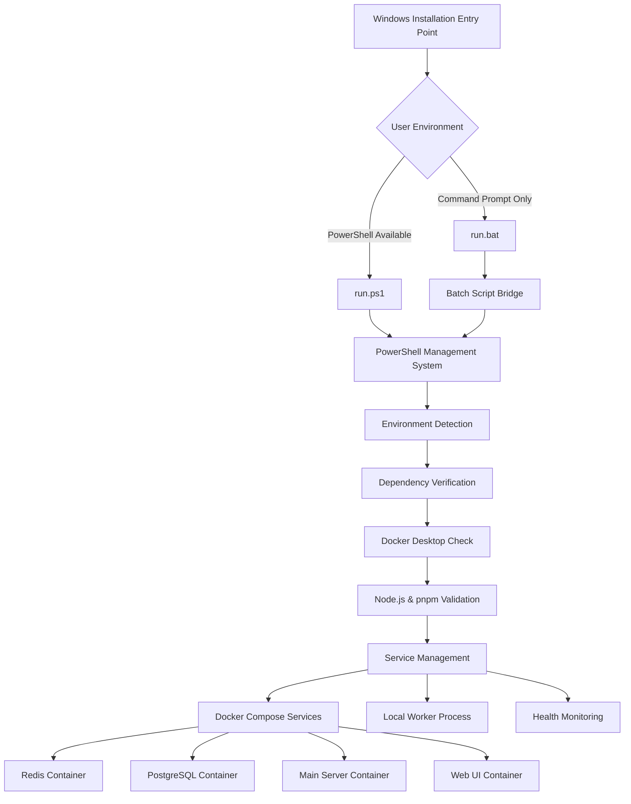
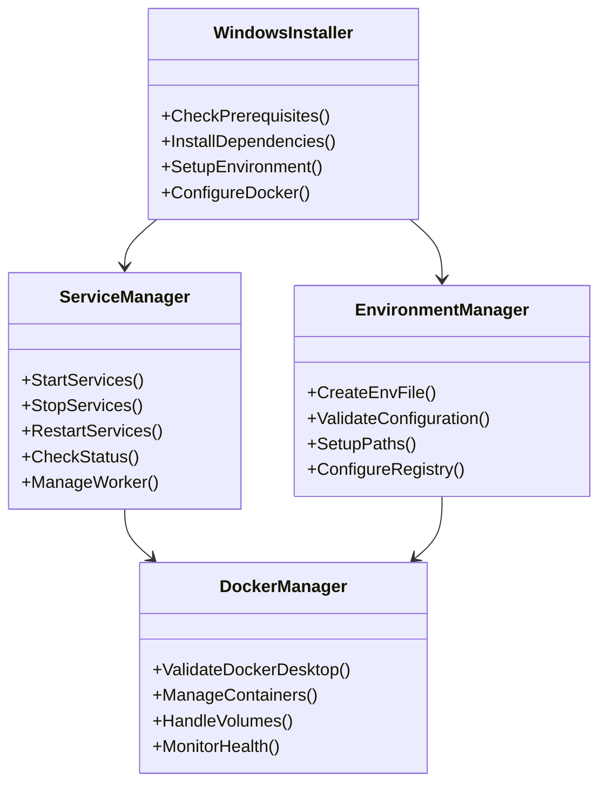
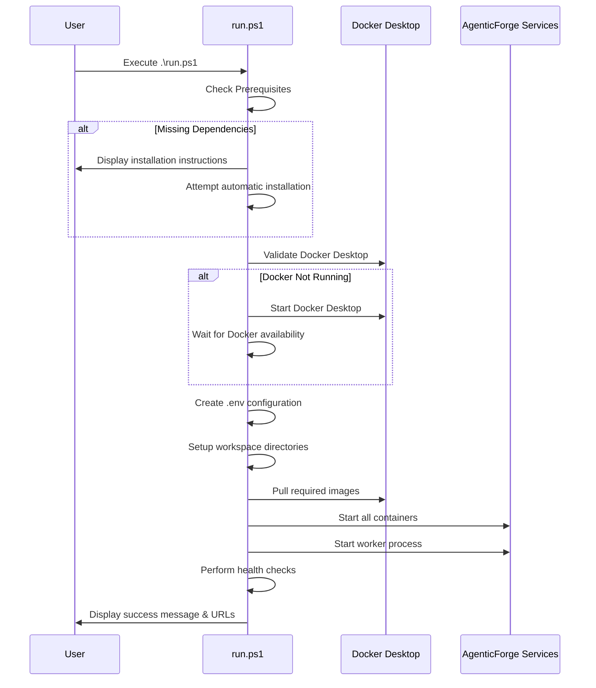
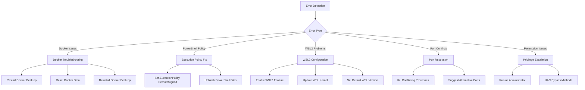
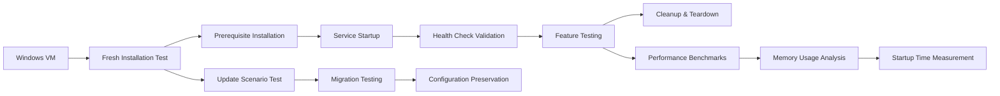
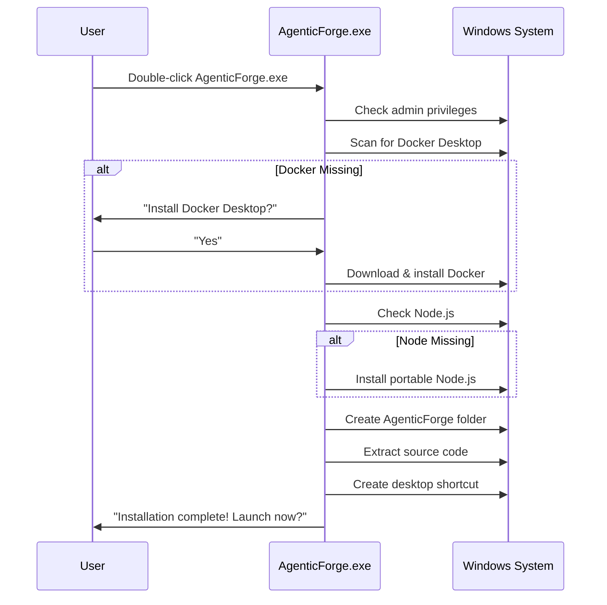

# Windows Compatibility Installation Script Design

## Overview

This design addresses making AgenticForge compatible with Windows by creating a comprehensive installation and management script equivalent to the existing `run-v2.sh` Unix script. The solution will provide Windows users with a seamless setup experience through both PowerShell and batch scripts.

## Current State Analysis

### Existing Unix Script Features
- Interactive menu system with 15+ options
- Service management (start/stop/restart)
- Docker container orchestration
- Environment setup and validation
- Build processes for core and UI packages
- Testing framework integration
- Health checks and monitoring
- Worker process management

### Windows Compatibility Challenges
- Different shell environments (PowerShell vs Bash)
- Path separator differences (`\` vs `/`)
- Docker Desktop for Windows requirements
- Different process management commands
- Environment variable handling variations
- File permission model differences

## Architecture



## Windows Script Implementation Strategy

### Option 1: Executable File `AgenticForge.exe` (RECOMMENDED)
**Single executable - No scripting knowledge required**

#### Why .exe is Better for Windows Users
- **Just double-click** - no command line needed
- **No PowerShell execution policy issues**
- **Works on any Windows** (7, 10, 11)
- **Professional user experience**
- **No "unknown script" security warnings**
- **Familiar Windows installation process**

#### How Users Will Use the Executable
```
1. Download AgenticForge.exe (one file)
2. Double-click to run
3. Follow the GUI installer wizard
4. Everything installed automatically!
5. Desktop shortcut created
```

#### Executable Implementation Technologies
| Technology | Pros | Cons | File Size | Best For |
|------------|------|------|-----------|----------|
| **Electron + Node.js** | Easy GUI, reuse web code | Large size | ~100MB | Rich interface |
| **Go Executable** | Small, fast, native | New codebase | ~10MB | Performance |
| **C# WinForms** | Native Windows, .NET | Windows-only | ~20MB | Native feel |
| **PowerShell to EXE** | Reuse PS1 logic | Still needs PowerShell | ~5MB | Quick conversion |
| **Python + PyInstaller** | Familiar language | Moderate size | ~30MB | Rapid development |

#### Recommended: Go Executable Implementation
**Complete Windows installer for AgenticForge**

##### Go Project Structure
```
agenticforge-windows/
├── main.go                    # Entry point
├── internal/
│   ├── installer/             # Installation logic
│   │   ├── docker.go         # Docker Desktop management
│   │   ├── nodejs.go         # Node.js installation
│   │   └── agenticforge.go   # AgenticForge setup
│   ├── ui/                   # Terminal UI
│   │   ├── menu.go           # Interactive menu
│   │   ├── progress.go       # Progress bars
│   │   └── colors.go         # Color output
│   ├── config/               # Configuration
│   │   ├── env.go            # .env generation
│   │   └── paths.go          # Windows paths
│   └── services/             # Service management
│       ├── docker.go         # Docker operations
│       ├── worker.go         # Worker process
│       └── health.go         # Health checks
├── assets/                   # Embedded resources
│   ├── agenticforge.zip     # Source code archive
│   ├── docker-compose.yml   # Docker configuration
│   └── run.ps1             # Fallback PowerShell
├── go.mod
└── go.sum
```

##### Core Go Implementation
```go
// main.go - Entry point with AgenticForge integration
package main

import (
    "context"
    "fmt"
    "log"
    "os"
    
    "github.com/charmbracelet/bubbletea"
    "github.com/charmbracelet/lipgloss"
)

type Model struct {
    currentStep string
    progress    float64
    logs        []string
    err         error
}

func main() {
    // Check admin privileges for Docker Desktop installation
    if !isAdmin() {
        fmt.Println("AgenticForge requires administrator privileges for Docker Desktop setup.")
        fmt.Println("Please run as administrator.")
        os.Exit(1)
    }
    
    // Initialize terminal UI
    p := tea.NewProgram(initialModel())
    if err := p.Start(); err != nil {
        log.Fatal(err)
    }
}

func (m Model) Init() tea.Cmd {
    return tea.Batch(
        checkPrerequisites,
        downloadAgenticForge,
    )
}
```

##### Docker Desktop Integration
```go
// internal/installer/docker.go
package installer

import (
    "fmt"
    "os"
    "os/exec"
    "path/filepath"
    "syscall"
    "time"
)

type DockerInstaller struct {
    downloadPath string
    version      string
}

func NewDockerInstaller() *DockerInstaller {
    return &DockerInstaller{
        downloadPath: filepath.Join(os.TempDir(), "DockerDesktop.exe"),
        version:      "latest", // Could be pinned to specific version
    }
}

// CheckDockerDesktop verifies if Docker Desktop is installed and running
func (d *DockerInstaller) CheckDockerDesktop() (bool, error) {
    // Check if docker command exists
    _, err := exec.LookPath("docker")
    if err != nil {
        return false, nil // Not installed
    }
    
    // Test docker connectivity
    cmd := exec.Command("docker", "version", "--format", "{{.Server.Version}}")
    output, err := cmd.Output()
    if err != nil {
        return false, fmt.Errorf("docker installed but not running: %w", err)
    }
    
    return len(output) > 0, nil
}

// InstallDockerDesktop downloads and installs Docker Desktop for Windows
func (d *DockerInstaller) InstallDockerDesktop(progressCallback func(float64)) error {
    // Download Docker Desktop installer
    url := "https://desktop.docker.com/win/main/amd64/Docker%20Desktop%20Installer.exe"
    
    if err := downloadWithProgress(url, d.downloadPath, progressCallback); err != nil {
        return fmt.Errorf("failed to download Docker Desktop: %w", err)
    }
    
    // Run installer silently
    cmd := exec.Command(d.downloadPath, "install", "--quiet")
    cmd.SysProcAttr = &syscall.SysProcAttr{
        HideWindow: true,
    }
    
    if err := cmd.Run(); err != nil {
        return fmt.Errorf("Docker Desktop installation failed: %w", err)
    }
    
    // Wait for Docker Desktop to start
    return d.waitForDocker()
}

// waitForDocker waits up to 5 minutes for Docker to be available
func (d *DockerInstaller) waitForDocker() error {
    timeout := time.After(5 * time.Minute)
    ticker := time.NewTicker(10 * time.Second)
    defer ticker.Stop()
    
    for {
        select {
        case <-timeout:
            return fmt.Errorf("timeout waiting for Docker Desktop to start")
        case <-ticker.C:
            if running, _ := d.CheckDockerDesktop(); running {
                return nil
            }
        }
    }
}
```

##### AgenticForge Setup Integration
```go
// internal/installer/agenticforge.go
package installer

import (
    "archive/zip"
    "embed"
    "fmt"
    "io"
    "os"
    "os/exec"
    "path/filepath"
    "strings"
)

//go:embed assets/*
var assets embed.FS

type AgenticForgeInstaller struct {
    installPath string
    workspacePath string
}

func NewAgenticForgeInstaller() *AgenticForgeInstaller {
    userProfile := os.Getenv("USERPROFILE")
    return &AgenticForgeInstaller{
        installPath:   filepath.Join(userProfile, "AgenticForge"),
        workspacePath: filepath.Join(userProfile, "agenticforge-workspace"),
    }
}

// InstallAgenticForge sets up the complete AgenticForge environment
func (a *AgenticForgeInstaller) InstallAgenticForge() error {
    // Create installation directory
    if err := os.MkdirAll(a.installPath, 0755); err != nil {
        return fmt.Errorf("failed to create install directory: %w", err)
    }
    
    // Extract embedded AgenticForge source
    if err := a.extractSource(); err != nil {
        return fmt.Errorf("failed to extract source: %w", err)
    }
    
    // Generate .env file with Windows-specific configuration
    if err := a.generateEnvFile(); err != nil {
        return fmt.Errorf("failed to generate .env: %w", err)
    }
    
    // Install Node.js dependencies
    if err := a.installDependencies(); err != nil {
        return fmt.Errorf("failed to install dependencies: %w", err)
    }
    
    // Build packages
    if err := a.buildPackages(); err != nil {
        return fmt.Errorf("failed to build packages: %w", err)
    }
    
    // Start Docker services
    if err := a.startServices(); err != nil {
        return fmt.Errorf("failed to start services: %w", err)
    }
    
    // Create desktop shortcuts
    if err := a.createShortcuts(); err != nil {
        return fmt.Errorf("failed to create shortcuts: %w", err)
    }
    
    return nil
}

// generateEnvFile creates Windows-specific .env configuration
func (a *AgenticForgeInstaller) generateEnvFile() error {
    envContent := fmt.Sprintf(`# AgenticForge Windows Configuration
PUBLIC_PORT=8080
WEB_PORT=3002
REDIS_PORT=6379
POSTGRES_DB=gforge
POSTGRES_USER=user
POSTGRES_PASSWORD=secure_%s
AUTH_TOKEN=%s
LLM_API_KEY=your_api_key_here
NODE_ENV=production
LOG_LEVEL=info

# Windows-specific paths
WORKSPACE_PATH=%s
HOST_PROJECT_PATH=%s
`,
        generateRandomString(8),
        generateRandomString(32),
        strings.ReplaceAll(a.workspacePath, "\\", "/"),
        strings.ReplaceAll(a.installPath, "\\", "/"),
    )
    
    envPath := filepath.Join(a.installPath, ".env")
    return os.WriteFile(envPath, []byte(envContent), 0644)
}

// startServices launches AgenticForge using Docker Compose
func (a *AgenticForgeInstaller) startServices() error {
    cmd := exec.Command("docker", "compose", "up", "-d")
    cmd.Dir = a.installPath
    cmd.Env = append(os.Environ(), "DOCKER_BUILDKIT=1")
    
    output, err := cmd.CombinedOutput()
    if err != nil {
        return fmt.Errorf("docker compose failed: %w\nOutput: %s", err, output)
    }
    
    // Start worker process with Windows-specific environment
    return a.startWorker()
}

// startWorker launches the AgenticForge worker process
func (a *AgenticForgeInstaller) startWorker() error {
    workerPath := filepath.Join(a.installPath, "packages", "core", "dist", "worker.js")
    
    cmd := exec.Command("node", workerPath)
    cmd.Dir = filepath.Join(a.installPath, "packages", "core")
    cmd.Env = append(os.Environ(),
        "REDIS_HOST=localhost",
        "POSTGRES_HOST=localhost",
    )
    
    // Start as background process
    if err := cmd.Start(); err != nil {
        return fmt.Errorf("failed to start worker: %w", err)
    }
    
    // Save PID for management
    pidFile := filepath.Join(a.installPath, "worker.pid")
    return os.WriteFile(pidFile, []byte(fmt.Sprintf("%d", cmd.Process.Pid)), 0644)
}
```

##### Go Build Process
```go
// Build configuration in go.mod
module agenticforge-installer

go 1.21

require (
    github.com/charmbracelet/bubbletea v0.25.0
    github.com/charmbracelet/lipgloss v0.9.1
    github.com/go-ole/go-ole v1.3.0 // Windows COM operations
    golang.org/x/sys v0.15.0 // Windows system calls
)
```

##### Build Commands
```bash
# Development build
go build -o agenticforge-dev.exe .

# Production build with embedded assets
go build -ldflags "-s -w -H windowsgui" -o AgenticForge.exe .

# Cross-compile from Linux/Mac for Windows
GOOS=windows GOARCH=amd64 go build -ldflags "-s -w" -o AgenticForge.exe .
```

##### Embedding AgenticForge Source Code
```go
// Build script to prepare embedded assets
//go:generate go run scripts/prepare-assets.go

// scripts/prepare-assets.go
package main

import (
    "archive/zip"
    "fmt"
    "io"
    "os"
    "path/filepath"
)

func main() {
    // Create assets directory
    os.MkdirAll("assets", 0755)
    
    // Zip AgenticForge source (excluding .git, node_modules)
    if err := zipAgenticForgeSource(); err != nil {
        panic(err)
    }
    
    fmt.Println("Assets prepared for embedding")
}

func zipAgenticForgeSource() error {
    zipFile, err := os.Create("assets/agenticforge.zip")
    if err != nil {
        return err
    }
    defer zipFile.Close()
    
    archive := zip.NewWriter(zipFile)
    defer archive.Close()
    
    // Walk through AgenticForge directory
    return filepath.Walk("../../", func(path string, info os.FileInfo, err error) error {
        if err != nil {
            return err
        }
        
        // Skip unwanted directories
        if shouldSkip(path) {
            if info.IsDir() {
                return filepath.SkipDir
            }
            return nil
        }
        
        // Add file to zip
        return addToZip(archive, path, info)
    })
}

func shouldSkip(path string) bool {
    skipDirs := []string{".git", "node_modules", "dist", ".qoder"}
    for _, dir := range skipDirs {
        if strings.Contains(path, dir) {
            return true
        }
    }
    return false
}
```

##### Windows Integration Features
```go
// internal/ui/menu.go - Windows-native menu system
package ui

import (
    "fmt"
    
    "github.com/charmbracelet/bubbletea"
    "github.com/charmbracelet/lipgloss"
)

type MenuModel struct {
    choices  []string
    cursor   int
    selected map[int]struct{}
    status   string
}

var (
    titleStyle = lipgloss.NewStyle().
        Foreground(lipgloss.Color("#FF6B35")).
        Bold(true).
        Padding(1, 2)
        
    itemStyle = lipgloss.NewStyle().
        PaddingLeft(4)
        
    selectedItemStyle = lipgloss.NewStyle().
        PaddingLeft(2).
        Foreground(lipgloss.Color("#00FF00")).
        Bold(true)
)

func NewMenu() MenuModel {
    return MenuModel{
        choices: []string{
            "🟢 Install AgenticForge",
            "⚡ Check System Requirements", 
            "🐳 Install Docker Desktop",
            "📦 Install Node.js & pnpm",
            "🚀 Start AgenticForge",
            "🔴 Stop Services",
            "📊 View Status",
            "🔧 Open Configuration",
            "🌐 Open Web Interface",
            "❌ Exit",
        },
        selected: make(map[int]struct{}),
    }
}

func (m MenuModel) View() string {
    s := titleStyle.Render("AgenticForge Windows Manager")
    s += "\n\n"
    
    for i, choice := range m.choices {
        cursor := " "
        if m.cursor == i {
            cursor = "►"
            s += selectedItemStyle.Render(fmt.Sprintf("%s %s", cursor, choice))
        } else {
            s += itemStyle.Render(fmt.Sprintf("%s %s", cursor, choice))
        }
        s += "\n"
    }
    
    if m.status != "" {
        s += "\n" + lipgloss.NewStyle().
            Foreground(lipgloss.Color("#FFD700")).
            Render("Status: "+m.status)
    }
    
    s += "\n\nPress Enter to select, q to quit"
    return s
}
```

### What is PS1?
**PS1 files are PowerShell scripts** - the modern Windows scripting language that replaces old batch files (.bat). PowerShell is:
- **More powerful** than traditional CMD/batch scripts
- **Built into Windows 10/11** by default
- **Cross-platform** (works on Windows, Mac, Linux)
- **Object-oriented** with advanced features like error handling, modules, and remote management

### Script Types Comparison
| Script Type | Extension | Description | Capabilities |
|-------------|-----------|-------------|--------------|
| **PowerShell** | `.ps1` | Modern Windows scripting | Full-featured, object-oriented, secure |
| **Batch** | `.bat` | Legacy DOS/Windows scripts | Basic commands, limited functionality |
| **Command** | `.cmd` | Enhanced batch scripts | Slightly better than .bat |

### Primary Script: `run.ps1`
**PowerShell-based management script with full feature parity**

#### Core Components
- **Environment Management Module**
  - Automatic .env file generation
  - Windows-specific path handling
  - Registry-based configuration storage
  - Docker Desktop integration

- **Service Management Module**
  - Docker Compose orchestration
  - Windows Service wrapper for worker
  - Process lifecycle management
  - Health check implementations

- **Interactive Menu System**
  - Color-coded PowerShell interface
  - Error handling and user feedback
  - Progress indicators for long operations
  - Context-sensitive help system

#### Architecture Components



### Secondary Script: `run.bat`
**Batch script for compatibility and PowerShell bridge**

#### How Users Will Use These Scripts
```powershell
# PowerShell method (recommended)
.\run.ps1

# Or double-click run.ps1 in File Explorer
# Or right-click → "Run with PowerShell"
```

```batch
# Batch method (fallback)
run.bat

# Or double-click run.bat in File Explorer
```

#### Example PowerShell vs Batch Comparison
**PowerShell (.ps1) - Advanced**
```powershell
# Modern PowerShell syntax
$services = docker compose ps --format json | ConvertFrom-Json
foreach ($service in $services) {
    Write-Host "Service: $($service.Name) - Status: $($service.State)" -ForegroundColor Green
}
```

**Batch (.bat) - Basic**
```batch
REM Basic batch syntax
docker compose ps
echo Services listed above
pause
```

#### Functionality
- PowerShell availability detection
- Execution policy management
- Legacy Windows support
- Graceful fallback mechanisms

## Windows-Specific Adaptations

### Path Management
```powershell
# Unix: /home/user/workspace
# Windows: $env:USERPROFILE\workspace
$WorkspacePath = Join-Path $env:USERPROFILE "agenticforge-workspace"
$ScriptPath = Split-Path -Parent $MyInvocation.MyCommand.Path
```

### Process Management
```powershell
# Worker process management
Start-Process -FilePath "node" -ArgumentList "dist/worker.js" -WindowStyle Hidden
$WorkerProcess = Get-Process -Name "node" | Where-Object {$_.ProcessName -eq "node"}
```

### Docker Integration
```powershell
# Docker Desktop validation
$DockerDesktop = Get-Process -Name "Docker Desktop" -ErrorAction SilentlyContinue
if (-not $DockerDesktop) {
    Write-Warning "Docker Desktop is not running. Starting..."
    Start-Process "Docker Desktop"
}
```

## Installation Flow

### Automated Installation Process



### Prerequisite Installation
- **Automated Chocolatey Integration**
  ```powershell
  if (-not (Get-Command choco -ErrorAction SilentlyContinue)) {
      Invoke-Expression ((New-Object System.Net.WebClient).DownloadString('https://chocolatey.org/install.ps1'))
  }
  choco install nodejs pnpm git docker-desktop -y
  ```

- **Docker Desktop Handling**
  - Automatic download and installation
  - WSL2 configuration assistance
  - Hyper-V requirement validation

### Environment Configuration

#### .env File Generation
```powershell
# Windows-specific .env template
@"
# AgenticForge Windows Configuration
PUBLIC_PORT=8080
WEB_PORT=3002
REDIS_PORT=6379
POSTGRES_DB=gforge
POSTGRES_USER=user
POSTGRES_PASSWORD=secure_$(New-Guid | Select-Object -ExpandProperty Guid | ForEach-Object { $_.ToString().Replace('-','').Substring(0,8) })
AUTH_TOKEN=$(New-Guid | Select-Object -ExpandProperty Guid | ForEach-Object { $_.ToString().Replace('-','') })
LLM_API_KEY=your_api_key_here
NODE_ENV=development
LOG_LEVEL=info

# Windows-specific paths
WORKSPACE_PATH=$env:USERPROFILE\agenticforge-workspace
HOST_PROJECT_PATH=$pwd
"@ | Out-File -FilePath .env -Encoding UTF8
```

## Menu System Design

### Interactive PowerShell Menu

```mermaid
stateDiagram-v2
    [*] --> MainMenu
    
    MainMenu --> DockerServices : 1-8
    MainMenu --> TestingQuality : 9-14
    MainMenu --> WindowsSpecific : 15-20
    MainMenu --> Exit : 21
    
    DockerServices --> StartServices : 1
    DockerServices --> RestartAll : 2
    DockerServices --> StopServices : 3
    DockerServices --> ShowStatus : 4
    DockerServices --> WorkerLogs : 5
    DockerServices --> ContainerShell : 6
    DockerServices --> RebuildAll : 7
    DockerServices --> DockerLogs : 8
    
    TestingQuality --> UnitTests : 9
    TestingQuality --> IntegrationTests : 10
    TestingQuality --> AllTests : 11
    TestingQuality --> LintCode : 12
    TestingQuality --> FormatCode : 13
    TestingQuality --> TypeCheck : 14
    
    WindowsSpecific --> CheckWSL2 : 15
    WindowsSpecific --> ConfigureHyperV : 16
    WindowsSpecific --> UpdateDockerDesktop : 17
    WindowsSpecific --> WindowsServiceSetup : 18
    WindowsSpecific --> TroubleshootWindows : 19
    WindowsSpecific --> SystemDiagnostics : 20
    
    DockerServices --> MainMenu
    TestingQuality --> MainMenu
    WindowsSpecific --> MainMenu
    Exit --> [*]
```



### Windows-Specific Menu Options

| Option | Function | Description |
|---------|----------|-------------|
| 15 | Check WSL2 | Validate WSL2 installation and configuration |
| 16 | Configure Hyper-V | Enable/configure Hyper-V for Docker Desktop |
| 17 | Update Docker Desktop | Check and update Docker Desktop to latest |
| 18 | Windows Service Setup | Configure AgenticForge as Windows Service |
| 19 | Troubleshoot Windows | Windows-specific troubleshooting wizard |
| 20 | System Diagnostics | Comprehensive system health check |

## Error Handling & Troubleshooting

### Windows-Specific Error Scenarios



### Automated Recovery Mechanisms

#### Docker Desktop Recovery
```powershell
function Repair-DockerDesktop {
    param([switch]$ForceReinstall)
    
    Write-Host "Diagnosing Docker Desktop issues..." -ForegroundColor Yellow
    
    # Check if Docker Desktop is running
    $dockerProcess = Get-Process "Docker Desktop" -ErrorAction SilentlyContinue
    
    if (-not $dockerProcess) {
        Write-Host "Starting Docker Desktop..." -ForegroundColor Blue
        Start-Process "Docker Desktop" -WindowStyle Minimized
        
        # Wait for Docker to be available
        $timeout = 120
        do {
            Start-Sleep 5
            $timeout -= 5
            $dockerRunning = docker version --format "{{.Server.Version}}" 2>$null
        } while (-not $dockerRunning -and $timeout -gt 0)
    }
    
    if ($ForceReinstall) {
        Write-Host "Reinstalling Docker Desktop..." -ForegroundColor Red
        # Uninstall and reinstall logic
    }
}
```

## Testing Strategy

### Windows Compatibility Testing

#### Unit Testing Extensions
- PowerShell Pester framework integration
- Windows-specific path testing
- Registry operation validation
- Service management testing

#### Integration Testing
- Docker Desktop integration tests
- Cross-platform compatibility validation
- Performance benchmarking on Windows
- WSL2 integration testing

### Automated Testing Pipeline



## Deployment & Distribution

### Option 1: Executable Distribution (RECOMMENDED)

#### Single Executable Package
```
AgenticForge-Windows.exe          # Single file download
├── Embedded installer logic
├── Dependency checker
├── Docker Desktop installer
├── Node.js portable version
├── AgenticForge source code
└── Configuration wizard
```

#### Distribution Channels for .exe
- **GitHub Releases**: Direct download `AgenticForge-Windows.exe`
- **Microsoft Store**: Official Windows app store
- **Chocolatey**: `choco install agenticforge`
- **Winget**: `winget install AgenticForge`
- **Company Website**: Direct download with installer

#### Executable Installation Flow


### Option 2: Script-Based Distribution

### Installation Package Structure
```
AgenticForge-Windows/
├── run.ps1                    # Main PowerShell script
├── run.bat                    # Batch script launcher
├── install/
│   ├── prerequisites.ps1      # Dependency installer
│   ├── docker-setup.ps1       # Docker Desktop configuration
│   └── wsl2-helper.ps1        # WSL2 setup assistant
├── lib/
│   ├── error-handling.ps1     # Windows error handling
│   ├── performance.ps1        # Performance monitoring
│   ├── testing.ps1           # Testing framework
│   └── help-system.ps1       # Help and documentation
├── docs/
│   ├── windows-setup.md       # Windows-specific documentation
│   ├── troubleshooting.md     # Troubleshooting guide
│   └── performance-tips.md    # Windows performance optimization
└── README-Windows.md          # Windows installation guide
```

### Distribution Methods
- **GitHub Releases**: Packaged ZIP with all scripts
- **Chocolatey Package**: `choco install agenticforge`
- **PowerShell Gallery**: `Install-Script AgenticForge`
- **Windows Package Manager**: `winget install AgenticForge`

## Performance Optimizations

### Windows-Specific Optimizations

#### Docker Desktop Configuration
```powershell
# Optimize Docker Desktop for AgenticForge
$dockerConfig = @{
    "experimental" = $true
    "builder" = @{ "gc" = @{ "enabled" = $true } }
    "features" = @{ "buildkit" = $true }
    "resources" = @{
        "cpus" = [Math]::Max(2, [Environment]::ProcessorCount - 1)
        "memory" = 4096
        "swap" = 2048
    }
}

$dockerConfig | ConvertTo-Json -Depth 10 | Out-File "$env:APPDATA\Docker\settings.json"
```

#### WSL2 Integration Optimization
- Memory allocation tuning
- CPU scheduling optimization
- Disk I/O performance improvements
- Network performance enhancements