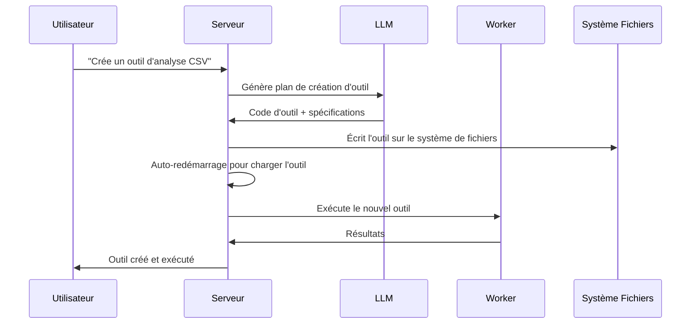

<p align="center">
  
</p>

<h1 align="center">AgenticForge</h1>

<p align="center">
  
</p>
<p align="center">
  <strong>🌐 Langues disponibles</strong><br>
  <a href="README_EN.md">English</a> • 
  <a href="README.md">Français</a> • 
  <a href="README_CHS.md">中文</a> • 
  <a href="README_CHT.md">繁體中文</a> • 
  <a href="README_JP.md">日本語</a> • 
  <a href="README_PTBR.md">Português (Brasil)</a> • 
  <a href="README_ES.md">Español</a>
</p> 
<h3 align="center">
      Une alternative privée et locale à MANUS.
</h3>

<p align="center">
  <em>
    Un agent IA 100% autonome, gratuit et local qui forge ses propres outils, écrit du code et exécute des tâches complexes, tout en conservant l'intégralité des données sur votre appareil. Basé sur le protocole MCP (Model Context Protocol) avec FastMCP comme moteur, il est conçu pour les modèles de raisonnement locaux et adaptable à l'API de votre LLM favori, garantissant une confidentialité totale et aucune dépendance au cloud.
  </em>
</p>
<br>
<p align="center">
       
</p>
<p align="center">
    
    
    
    
    
    
</p>

## Pourquoi Agentic Forge ?

🔒 **Entièrement Local et Privé** - Tout fonctionne sur votre machine — pas de cloud, pas de partage de données. Vos fichiers, conversations et outils restent privés.

🛠️ **Auto-Forge d'Outils** - Agentic Forge peut créer ses propres outils — quand une capacité lui manque, il écrit le code pour la construire.

💻 **Assistant de Codage Autonome** - Besoin de code ? Il peut écrire, déboguer et exécuter des programmes en Python, TypeScript, Bash et plus — sans supervision.

🧠 **Sélection Intelligente d'Outils** - Vous demandez, il trouve automatiquement le meilleur outil pour le travail. Comme avoir une forge d'experts prêts à aider.

📋 **Planifie et Exécute des Tâches Complexes** - De la gestion de fichiers au scraping web — il peut diviser les grandes tâches en étapes et forger les outils pour accomplir le travail.

🌐 **Navigation Web Intelligente** - Agentic Forge peut naviguer sur internet de manière autonome — rechercher, lire, extraire des infos, automatiser des tâches — le tout sans intervention.

🚀 **Propulsé par FastMCP** - Utilise le protocole MCP (Model Context Protocol) avec FastMCP comme framework ultra-performant — une véritable fusée pour les interactions LLM.

---

## Démo

> **"Peux-tu créer un outil pour analyser une une cotation boursiere pour en faire le trading?"**

---

## 🛠️ ⚠️ Travail Actif en Cours

🙏 Ce projet a commencé pour prouver que MCP etait mieux que API et a grandi au-delà des attentes. Les contributions, commentaires et patience sont profondément appréciés alors que nous forgeons de l'avant.

---

## Prérequis

Avant de commencer, assurez-vous d'avoir les logiciels suivants installés :

- **Git** : Pour cloner le dépôt. [Télécharger Git](https://git-scm.com/)
- **Docker Engine & Docker Compose** : Pour exécuter les services groupés.
  - [Installer Docker Desktop](https://www.docker.com/products/docker-desktop/) (inclut Docker Compose V2) : Windows | Mac | Linux
  - Ou installer séparément : [Docker Engine](https://docs.docker.com/engine/install/) | [Docker Compose](https://docs.docker.com/compose/install/)
- **Node.js 20+** : Pour l'interface web. [Télécharger Node.js](https://nodejs.org/)
- **pnpm** : Gestionnaire de paquets. Installer avec `npm install -g pnpm`

---

## 1. Cloner le dépôt

```bash
git clone https://github.com/votre-username/agentic-forge.git
cd agentic-forge
```

## 2. Lancer le script de gestion

Rendez le script de gestion exécutable (sur Linux/macOS) et lancez-le.

```bash
# Sur Linux ou macOS
chmod +x run.sh
./run.sh

# Sur Windows
./run.sh
```

À la première exécution, le script vérifiera si un fichier `.env` existe. S'il n'existe pas, il le créera automatiquement pour vous avec les valeurs par défaut.

## 3. Configurer votre environnement

Ouvrez le fichier `.env` qui a été créé et remplissez les valeurs. Voici un exemple basé sur le fichier généré automatiquement.

```env
# Fichier .env généré automatiquement. Remplissez les valeurs.
# Port exposé par le serveur principal
PUBLIC_PORT=8080
# Port de l'interface web
WEB_PORT=3002

# --- Configuration Redis ---
# Le worker local se connectera à Redis via localhost sur ce port.
# Assurez-vous que ce port correspond à celui exposé dans docker-compose.yml.
REDIS_HOST=localhost
REDIS_PORT=6379
REDIS_HOST_PORT=6379
REDIS_PASSWORD=""

# --- Configuration du LLM et de l'Authentification ---
LLM_API_KEY="votre_cle_api_gemini"
LLM_MODEL_NAME=gemini-1.5-flash
AUTH_TOKEN="un_token_secret_et_long_de_votre_choix"

# --- Configuration Technique ---
NODE_ENV=development
LOG_LEVEL=info
```

**Important** :
- Définissez un `AUTH_TOKEN` fort (32+ caractères recommandés).
- Les clés API sont optionnelles si vous utilisez des modèles locaux.

---

## 4. Démarrer Docker

Assurez-vous que Docker est en cours d'exécution avant de continuer.

---

## Configuration pour LLM Local (Recommandé)

### Exigences Matérielles

| Taille Modèle | Mémoire GPU | Performance                                |
| ------------- | ----------- | ------------------------------------------ |
| 7B            | 8GB VRAM    | ⚠️ Tâches basiques seulement               |
| 14B           | 12GB VRAM   | ✅ La plupart des tâches fonctionnent bien |
| 32B           | 24GB VRAM   | 🚀 Excellentes performances                |
| 70B+          | 48GB+ VRAM  | 💪 Qualité professionnelle                 |

### Configuration avec Ollama (Recommandé)

1.  **Installer Ollama** : [Télécharger Ollama](https://ollama.ai/)
2.  **Démarrer Ollama** :
    ```bash
    ollama serve
    ```
3.  **Télécharger un modèle de raisonnement** :
    ```bash
    ollama pull deepseek-r1:14b
    # ou pour plus de puissance : ollama pull deepseek-r1:32b
    ```
4.  **Mettre à jour la configuration** dans `.env` :
    ```env
    LLM_MODEL_NAME="deepseek-r1:14b"
    LLM_API_BASE_URL="http://localhost:11434"
    ```

### Alternative : LM Studio

1.  Téléchargez et installez [LM Studio](https://lmstudio.ai/)
2.  Chargez un modèle comme `deepseek-r1-distill-qwen-14b`
3.  Démarrez le serveur local
4.  Mettez à jour `.env` :
    ```env
    LLM_API_BASE_URL="http://localhost:1234"
    ```

---

## Configuration pour Usage API

Si vous préférez les modèles cloud ou manquez de matériel suffisant :

### 1. Choisir un fournisseur d'API

| Fournisseur | Modèles Exemples                     | Lien Clé API                                              |
| ----------- | ------------------------------------ | --------------------------------------------------------- |
| OpenAI      | `gpt-4`, `o1`                        | [platform.openai.com](https://platform.openai.com/signup) |
| Google      | `gemini-2.5-pro`, `gemini-2.5-flash` | [aistudio.google.com](https://aistudio.google.com/keys)   |
| Anthropic   | `claude-4-sonnet`, `claude-4-opus`   | [console.anthropic.com](https://console.anthropic.com/)   |
| DeepSeek    | `deepseek-chat`, `deepseek-coder`    | [platform.deepseek.com](https://platform.deepseek.com)    |

### 2. Définir votre clé API

**Linux/macOS :**
```bash
export LLM_API_KEY="votre_cle_api_ici"
# Ajoutez à ~/.bashrc ou ~/.zshrc pour la persistance
```

**Windows :**
```cmd
set LLM_API_KEY=votre_cle_api_ici
```

### 3. Mettre à jour `.env` :
```env
LLM_API_KEY="votre_cle_api_ici"
LLM_MODEL_NAME="gemini-1.5-pro" # ou un autre modèle de votre choix
```

---

## Démarrer les Services et Exécuter

### Utiliser la Console de Gestion (`run.sh`)

Après avoir configuré votre fichier `.env`, utilisez la console de gestion pour démarrer l'application.

Lancez la console interactive :
```bash
./run.sh
```

Depuis le menu de la console :
1.  **Démarrer** - Lancer tous les services
2.  **Statut** - Vérifier la santé des services
3.  **Logs** - Surveiller les logs en temps réel

### Commandes Docker Manuelles

Démarrer tous les services :
```bash
docker compose up -d
```

Vérifier le statut :
```bash
docker compose ps
```

Voir les logs :
```bash
docker compose logs -f
```

**⚠️ Attention** : Le démarrage initial peut prendre plusieurs minutes car les images Docker sont téléchargées et les services s'initialisent. Attendez de voir `agentic_forge_server | ... "GET /api/health HTTP/1.1" 200 ...` dans les logs.

---

## Points d'Accès

Une fois les services en marche :

| Service                | URL                                                 | Description                      |
| ---------------------- | --------------------------------------------------- | -------------------------------- |
| **Interface Web**      | http://localhost:${WEB_PORT:-3002}                  | Interface utilisateur principale |
| **Point d'API**        | http://localhost:${PUBLIC_PORT:-8080}/api/v1/agent/stream | Accès API direct                 |
| **Vérification Santé** | http://localhost:${PUBLIC_PORT:-8080}/api/health    | Statut de santé des services     |

### Test Rapide

```bash
# Vérification santé
curl http://localhost:8080/api/health

# Test API (remplacez VOTRE_AUTH_TOKEN)
curl -X POST http://localhost:8080/api/v1/agent/stream 
  -H "Content-Type: application/json" 
  -H "Authorization: Bearer VOTRE_AUTH_TOKEN" 
  -d '{"goal": "Crée un simple script Python hello world"}'
```

---

## Exemples d'Usage

Une fois vos services en marche, essayez ces exemples :

### 🔧 Forge d'Outils
```
"J'ai besoin d'un outil pour convertir des fichiers CSV en format JSON. Crée-le puis utilise-le sur mon fichier donnees.csv."
```

### 💻 Génération de Code
```
"Écris un script Python qui surveille un répertoire pour les nouveaux fichiers et enregistre leurs détails."
```

### 🌐 Automatisation Web
```
"Recherche en ligne les dernières bonnes pratiques TypeScript et crée un document de résumé."
```

### 📊 Analyse de Données
```
"Analyse le fichier donnees_ventes.csv dans mon espace de travail et crée une visualisation des tendances."
```

### 🛠️ Tâches Système
```
"Crée un script de sauvegarde pour mes fichiers importants et programme son exécution quotidienne."
```

**Note** : Soyez explicite dans vos demandes. Au lieu de "Est-ce que tu connais X ?", demandez "Recherche en ligne des informations sur X et résume-les."

---

## Console de Gestion (`run.sh`)

La console interactive fournit un contrôle complet sur votre instance Agentic Forge :

```
   ╔══════════════════════════════════╗
   ║      A G E N T I C  F O R G E    ║
   ╚══════════════════════════════════╝
──────────────────────────────────────────
  Docker & Services
   1) 🟢 Démarrer         5) 📊 Logs
   2) 🔄 Redémarrer       6) 🐚 Shell (Container)
   3) 🔴 Arrêter          7) 🔨 Rebuild (no cache)
   4) ⚡ Statut           8) 🧹 Nettoyer Docker

  Développement
  10) 🔍 Lint           12) 🧪 Tests
  11) ✨ Format         13) 📘 TypeCheck

  16) 🚪 Quitter
```

### Commandes Clés

| Option | Description             | Quand l'Utiliser                   |
| ------ | ----------------------- | ---------------------------------- |
| **1**  | Démarrer l'écosystème   | Premier lancement ou après arrêt   |
| **2**  | Redémarrer les services | Après changements de configuration |
| **4**  | Vérifier le statut      | Diagnostics de santé               |
| **5**  | Suivre les logs         | Surveillance en temps réel         |
| **7**  | Reconstruire les images | Après changements majeurs de code  |

---

## Aperçu de l'Architecture

### 🏗️ Microservices Distribués

- **🧠 Serveur** (Port `${PUBLIC_PORT:-8080}`) : Orchestration centrale, communication LLM, gestion de session
- **⚡ Worker** : Traitement de tâches asynchrones, exécution de code, automatisation web
- **🌐 Interface Web** (Port `${WEB_PORT:-3002}`) : UI moderne basée sur React
- **💾 Redis** (Port `6379`) : File de tâches, stockage de session, mise en cache

### 🔄 Processus de Forge d'Outils



---

## Développement

### Structure du Projet

```
agentic-forge/
├── packages/
│   ├── core/                  # Code source du Backend et du Worker
│   │   ├── src/
│   │   │   ├── agent.ts
│   │   │   ├── server.ts
│   │   │   ├── worker.ts
│   │   │   ├── tools/         # Outils disponibles
│   │   │   ├── prompts/       # Templates de prompts LLM
│   │   │   └── utils/         # Utilitaires
│   │   └── package.json
│   └── ui/                    # Code source du Frontend
│       ├── src/
│       └── package.json
├── .env                       # Fichier de configuration (local)
├── docker-compose.yml         # Orchestration des services
├── run.sh                     # Script de gestion
└── README_FR.md               # Cette documentation
```

### Ajouter des Outils Personnalisés

```typescript
// packages/core/src/tools/custom/monOutil.tool.ts
import { z } from 'zod';
import type { Tool, Ctx } from '../../types.js';

export const monOutilParams = z.object({
  entree: z.string().describe("Paramètre d'entrée"),
  options: z.number().default(1),
});

export const monOutil: Tool<typeof monOutilParams> = {
  name: 'monOutilPersonnalise',
  description: 'Description de ce que fait cet outil',
  parameters: monOutilParams,
  execute: async (args, ctx: Ctx) => {
    ctx.log.info('Exécution outil personnalisé', { args });

    // Votre logique d'outil ici
    const resultat = await traiterEntree(args.entree, args.options);

    return resultat;
  },
};
```

N'oubliez pas de l'ajouter à `packages/core/src/tools/index.ts` :

```typescript
import { monOutil } from './custom/monOutil.tool.js';

export const allTools: Tool<any>[] = [
  // ... outils existants
  monOutil,
];
```

---

## Licence

Ce projet est sous licence MIT. Voir le fichier `LICENSE` pour les détails.

---

## Remerciements

- **[FastMCP](https://github.com/punkpeye/fastmcp)** : Framework MCP ultra-performant - la fusée qui propulse Agentic Forge 🚀
- **[Model Context Protocol (MCP)](https://modelcontextprotocol.io/)** : Protocole révolutionnaire pour l'interaction avec les LLMs
- **[Docker](https://docker.com)** : Conteneurisation et isolation
- **[Redis](https://redis.io)** : Structures de données haute performance
- **[Playwright](https://playwright.dev)** : Automatisation web moderne
- **Communauté Open Source** : Pour l'inspiration et la collaboration

---

## Support

- **Issues** : [GitHub Issues](https://github.com/votre-username/agentic-forge/issues)
- **Discussions** : [GitHub Discussions](https://github.com/votre-username/agentic-forge/discussions)
- **Documentation** : [Wiki du Projet](https://github.com/votre-username/agentic-forge/wiki)

---

<div align="center">

**🔨 Un forgeron forge ses marteaux.** **🤖 Agentic Forge forge ses propres capacités.**

_Forgez votre avenir technologique._

[](./run.sh)

</div>
