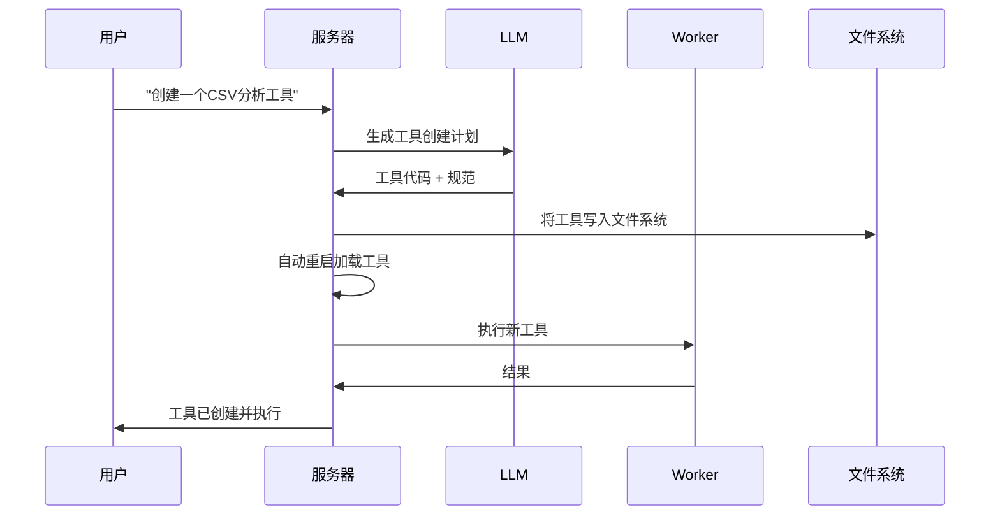

<p align="center">
  
</p>

<h1 align="center">G-Forge</h1>

<p align="center">
  
</p>
<p align="center">
  <strong>🌐 Langues disponibles</strong><br>
  <a href="README_EN.md">English</a> • 
  <a href="README.md">Français</a> • 
  <a href="README_CHS.md">中文</a> • 
  <a href="README_CHT.md">繁體中文</a> • 
  <a href="README_JP.md">日本語</a> • 
  <a href="README_PTBR.md">Português (Brasil)</a> • 
  <a href="README_ES.md">Español</a>
</p> 
<h3 align="center">
      MANUS的私有本地替代方案
</h3>

<p align="center">
  <em>
    一个100%自主、免费的本地AI代理，它可以锻造自己的工具、编写代码并执行复杂任务，同时将所有数据保存在您的设备上。基于MCP（模型上下文协议）和FastMCP引擎，专为本地推理模型设计，可适配您喜爱的LLM API，确保完全隐私且无云依赖。
  </em>
</p>
<br>
<p align="center">
       
</p>
<p align="center">
    
    
    
    
    
    
</p>

## 为什么选择G-Forge？

🔒 **⚠️ 警告**：初始启动可能需要10-15分钟，因为要下载Docker镜像并初始化服务。等待日志中出现`backend: "GET /health HTTP/1.1" 200 OK`。

---

## 访问点

服务运行后：

| 服务         | URL                                       | 描述         |
| ------------ | ----------------------------------------- | ------------ |
| **Web界面**  | http://localhost:3000                     | 主用户界面   |
| **API端点**  | http://localhost:8080/api/v1/agent/stream | 直接API访问  |
| **健康检查** | http://localhost:8080/health              | 服务健康状态 |

### 快速测试

```bash
# 健康检查
curl http://localhost:8080/health

# API测试
curl -X POST http://localhost:8080/api/v1/agent/stream \
  -H "Content-Type: application/json" \
  -H "Authorization: Bearer YOUR_AUTH_TOKEN" \
  -d '{"goal": "创建一个简单的Python hello world脚本"}'
```

---

## 使用示例

服务运行后，尝试这些示例：

### 🔧 工具锻造

```
"我需要一个将CSV文件转换为JSON格式的工具。创建它然后在我的data.csv文件上使用它。"
```

### 💻 代码生成

```
"编写一个Python脚本，监控目录中的新文件并记录它们的详细信息。"
```

### 🌐 网络自动化

```
"在线搜索最新的TypeScript最佳实践并创建一个摘要文档。"
```

### 📊 数据分析

```
"分析我工作区中的sales_data.csv文件并创建趋势可视化。"
```

### 🛠️ 系统任务

```
"为我的重要文件创建备份脚本并安排它每天运行。"
```

**注意**：在请求中要明确。不要问"你知道X吗？"，而是问"在线搜索关于X的信息并总结它。"

---

## 管理控制台（`run.sh`）

交互式控制台提供对您的G-Forge实例的完全控制：

```
🔨 G-Forge - 管理控制台
────────────────────────────────────────

   Docker & 服务
1) 🟢 启动        5) 📊 日志
2) 🔄 重启        6) 🐚 Shell
3) 🔴 停止        7) 🔨 重建
4) ⚡ 状态        8) 🧹 清理

   开发 & 质量
10) 🔍 Lint       13) 🧪 测试
11) ✨ 格式化     14) 📘 类型检查
12) 🧽 清理      15) 📋 审计

16) 🚪 退出
```

### 关键命令

| 选项  | 描述         | 何时使用         |
| ----- | ------------ | ---------------- |
| **1** | 启动生态系统 | 首次启动或停止后 |
| **2** | 重启服务     | 配置更改后       |
| **4** | 检查状态     | 健康诊断         |
| **5** | 跟踪日志     | 实时监控         |
| **7** | 重建镜像     | 主要代码更改后   |

---

## 架构概览

### 🏗️ 分布式微服务

- **🧠 服务器**（端口8080）：中央编排、LLM通信、会话管理
- **⚡ Worker**：异步任务处理、代码执行、网络自动化
- **🌐 Web界面**（端口3000）：现代基于React的UI
- **💾 Redis**（端口6378）：任务队列、会话存储、缓存

### 🔄 工具锻造过程



---

## 开发

### 项目结构

```
agentic-forge/
├── 📁 src/                    # TypeScript源代码
│   ├── 📁 tools/             # 可用工具
│   │   ├── 📁 system/        # 系统工具（创建、重启）
│   │   ├── 📁 fs/            # 文件系统操作
│   │   ├── 📁 code/          # 代码执行
│   │   ├── 📁 browser/       # 网络自动化
│   │   └── 📁 generated/     # 自动生成的工具
│   ├── 📁 prompts/           # LLM提示模板
│   ├── 📁 utils/             # 实用程序和助手
│   ├── 📄 server.ts          # 主服务器
│   ├── 📄 worker.ts          # 异步worker
│   └── 📄 webServer.ts       # Web界面
├── 📄 docker-compose.yml     # 服务编排
├── 📄 Dockerfile             # 容器定义
├── 📄 run.sh                 # 管理控制台
└── 📄 README.md              # 本文档
```

### 添加自定义工具

```typescript
// src/tools/custom/myTool.tool.ts
import { z } from 'zod';
import type { Tool, Ctx } from '../../types.js';

export const myToolParams = z.object({
  input: z.string().describe('输入参数'),
  options: z.number().default(1),
});

export const myTool: Tool<typeof myToolParams> = {
  name: 'myCustomTool',
  description: '描述此工具的功能',
  parameters: myToolParams,
  execute: async (args, ctx: Ctx) => {
    ctx.log.info('执行自定义工具', { args });

    // 您的工具逻辑在这里
    const result = await processInput(args.input, args.options);

    return result;
  },
};
```

不要忘记将其添加到`src/tools/index.ts`：

```typescript
import { myTool } from './custom/myTool.tool.js';

export const allTools: Tool<any>[] = [
  // ... 现有工具
  myTool,
];
```

---

## 许可证

本项目采用MIT许可证。详细信息请参阅[LICENSE](LICENSE)文件。

---

## 致谢

- **[FastMCP](https://github.com/punkpeye/fastmcp)**：超高性能MCP框架 - 驱动G-Forge的火箭 🚀
- **[模型上下文协议（MCP）](https://modelcontextprotocol.io/)**：LLM交互的革命性协议
- **[Docker](https://docker.com)**：容器化和隔离
- **[Redis](https://redis.io)**：高性能数据结构
- **[Playwright](https://playwright.dev)**：现代网络自动化
- **开源社区**：提供灵感和协作

---

## 支持

- **问题**：[GitHub Issues](https://github.com/your-username/agentic-forge/issues)
- **讨论**：[GitHub Discussions](https://github.com/your-username/agentic-forge/discussions)
- **文档**：[项目Wiki](https://github.com/your-username/agentic-forge/wiki)

---

<div align="center">

**🔨 铁匠锻造他的锤子。** **🤖 G-Forge锻造自己的能力。**

_锻造您的技术未来。_

[](./run.sh)

</div>完全本地化和私有** - 一切都在您的机器上运行——无云端，无数据共享。您的文件、对话和工具保持私有。

🛠️ **自我工具锻造** - G-Forge可以创建自己的工具——当它缺乏某种能力时，它会编写代码来构建它。

💻 **自主编程助手** - 需要代码？它可以用Python、TypeScript、Bash等编写、调试和执行程序——无需监督。

🧠 **智能工具选择** - 您询问，它自动找到最适合工作的工具。就像拥有一个专家工坊随时准备帮助。

📋 **规划并执行复杂任务** - 从文件管理到网络抓取——它可以将大型任务分解为步骤，并锻造工具来完成工作。

🌐 **智能网络导航** - G-Forge可以自主浏览互联网——搜索、阅读、提取信息、自动化任务——全部无需干预。

🚀 **由FastMCP驱动** - 使用MCP（模型上下文协议）和FastMCP作为超高性能框架——真正的LLM交互火箭。

---

## 演示

> **"你能创建一个分析我的CSV文件的工具，然后用它从sales_data.csv生成报告吗？"**

---

## 🛠️ ⚠️ 正在积极开发中

🙏 这个项目开始是为了证明MCP比API更好，现已超出预期发展。在我们继续前进时，贡献、反馈和耐心都深受赞赏。

---

## 前提条件

开始之前，请确保您已安装以下软件：

- **Git**：克隆存储库。[下载Git](https://git-scm.com/)
- **Docker Engine & Docker Compose**：运行捆绑服务。
  - [安装Docker Desktop](https://www.docker.com/products/docker-desktop/)（包含Docker Compose V2）：Windows | Mac | Linux
  - 或分别安装：[Docker Engine](https://docs.docker.com/engine/install/) | [Docker Compose](https://docs.docker.com/compose/install/)
- **Node.js 20+**：用于Web界面。[下载Node.js](https://nodejs.org/)
- **pnpm**：包管理器。使用`npm install -g pnpm`安装

---

## 1. 克隆存储库

```bash
git clone https://github.com/your-username/agentic-forge.git
cd agentic-forge
```

## 2. 运行安装脚本

使管理脚本可执行并运行它。

```bash
chmod +x run.sh
./run.sh
```

首次运行时，脚本会检查`.env`文件是否存在。如果不存在，它会自动为您创建。

## 3. 配置您的环境

创建`.env`文件后，打开它并用您自己的凭据填写值。

```env
# 将此文件复制到.env并填写值。
HOST_PORT=8080
PORT=8080
NODE_ENV=development
LOG_LEVEL=info
AUTH_TOKEN=""
REDIS_HOST=redis
REDIS_PORT=6378
REDIS_HOST_PORT=6378
REDIS_PASSWORD=""
# Google API不再需要基础URL，注释或删除它。
# LLM_API_BASE_URL=
WEB_PORT=3000
# 使用您的Google Gemini API密钥
LLM_API_KEY=""

# 指定Gemini模型，例如"gemini-1.5-pro-latest"
LLM_MODEL_NAME=gemini-2.5-flash
```

**重要**：

- 设置一个强`AUTH_TOKEN`（推荐32+字符）
- 如果您使用本地模型，API密钥是可选的

---

## 4. 启动Docker

继续之前确保Docker正在运行。

---

## 本地LLM配置（推荐）

### 硬件要求

| 模型大小 | GPU内存    | 性能                  |
| -------- | ---------- | --------------------- |
| 7B       | 8GB VRAM   | ⚠️ 仅基本任务         |
| 14B      | 12GB VRAM  | ✅ 大多数任务工作良好 |
| 32B      | 24GB VRAM  | 🚀 出色性能           |
| 70B+     | 48GB+ VRAM | 💪 专业质量           |

### 使用Ollama设置（推荐）

1.  **安装Ollama**：[下载Ollama](https://ollama.ai/)
2.  **启动Ollama**：
    ```bash
    ollama serve
    ```
3.  **下载推理模型**：
    ```bash
    ollama pull deepseek-r1:14b
    # 或获得更多功能：ollama pull deepseek-r1:32b
    ```
4.  **在`.env`中更新配置**：
    ```env
    LLM_MODEL_NAME="deepseek-r1:14b"
    LLM_API_BASE_URL="http://localhost:11434"
    ```

### 替代方案：LM Studio

1.  下载并安装[LM Studio](https://lmstudio.ai/)
2.  加载模型如`deepseek-r1-distill-qwen-14b`
3.  启动本地服务器
4.  更新`.env`：
    ```env
    LLM_API_BASE_URL="http://localhost:1234"
    ```

---

## API使用配置

如果您更喜欢云模型或缺乏足够的硬件：

### 1. 选择API提供商

| 提供商    | 模型示例                             | API密钥链接                                               |
| --------- | ------------------------------------ | --------------------------------------------------------- |
| OpenAI    | `gpt-4`, `o1`                        | [platform.openai.com](https://platform.openai.com/signup) |
| Google    | `gemini-2.5-pro`, `gemini-2.5-flash` | [aistudio.google.com](https://aistudio.google.com/keys)   |
| Anthropic | `claude-4-sonnet`, `claude-4-opus`   | [console.anthropic.com](https://console.anthropic.com/)   |
| DeepSeek  | `deepseek-chat`, `deepseek-coder`    | [platform.deepseek.com](https://platform.deepseek.com)    |

### 2. 设置您的API密钥

**Linux/macOS：**

```bash
export LLM_API_KEY="your_api_key_here"
# 添加到~/.bashrc或~/.zshrc以持久化
```

**Windows：**

```cmd
set LLM_API_KEY=your_api_key_here
```

### 3. 更新`.env`：

```env
LLM_API_KEY="your_api_key_here"
LLM_MODEL_NAME="gemini-1.5-pro"
```

---

## 启动服务并运行

### 使用管理控制台（`run.sh`）

配置`.env`文件后，使用管理控制台启动应用程序。

启动交互式控制台：

```bash
./run.sh
```

从控制台菜单：

1.  **启动** - 启动所有服务
2.  **状态** - 检查服务健康状况
3.  **日志** - 实时监控日志

### 手动Docker命令

启动所有服务：

```bash
docker-compose up -d
```

检查状态：

```bash
docker-compose ps
```

查看日志：

```bash
docker-compose logs -f
```

\*\*
