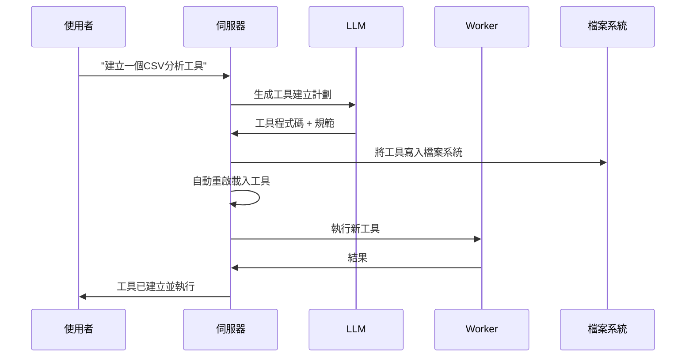

<p align="center">
  
</p>

<h1 align="center">G-Forge</h1>

<p align="center">
  
</p>
<p align="center">
  <strong>🌐 Langues disponibles</strong><br>
  <a href="README_EN.md">English</a> • 
  <a href="README.md">Français</a> • 
  <a href="README_CHS.md">中文</a> • 
  <a href="README_CHT.md">繁體中文</a> • 
  <a href="README_JP.md">日本語</a> • 
  <a href="README_PTBR.md">Português (Brasil)</a> • 
  <a href="README_ES.md">Español</a>
</p> 
<h3 align="center">
      MANUS的私有本地替代方案
</h3>

<p align="center">
  <em>
    一個100%自主、免費的本地AI代理，它可以鍛造自己的工具、編寫程式碼並執行複雜任務，同時將所有資料保存在您的設備上。基於MCP（模型上下文協議）和FastMCP引擎，專為本地推理模型設計，可適配您喜愛的LLM API，確保完全隱私且無雲端依賴。
  </em>
</p>
<br>
<p align="center">
       
</p>
<p align="center">
    
    
    
    
    
    
</p>

## 為什麼選擇G-Forge？

🔒 **完全本地化和私有** - 一切都在您的機器上運行——無雲端，無資料共享。您的檔案、對話和工具保持私有。

🛠️ **自我工具鍛造** - G-Forge可以創建自己的工具——當它缺乏某種能力時，它會編寫程式碼來構建它。

💻 **自主程式設計助手** - 需要程式碼？它可以用Python、TypeScript、Bash等編寫、除錯和執行程式——無需監督。

🧠 **智能工具選擇** - 您詢問，它自動找到最適合工作的工具。就像擁有一個專家工坊隨時準備幫助。

📋 **規劃並執行複雜任務** - 從檔案管理到網路爬取——它可以將大型任務分解為步驟，並鍛造工具來完成工作。

🌐 **智能網路導航** - G-Forge可以自主瀏覽網際網路——搜尋、閱讀、提取資訊、自動化任務——全部無需干預。

🚀 **由FastMCP驅動** - 使用MCP（模型上下文協議）和FastMCP作為超高效能框架——真正的LLM交互火箭。

---

## 演示

> **"你能創建一個分析我的CSV檔案的工具，然後用它從sales_data.csv生成報告嗎？"**

---

## 🛠️ ⚠️ 正在積極開發中

🙏 這個專案開始是為了證明MCP比API更好，現已超出預期發展。在我們繼續前進時，貢獻、回饋和耐心都深受讚賞。

---

## 前提條件

開始之前，請確保您已安裝以下軟體：

- **Git**：複製儲存庫。[下載Git](https://git-scm.com/)
- **Docker Engine & Docker Compose**：運行捆綁服務。
  - [安裝Docker Desktop](https://www.docker.com/products/docker-desktop/)（包含Docker Compose V2）：Windows | Mac | Linux
  - 或分別安裝：[Docker Engine](https://docs.docker.com/engine/install/) | [Docker Compose](https://docs.docker.com/compose/install/)
- **Node.js 20+**：用於Web介面。[下載Node.js](https://nodejs.org/)
- **pnpm**：套件管理器。使用`npm install -g pnpm`安裝

---

## 1. 複製儲存庫

```bash
git clone https://github.com/your-username/agentic-forge.git
cd agentic-forge
```

## 2. 運行安裝腳本

使管理腳本可執行並運行它。

```bash
chmod +x run.sh
./run.sh
```

首次運行時，腳本會檢查`.env`檔案是否存在。如果不存在，它會自動為您創建。

## 3. 設定您的環境

建立`.env`檔案後，開啟它並用您自己的憑據填寫值。

```env
# 將此檔案複製到.env並填寫值。
HOST_PORT=8080
PORT=8080
NODE_ENV=development
LOG_LEVEL=info
AUTH_TOKEN=""
REDIS_HOST=redis
REDIS_PORT=6378
REDIS_HOST_PORT=6378
REDIS_PASSWORD=""
# Google API不再需要基礎URL，註解或刪除它。
# LLM_API_BASE_URL=
WEB_PORT=3000
# 使用您的Google Gemini API金鑰
LLM_API_KEY=""

# 指定Gemini模型，例如"gemini-1.5-pro-latest"
LLM_MODEL_NAME=gemini-2.5-flash
```

**重要**：

- 設定一個強`AUTH_TOKEN`（推薦32+字元）
- 如果您使用本地模型，API金鑰是可選的

---

## 4. 啟動Docker

繼續之前確保Docker正在運行。

---

## 本地LLM設定（推薦）

### 硬體要求

| 模型大小 | GPU記憶體  | 效能                  |
| -------- | ---------- | --------------------- |
| 7B       | 8GB VRAM   | ⚠️ 僅基本任務         |
| 14B      | 12GB VRAM  | ✅ 大多數任務工作良好 |
| 32B      | 24GB VRAM  | 🚀 出色效能           |
| 70B+     | 48GB+ VRAM | 💪 專業品質           |

### 使用Ollama設定（推薦）

1.  **安裝Ollama**：[下載Ollama](https://ollama.ai/)
2.  **啟動Ollama**：
    ```bash
    ollama serve
    ```
3.  **下載推理模型**：
    ```bash
    ollama pull deepseek-r1:14b
    # 或獲得更多功能：ollama pull deepseek-r1:32b
    ```
4.  **在`.env`中更新設定**：
    ```env
    LLM_MODEL_NAME="deepseek-r1:14b"
    LLM_API_BASE_URL="http://localhost:11434"
    ```

### 替代方案：LM Studio

1.  下載並安裝[LM Studio](https://lmstudio.ai/)
2.  載入模型如`deepseek-r1-distill-qwen-14b`
3.  啟動本地伺服器
4.  更新`.env`：
    ```env
    LLM_API_BASE_URL="http://localhost:1234"
    ```

---

## API使用設定

如果您更喜歡雲端模型或缺乏足夠的硬體：

### 1. 選擇API提供商

| 提供商    | 模型範例                             | API金鑰連結                                               |
| --------- | ------------------------------------ | --------------------------------------------------------- |
| OpenAI    | `gpt-4`, `o1`                        | [platform.openai.com](https://platform.openai.com/signup) |
| Google    | `gemini-2.5-pro`, `gemini-2.5-flash` | [aistudio.google.com](https://aistudio.google.com/keys)   |
| Anthropic | `claude-4-sonnet`, `claude-4-opus`   | [console.anthropic.com](https://console.anthropic.com/)   |
| DeepSeek  | `deepseek-chat`, `deepseek-coder`    | [platform.deepseek.com](https://platform.deepseek.com)    |

### 2. 設定您的API金鑰

**Linux/macOS：**

```bash
export LLM_API_KEY="your_api_key_here"
# 新增到~/.bashrc或~/.zshrc以持久化
```

**Windows：**

```cmd
set LLM_API_KEY=your_api_key_here
```

### 3. 更新`.env`：

```env
LLM_API_KEY="your_api_key_here"
LLM_MODEL_NAME="gemini-1.5-pro"
```

---

## 啟動服務並運行

### 使用管理控制台（`run.sh`）

設定`.env`檔案後，使用管理控制台啟動應用程式。

啟動互動式控制台：

```bash
./run.sh
```

從控制台選單：

1.  **啟動** - 啟動所有服務
2.  **狀態** - 檢查服務健康狀況
3.  **日誌** - 即時監控日誌

### 手動Docker命令

啟動所有服務：

```bash
docker-compose up -d
```

檢查狀態：

```bash
docker-compose ps
```

檢視日誌：

```bash
docker-compose logs -f
```

**⚠️ 警告**：初始啟動可能需要10-15分鐘，因為要下載Docker映像並初始化服務。等待日誌中出現`backend: "GET /health HTTP/1.1" 200 OK`。

---

## 存取點

服務運行後：

| 服務         | URL                                       | 描述         |
| ------------ | ----------------------------------------- | ------------ |
| **Web介面**  | http://localhost:3000                     | 主使用者介面 |
| **API端點**  | http://localhost:8080/api/v1/agent/stream | 直接API存取  |
| **健康檢查** | http://localhost:8080/health              | 服務健康狀態 |

### 快速測試

```bash
# 健康檢查
curl http://localhost:8080/health

# API測試
curl -X POST http://localhost:8080/api/v1/agent/stream \
  -H "Content-Type: application/json" \
  -H "Authorization: Bearer YOUR_AUTH_TOKEN" \
  -d '{"goal": "建立一個簡單的Python hello world腳本"}'
```

---

## 使用範例

服務運行後，嘗試這些範例：

### 🔧 工具鍛造

```
"我需要一個將CSV檔案轉換為JSON格式的工具。建立它然後在我的data.csv檔案上使用它。"
```

### 💻 程式碼生成

```
"編寫一個Python腳本，監控目錄中的新檔案並記錄它們的詳細資訊。"
```

### 🌐 網路自動化

```
"線上搜尋最新的TypeScript最佳實務並建立一個摘要文件。"
```

### 📊 資料分析

```
"分析我工作區中的sales_data.csv檔案並建立趨勢視覺化。"
```

### 🛠️ 系統任務

```
"為我的重要檔案建立備份腳本並安排它每天運行。"
```

**注意**：在請求中要明確。不要問"你知道X嗎？"，而是問"線上搜尋關於X的資訊並總結它。"

---

## 管理控制台（`run.sh`）

互動式控制台提供對您的G-Forge實例的完全控制：

```
🔨 G-Forge - 管理控制台
────────────────────────────────────────

   Docker & 服務
1) 🟢 啟動        5) 📊 日誌
2) 🔄 重啟        6) 🐚 Shell
3) 🔴 停止        7) 🔨 重建
4) ⚡ 狀態        8) 🧹 清理

   開發 & 品質
10) 🔍 Lint       13) 🧪 測試
11) ✨ 格式化     14) 📘 型別檢查
12) 🧽 清理      15) 📋 稽核

16) 🚪 退出
```

### 關鍵命令

| 選項  | 描述         | 何時使用         |
| ----- | ------------ | ---------------- |
| **1** | 啟動生態系統 | 首次啟動或停止後 |
| **2** | 重啟服務     | 設定更改後       |
| **4** | 檢查狀態     | 健康診斷         |
| **5** | 跟蹤日誌     | 即時監控         |
| **7** | 重建映像     | 主要程式碼更改後 |

---

## 架構概覽

### 🏗️ 分散式微服務

- **🧠 伺服器**（埠8080）：中央編排、LLM通訊、會話管理
- **⚡ Worker**：非同步任務處理、程式碼執行、網路自動化
- **🌐 Web介面**（埠3000）：現代基於React的UI
- **💾 Redis**（埠6378）：任務佇列、會話儲存、快取

### 🔄 工具鍛造過程



---

## 開發

### 專案結構

```
agentic-forge/
├── 📁 src/                    # TypeScript原始碼
│   ├── 📁 tools/             # 可用工具
│   │   ├── 📁 system/        # 系統工具（建立、重啟）
│   │   ├── 📁 fs/            # 檔案系統操作
│   │   ├── 📁 code/          # 程式碼執行
│   │   ├── 📁 browser/       # 網路自動化
│   │   └── 📁 generated/     # 自動生成的工具
│   ├── 📁 prompts/           # LLM提示範本
│   ├── 📁 utils/             # 實用程式和協助程式
│   ├── 📄 server.ts          # 主伺服器
│   ├── 📄 worker.ts          # 非同步worker
│   └── 📄 webServer.ts       # Web介面
├── 📄 docker-compose.yml     # 服務編排
├── 📄 Dockerfile             # 容器定義
├── 📄 run.sh                 # 管理控制台
└── 📄 README.md              # 本文件
```

### 新增自訂工具

```typescript
// src/tools/custom/myTool.tool.ts
import { z } from 'zod';
import type { Tool, Ctx } from '../../types.js';

export const myToolParams = z.object({
  input: z.string().describe('輸入參數'),
  options: z.number().default(1),
});

export const myTool: Tool<typeof myToolParams> = {
  name: 'myCustomTool',
  description: '描述此工具的功能',
  parameters: myToolParams,
  execute: async (args, ctx: Ctx) => {
    ctx.log.info('執行自訂工具', { args });

    // 您的工具邏輯在這裡
    const result = await processInput(args.input, args.options);

    return result;
  },
};
```

不要忘記將其新增到`src/tools/index.ts`：

```typescript
import { myTool } from './custom/myTool.tool.js';

export const allTools: Tool<any>[] = [
  // ... 現有工具
  myTool,
];
```

---

## 授權

本專案採用MIT授權。詳細資訊請參閱[LICENSE](LICENSE)檔案。

---

## 致謝

- **[FastMCP](https://github.com/punkpeye/fastmcp)**：超高效能MCP框架 - 驅動G-Forge的火箭 🚀
- **[模型上下文協議（MCP）](https://modelcontextprotocol.io/)**：LLM交互的革命性協議
- **[Docker](https://docker.com)**：容器化和隔離
- **[Redis](https://redis.io)**：高效能資料結構
- **[Playwright](https://playwright.dev)**：現代網路自動化
- **開源社群**：提供靈感和協作

---
