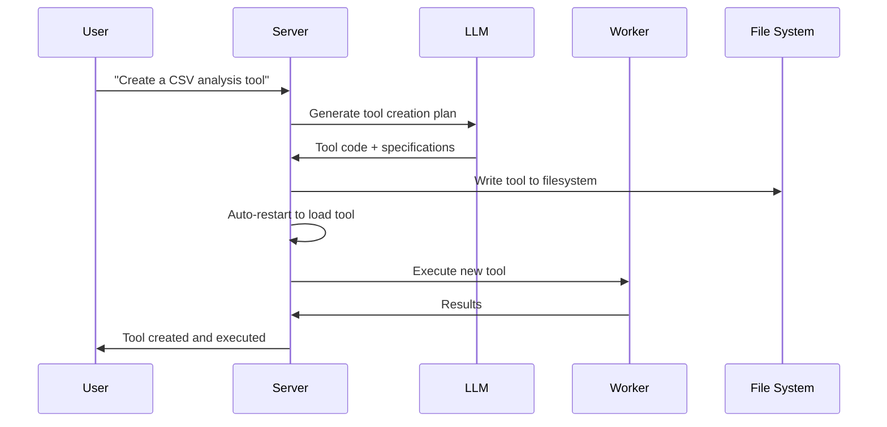

<p align="center">
  
</p>

<h1 align="center">G-Forge</h1>

<p align="center">
  
</p>
<p align="center">
  <strong>🌐 Langues disponibles</strong><br>
  <a href="README_EN.md">English</a> • 
  <a href="README.md">Français</a> • 
  <a href="README_CHS.md">中文</a> • 
  <a href="README_CHT.md">繁體中文</a> • 
  <a href="README_JP.md">日本語</a> • 
  <a href="README_PTBR.md">Português (Brasil)</a> • 
  <a href="README_ES.md">Español</a>
</p>  
<h3 align="center">
      A private and local alternative to MANUS.
</h3>

<p align="center">
  <em>
    A 100% autonomous, free and local AI agent that forges its own tools, writes code and executes complex tasks, while keeping all data on your device. Based on the MCP (Model Context Protocol) with FastMCP as engine, it is designed for local reasoning models and adaptable to your favorite LLM API, ensuring total privacy and no cloud dependencies.
  </em>
</p>
<br>
<p align="center">
       
</p>
<p align="center">
    
    
    
    
    
    
</p>

## Why G-Forge?

🔒 **Fully Local and Private** - Everything runs on your machine — no cloud, no data sharing. Your files, conversations and tools remain private.

🛠️ **Self-Tool Forging** - G-Forge can create its own tools — when it lacks a capability, it writes the code to build it.

💻 **Autonomous Coding Assistant** - Need code? It can write, debug and execute programs in Python, TypeScript, Bash and more — without supervision.

🧠 **Intelligent Tool Selection** - You ask, it automatically finds the best tool for the job. Like having a forge of experts ready to help.

📋 **Plans and Executes Complex Tasks** - From file management to web scraping — it can divide large tasks into steps and forge the tools to accomplish the work.

🌐 **Smart Web Navigation** - G-Forge can browse the internet autonomously — search, read, extract info, automate tasks — all without intervention.

🚀 **Powered by FastMCP** - Uses the MCP (Model Context Protocol) with FastMCP as ultra-performant framework — a real rocket for LLM interactions.

---

## Demo

> **"Can you create a tool to analyze my CSV files, then use it to generate a report from sales_data.csv?"**

---

## 🛠️ ⚠️ Active Work in Progress

🙏 This project started to prove that MCP was better than API and has grown beyond expectations. Contributions, feedback and patience are deeply appreciated as we forge ahead.

---

## Prerequisites

Before starting, make sure you have the following software installed:

- **Git**: To clone the repository. [Download Git](https://git-scm.com/)
- **Docker Engine & Docker Compose**: To run the bundled services.
  - [Install Docker Desktop](https://www.docker.com/products/docker-desktop/) (includes Docker Compose V2): Windows | Mac | Linux
  - Or install separately: [Docker Engine](https://docs.docker.com/engine/install/) | [Docker Compose](https://docs.docker.com/compose/install/)
- **Node.js 20+**: For the web interface. [Download Node.js](https://nodejs.org/)
- **pnpm**: Package manager. Install with `npm install -g pnpm`

---

## 1. Clone the repository

```bash
git clone https://github.com/your-username/agentic-forge.git
cd agentic-forge
```

## 2. Run the installation script

Make the management script executable and run it.

```bash
chmod +x run.sh
./run.sh
```

On first run, the script will check if a `.env` file exists. If it doesn't exist, it will create it automatically for you.

## 3. Configure your environment

Once the `.env` file is created, open it and fill in the values with your own credentials.

```env
# Copy this file to .env and fill in the values.
HOST_PORT=8080
PORT=8080
NODE_ENV=development
LOG_LEVEL=info
AUTH_TOKEN=""
REDIS_HOST=redis
REDIS_PORT=6378
REDIS_HOST_PORT=6378
REDIS_PASSWORD=""
# Base URL is no longer needed for Google API, comment or remove it.
# LLM_API_BASE_URL=
WEB_PORT=3000
# Use your Google Gemini API key
LLM_API_KEY=""

# Specify a Gemini model, e.g. "gemini-1.5-pro-latest"
LLM_MODEL_NAME=gemini-2.5-flash
```

**Important**:

- Set a strong `AUTH_TOKEN` (32+ characters recommended)
- API keys are optional if you use local models

---

## 4. Start Docker

Make sure Docker is running before continuing.

---

## Local LLM Configuration (Recommended)

### Hardware Requirements

| Model Size | GPU Memory | Performance              |
| ---------- | ---------- | ------------------------ |
| 7B         | 8GB VRAM   | ⚠️ Basic tasks only      |
| 14B        | 12GB VRAM  | ✅ Most tasks work well  |
| 32B        | 24GB VRAM  | 🚀 Excellent performance |
| 70B+       | 48GB+ VRAM | 💪 Professional quality  |

### Setup with Ollama (Recommended)

1.  **Install Ollama**: [Download Ollama](https://ollama.ai/)
2.  **Start Ollama**:
    ```bash
    ollama serve
    ```
3.  **Download a reasoning model**:
    ```bash
    ollama pull deepseek-r1:14b
    # or for more power: ollama pull deepseek-r1:32b
    ```
4.  **Update configuration** in `.env`:
    ```env
    LLM_MODEL_NAME="deepseek-r1:14b"
    LLM_API_BASE_URL="http://localhost:11434"
    ```

### Alternative: LM Studio

1.  Download and install [LM Studio](https://lmstudio.ai/)
2.  Load a model like `deepseek-r1-distill-qwen-14b`
3.  Start the local server
4.  Update `.env`:
    ```env
    LLM_API_BASE_URL="http://localhost:1234"
    ```

---

## API Usage Configuration

If you prefer cloud models or lack sufficient hardware:

### 1. Choose an API Provider

| Provider  | Model Examples                       | API Key Link                                              |
| --------- | ------------------------------------ | --------------------------------------------------------- |
| OpenAI    | `gpt-4`, `o1`                        | [platform.openai.com](https://platform.openai.com/signup) |
| Google    | `gemini-2.5-pro`, `gemini-2.5-flash` | [aistudio.google.com](https://aistudio.google.com/keys)   |
| Anthropic | `claude-4-sonnet`, `claude-4-opus`   | [console.anthropic.com](https://console.anthropic.com/)   |
| DeepSeek  | `deepseek-chat`, `deepseek-coder`    | [platform.deepseek.com](https://platform.deepseek.com)    |

### 2. Set your API key

**Linux/macOS:**

```bash
export LLM_API_KEY="your_api_key_here"
# Add to ~/.bashrc or ~/.zshrc for persistence
```

**Windows:**

```cmd
set LLM_API_KEY=your_api_key_here
```

### 3. Update `.env`:

```env
LLM_API_KEY="your_api_key_here"
LLM_MODEL_NAME="gemini-1.5-pro"
```

---

## Start Services and Run

### Using the Management Console (`run.sh`)

After configuring your `.env` file, use the management console to start the application.

Launch the interactive console:

```bash
./run.sh
```

From the console menu:

1.  **Start** - Launch all services
2.  **Status** - Check service health
3.  **Logs** - Monitor logs in real time

### Manual Docker Commands

Start all services:

```bash
docker-compose up -d
```

Check status:

```bash
docker-compose ps
```

View logs:

```bash
docker-compose logs -f
```

**⚠️ Warning**: Initial startup can take 10-15 minutes as Docker images are downloaded and services initialize. Wait to see `backend: "GET /health HTTP/1.1" 200 OK` in the logs.

---

## Access Points

Once services are running:

| Service           | URL                                       | Description           |
| ----------------- | ----------------------------------------- | --------------------- |
| **Web Interface** | http://localhost:3000                     | Main user interface   |
| **API Endpoint**  | http://localhost:8080/api/v1/agent/stream | Direct API access     |
| **Health Check**  | http://localhost:8080/health              | Service health status |

### Quick Test

```bash
# Health check
curl http://localhost:8080/health

# API test
curl -X POST http://localhost:8080/api/v1/agent/stream \
  -H "Content-Type: application/json" \
  -H "Authorization: Bearer YOUR_AUTH_TOKEN" \
  -d '{"goal": "Create a simple Python hello world script"}'
```

---

## Usage Examples

Once your services are running, try these examples:

### 🔧 Tool Forging

```
"I need a tool to convert CSV files to JSON format. Create it then use it on my data.csv file."
```

### 💻 Code Generation

```
"Write a Python script that monitors a directory for new files and logs their details."
```

### 🌐 Web Automation

```
"Search online for the latest TypeScript best practices and create a summary document."
```

### 📊 Data Analysis

```
"Analyze the sales_data.csv file in my workspace and create a visualization of trends."
```

### 🛠️ System Tasks

```
"Create a backup script for my important files and schedule it to run daily."
```

**Note**: Be explicit in your requests. Instead of "Do you know X?", ask "Search online for information about X and summarize it."

---

### Management Console (`run.sh`)

The interactive console provides complete control over your G-Forge instance:

```
   ╔══════════════════════════════════╗
   ║           G - F O R G E          ║
   ╚══════════════════════════════════╝
──────────────────────────────────────────
  Docker & Services
   1) 🟢 Start            5) 📊 Logs
   2) 🔄 Restart          6) 🐚 Shell (Container)
   3) 🔴 Stop             7) 🔨 Rebuild (no cache)
   4) ⚡ Status           8) 🧹 Clean Docker

  Development
  10) 🔍 Lint            12) 🧪 Tests
  11) ✨ Format          13) 📘 TypeCheck
  14) 🎯 Quality Check

  16) 🚪 Quit
```

### Key Commands

| Option | Description      | When to Use                    |
| ------ | ---------------- | ------------------------------ |
| **1**  | Start ecosystem  | First launch or after stopping |
| **2**  | Restart services | After configuration changes    |
| **4**  | Check status     | Health diagnostics             |
| **5**  | Follow logs      | Real-time monitoring           |
| **7**  | Rebuild images   | After major code changes       |
| **14** | Quality check    | Run lint, typecheck, unit tests |

---

## Architecture Overview

### 🏗️ Distributed Microservices

- **🧠 Server** (Port 8080): Central orchestration, LLM communication, session management
- **⚡ Worker**: Async task processing, code execution, web automation
- **🌐 Web Interface** (Port 3000): Modern React-based UI
- **💾 Redis** (Port 6378): Task queue, session storage, caching

### 🔄 Tool Forging Process



---

## Development

### Project Structure

```
agentic-forge/
├── 📁 src/                    # TypeScript source code
│   ├── 📁 tools/             # Available tools
│   │   ├── 📁 system/        # System tools (creation, restart)
│   │   ├── 📁 fs/            # File system operations
│   │   ├── 📁 code/          # Code execution
│   │   ├── 📁 browser/       # Web automation
│   │   └── 📁 generated/     # Auto-generated tools
│   ├── 📁 prompts/           # LLM prompt templates
│   ├── 📁 utils/             # Utilities and helpers
│   ├── 📄 server.ts          # Main server
│   ├── 📄 worker.ts          # Async worker
│   └── 📄 webServer.ts       # Web interface
├── 📄 docker-compose.yml     # Service orchestration
├── 📄 Dockerfile             # Container definition
├── 📄 run.sh                 # Management console
└── 📄 README.md              # This documentation
```

### Adding Custom Tools

```typescript
// src/tools/custom/myTool.tool.ts
import { z } from 'zod';
import type { Tool, Ctx } from '../../types.js';

export const myToolParams = z.object({
  input: z.string().describe('Input parameter'),
  options: z.number().default(1),
});

export const myTool: Tool<typeof myToolParams> = {
  name: 'myCustomTool',
  description: 'Description of what this tool does',
  parameters: myToolParams,
  execute: async (args, ctx: Ctx) => {
    ctx.log.info('Executing custom tool', { args });

    // Your tool logic here
    const result = await processInput(args.input, args.options);

    return result;
  },
};
```

Don't forget to add it to `src/tools/index.ts`:

```typescript
import { myTool } from './custom/myTool.tool.js';

export const allTools: Tool<any>[] = [
  // ... existing tools
  myTool,
];
```

---

## License

This project is licensed under the MIT License. See the [LICENSE](LICENSE) file for details.

---

## Acknowledgments

- **[FastMCP](https://github.com/punkpeye/fastmcp)**: Ultra-performant MCP framework - the rocket that powers G-Forge 🚀
- **[Model Context Protocol (MCP)](https://modelcontextprotocol.io/)**: Revolutionary protocol for LLM interaction
- **[Docker](https://docker.com)**: Containerization and isolation
- **[Redis](https://redis.io)**: High-performance data structures
- **[Playwright](https://playwright.dev)**: Modern web automation
- **Open Source Community**: For inspiration and collaboration

---

## Support

- **Issues**: [GitHub Issues](https://github.com/your-username/agentic-forge/issues)
- **Discussions**: [GitHub Discussions](https://github.com/your-username/agentic-forge/discussions)
- **Documentation**: [Project Wiki](https://github.com/your-username/agentic-forge/wiki)

---

<div align="center">

**🔨 A blacksmith forges his hammers.** **🤖 G-Forge forges its own capabilities.**

_Forge your technological future._

[](./run.sh)

</div>
