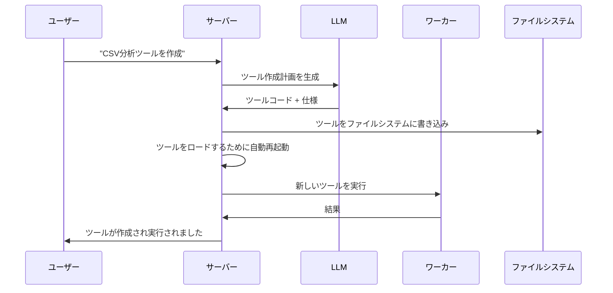

<p align="center">
  
</p>

<h1 align="center">AgenticForge</h1>

<p align="center">
  
</p>
<p align="center">
  <strong>🌐 Langues disponibles</strong><br>
  <a href="README_EN.md">English</a> • 
  <a href="README.md">Français</a> • 
  <a href="README_CHS.md">中文</a> • 
  <a href="README_CHT.md">繁體中文</a> • 
  <a href="README_JP.md">日本語</a> • 
  <a href="README_PTBR.md">Português (Brasil)</a> • 
  <a href="README_ES.md">Español</a>
</p>  
<h3 align="center">
      MANUSのプライベートでローカルな代替手段
</h3>

<p align="center">
  <em>
    100%自律的で無料のローカルAIエージェントで、独自のツールを鍛造し、コードを書き、複雑なタスクを実行しながら、すべてのデータをあなたのデバイス上に保持します。MCP（Model Context Protocol）とFastMCPエンジンをベースにし、ローカル推論モデル向けに設計され、お気に入りのLLM APIに適応可能で、完全なプライバシーとクラウド依存性なしを保証します。
  </em>
</p>
<br>
<p align="center">
       
</p>
<p align="center">
    
    
    
    
    
    
</p>

## なぜAgentic Forgeを選ぶのか？

🔒 **完全ローカルかつプライベート** - すべてがあなたのマシン上で動作 — クラウドなし、データ共有なし。あなたのファイル、会話、ツールはプライベートに保たれます。

🛠️ **セルフツール鍛造** - Agentic Forgeは独自のツールを作成できます — 能力が不足している場合、それを構築するコードを書きます。

💻 **自律的コーディングアシスタント** - コードが必要？Python、TypeScript、Bashなどでプログラムを書き、デバッグし、実行できます — 監督なしで。

🧠 **インテリジェントツール選択** - あなたが尋ねると、自動的に仕事に最適なツールを見つけます。専門家の工房がいつでも助ける準備ができているようなものです。

📋 **複雑なタスクの計画と実行** - ファイル管理からWebスクレイピングまで — 大きなタスクをステップに分割し、作業を達成するためのツールを鍛造できます。

🌐 **スマートWeb ナビゲーション** - Agentic Forgeは自律的にインターネットを閲覧できます — 検索、読み取り、情報抽出、タスクの自動化 — すべて介入なしで。

🚀 **FastMCPで駆動** - MCP（Model Context Protocol）とFastMCPを超高性能フレームワークとして使用 — LLM相互作用のための真のロケット。

---

## デモ

> **"CSVファイルを分析するツールを作成して、sales_data.csvからレポートを生成するために使用できますか？"**

---

## 🛠️ ⚠️ 進行中の積極的な作業

🙏 このプロジェクトは、MCPがAPIより優れていることを証明するために始まり、期待を超えて成長しました。私たちが前進する中で、貢献、フィードバック、そして忍耐は深く感謝されています。

---

## 前提条件

開始する前に、以下のソフトウェアがインストールされていることを確認してください：

- **Git**：リポジトリをクローンするため。[Gitをダウンロード](https://git-scm.com/)
- **Docker Engine & Docker Compose**：バンドルされたサービスを実行するため。
  - [Docker Desktopをインストール](https://www.docker.com/products/docker-desktop/)（Docker Compose V2を含む）：Windows | Mac | Linux
  - または別々にインストール：[Docker Engine](https://docs.docker.com/engine/install/) | [Docker Compose](https://docs.docker.com/compose/install/)
- **Node.js 20+**：Webインターフェースのため。[Node.jsをダウンロード](https://nodejs.org/)
- **pnpm**：パッケージマネージャー。`npm install -g pnpm`でインストール

---

## 1. リポジトリをクローン

```bash
git clone https://github.com/your-username/agentic-forge.git
cd agentic-forge
```

## 2. インストールスクリプトを実行

管理スクリプトを実行可能にして実行します。

```bash
chmod +x run.sh
./run.sh
```

初回実行時、スクリプトは`.env`ファイルが存在するかチェックします。存在しない場合、自動的に作成されます。

## 3. 環境を設定

`.env`ファイルが作成されたら、それを開いてあなた自身の資格情報で値を埋めます。

```env
# このファイルを.envにコピーして値を埋めてください。
HOST_PORT=8080
PORT=8080
NODE_ENV=development
LOG_LEVEL=info
AUTH_TOKEN=""
REDIS_HOST=redis
REDIS_PORT=6378
REDIS_HOST_PORT=6378
REDIS_PASSWORD=""
# Google APIにはベースURLは不要になりました、コメントアウトまたは削除してください。
# LLM_API_BASE_URL=
WEB_PORT=3000
# Google Gemini APIキーを使用してください
LLM_API_KEY=""

# Geminiモデルを指定してください、例："gemini-1.5-pro-latest"
LLM_MODEL_NAME=gemini-2.5-flash
```

**重要**：

- 強力な`AUTH_TOKEN`を設定してください（32文字以上推奨）
- ローカルモデルを使用する場合、APIキーはオプションです

---

## 4. Dockerを開始

続行する前に、Dockerが実行されていることを確認してください。

---

## ローカルLLM設定（推奨）

### ハードウェア要件

| モデルサイズ | GPU メモリ | パフォーマンス            |
| ------------ | ---------- | ------------------------- |
| 7B           | 8GB VRAM   | ⚠️ 基本タスクのみ         |
| 14B          | 12GB VRAM  | ✅ ほとんどのタスクで良好 |
| 32B          | 24GB VRAM  | 🚀 優秀なパフォーマンス   |
| 70B+         | 48GB+ VRAM | 💪 プロフェッショナル品質 |

### Ollamaでの設定（推奨）

1.  **Ollamaをインストール**：[Ollamaをダウンロード](https://ollama.ai/)
2.  **Ollamaを開始**：
    ```bash
    ollama serve
    ```
3.  **推論モデルをダウンロード**：
    ```bash
    ollama pull deepseek-r1:14b
    # またはより強力なもの：ollama pull deepseek-r1:32b
    ```
4.  **`.env`で設定を更新**：
    ```env
    LLM_MODEL_NAME="deepseek-r1:14b"
    LLM_API_BASE_URL="http://localhost:11434"
    ```

### 代替案：LM Studio

1.  [LM Studio](https://lmstudio.ai/)をダウンロードしてインストール
2.  `deepseek-r1-distill-qwen-14b`のようなモデルをロード
3.  ローカルサーバーを開始
4.  `.env`を更新：
    ```env
    LLM_API_BASE_URL="http://localhost:1234"
    ```

---

## API使用設定

クラウドモデルを好むか、十分なハードウェアが不足している場合：

### 1. APIプロバイダーを選択

| プロバイダー | モデル例                             | APIキーリンク                                             |
| ------------ | ------------------------------------ | --------------------------------------------------------- |
| OpenAI       | `gpt-4`, `o1`                        | [platform.openai.com](https://platform.openai.com/signup) |
| Google       | `gemini-2.5-pro`, `gemini-2.5-flash` | [aistudio.google.com](https://aistudio.google.com/keys)   |
| Anthropic    | `claude-4-sonnet`, `claude-4-opus`   | [console.anthropic.com](https://console.anthropic.com/)   |
| DeepSeek     | `deepseek-chat`, `deepseek-coder`    | [platform.deepseek.com](https://platform.deepseek.com)    |

### 2. APIキーを設定

**Linux/macOS：**

```bash
export LLM_API_KEY="your_api_key_here"
# 永続化のため~/.bashrcまたは~/.zshrcに追加
```

**Windows：**

```cmd
set LLM_API_KEY=your_api_key_here
```

### 3. `.env`を更新：

```env
LLM_API_KEY="your_api_key_here"
LLM_MODEL_NAME="gemini-1.5-pro"
```

---

## サービスを開始して実行

### 管理コンソールを使用（`run.sh`）

`.env`ファイルを設定した後、管理コンソールを使用してアプリケーションを開始します。

インタラクティブコンソールを起動：

```bash
./run.sh
```

コンソールメニューから：

1.  **開始** - すべてのサービスを起動
2.  **ステータス** - サービスの健康状態をチェック
3.  **ログ** - リアルタイムでログを監視

### 手動Dockerコマンド

すべてのサービスを開始：

```bash
docker-compose up -d
```

ステータスをチェック：

```bash
docker-compose ps
```

ログを表示：

```bash
docker-compose logs -f
```

**⚠️ 警告**：初回起動はDockerイメージのダウンロードとサービスの初期化により10-15分かかる場合があります。ログに`backend: "GET /health HTTP/1.1" 200 OK`が表示されるまで待ってください。

---

## アクセスポイント

サービスが実行されている場合：

| サービス                | URL                                       | 説明                           |
| ----------------------- | ----------------------------------------- | ------------------------------ |
| **Webインターフェース** | http://localhost:3000                     | メインユーザーインターフェース |
| **APIエンドポイント**   | http://localhost:8080/api/v1/agent/stream | 直接API アクセス               |
| **ヘルスチェック**      | http://localhost:8080/health              | サービス健康状態               |

### クイックテスト

```bash
# ヘルスチェック
curl http://localhost:8080/health

# APIテスト
curl -X POST http://localhost:8080/api/v1/agent/stream \
  -H "Content-Type: application/json" \
  -H "Authorization: Bearer YOUR_AUTH_TOKEN" \
  -d '{"goal": "シンプルなPython hello worldスクリプトを作成"}'
```

---

## 使用例

サービスが実行されている場合、これらの例を試してください：

### 🔧 ツール鍛造

```
"CSVファイルをJSON形式に変換するツールが必要です。それを作成してから、私のdata.csvファイルで使用してください。"
```

### 💻 コード生成

```
"ディレクトリ内の新しいファイルを監視し、その詳細をログに記録するPythonスクリプトを書いてください。"
```

### 🌐 Web自動化

```
"最新のTypeScriptベストプラクティスをオンラインで検索し、要約ドキュメントを作成してください。"
```

### 📊 データ分析

```
"ワークスペース内のsales_data.csvファイルを分析し、トレンドの可視化を作成してください。"
```

### 🛠️ システムタスク

```
"重要なファイルのバックアップスクリプトを作成し、毎日実行するようにスケジュールしてください。"
```

**注意**：リクエストでは明確にしてください。"Xを知っていますか？"ではなく、"Xについての情報をオンラインで検索して要約してください。"と尋ねてください。

---

## 管理コンソール（`run.sh`）

インタラクティブコンソールは、Agentic Forgeインスタンスの完全な制御を提供します：

```
🔨 Agentic Forge - 管理コンソール
────────────────────────────────────────

   Docker & サービス
1) 🟢 開始        5) 📊 ログ
2) 🔄 再起動      6) 🐚 シェル
3) 🔴 停止        7) 🔨 リビルド
4) ⚡ ステータス  8) 🧹 クリーン

   開発 & 品質
10) 🔍 Lint       13) 🧪 テスト
11) ✨ フォーマット 14) 📘 タイプチェック
12) 🧽 クリーン   15) 📋 監査

16) 🚪 終了
```

### キーコマンド

| オプション | 説明                 | 使用時               |
| ---------- | -------------------- | -------------------- |
| **1**      | エコシステムを開始   | 初回起動または停止後 |
| **2**      | サービスを再起動     | 設定変更後           |
| **4**      | ステータスをチェック | 健康診断             |
| **5**      | ログをフォロー       | リアルタイム監視     |
| **7**      | イメージをリビルド   | 主要なコード変更後   |

---

## アーキテクチャ概要

### 🏗️ 分散マイクロサービス

- **🧠 サーバー**（ポート8080）：中央オーケストレーション、LLM通信、セッション管理
- **⚡ ワーカー**：非同期タスク処理、コード実行、Web自動化
- **🌐 Webインターフェース**（ポート3000）：モダンなReactベースのUI
- **💾 Redis**（ポート6378）：タスクキュー、セッションストレージ、キャッシュ

### 🔄 ツール鍛造プロセス



---

## 開発

### プロジェクト構造

```
agentic-forge/
├── 📁 src/                    # TypeScriptソースコード
│   ├── 📁 tools/             # 利用可能なツール
│   │   ├── 📁 system/        # システムツール（作成、再起動）
│   │   ├── 📁 fs/            # ファイルシステム操作
│   │   ├── 📁 code/          # コード実行
│   │   ├── 📁 browser/       # Web自動化
│   │   └── 📁 generated/     # 自動生成されたツール
│   ├── 📁 prompts/           # LLMプロンプトテンプレート
│   ├── 📁 utils/             # ユーティリティとヘルパー
│   ├── 📄 server.ts          # メインサーバー
│   ├── 📄 worker.ts          # 非同期ワーカー
│   └── 📄 webServer.ts       # Webインターフェース
├── 📄 docker-compose.yml     # サービスオーケストレーション
├── 📄 Dockerfile             # コンテナ定義
├── 📄 run.sh                 # 管理コンソール
└── 📄 README.md              # このドキュメント
```

### カスタムツールの追加

```typescript
// src/tools/custom/myTool.tool.ts
import { z } from 'zod';
import type { Tool, Ctx } from '../../types.js';

export const myToolParams = z.object({
  input: z.string().describe('入力パラメータ'),
  options: z.number().default(1),
});

export const myTool: Tool<typeof myToolParams> = {
  name: 'myCustomTool',
  description: 'このツールが何をするかの説明',
  parameters: myToolParams,
  execute: async (args, ctx: Ctx) => {
    ctx.log.info('カスタムツールを実行', { args });

    // あなたのツールロジックをここに
    const result = await processInput(args.input, args.options);

    return result;
  },
};
```

`src/tools/index.ts`に追加することを忘れないでください：

```typescript
import { myTool } from './custom/myTool.tool.js';

export const allTools: Tool<any>[] = [
  // ... 既存のツール
  myTool,
];
```

---

## ライセンス

このプロジェクトはMITライセンスの下でライセンスされています。詳細は[LICENSE](LICENSE)ファイルを参照してください。

---

## 謝辞

- **[FastMCP](https://github.com/punkpeye/fastmcp)**：超高性能MCPフレームワーク - Agentic Forgeを動かすロケット 🚀
- **[Model Context Protocol (MCP)](https://modelcontextprotocol.io/)**：LLM相互作用のための革命的なプロトコル
- **[Docker](https://docker.com)**：コンテナ化と分離
- **[Redis](https://redis.io)**：高性能データ構造
- **[Playwright](https://playwright.dev)**：モダンなWeb自動化
- **オープンソースコミュニティ**：インスピレーションとコラボレーションのため

---

## サポート

- **問題**：[GitHub Issues](https://github.com/your-username/agentic-forge/issues)
- **ディスカッション**：[GitHub Discussions](https://github.com/your-username/agentic-forge/discussions)
- **ドキュメント**：[プロジェクトWiki](https://github.com/your-username/agentic-forge/wiki)

---

<div align="center">

**🔨 鍛冶屋は自分のハンマーを鍛造する。** **🤖 Agentic Forgeは自分の能力を鍛造する。**

_あなたの技術的未来を鍛造しよう。_

[](./run.sh)

</div>
