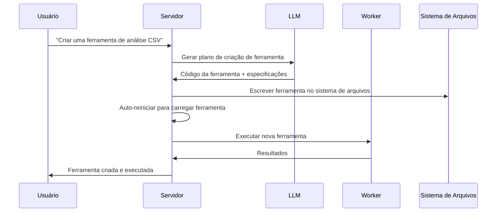

<p align="center">
  
</p>

<h1 align="center">AgenticForge</h1>

<p align="center">
  
</p>
<p align="center">
  <strong>🌐 Idiomas Disponíveis</strong><br>
  <a href="README.md">English</a> • 
  <a href="README_FR.md">Français</a> • 
  <a href="README_CHS.md">中文</a> • 
  <a href="README_CHT.md">繁體中文</a> • 
  <a href="README_JP.md">日本語</a> • 
  <a href="README_PTBR.md">Português (Brasil)</a> • 
  <a href="README_ES.md">Español</a>
</p> 
<h3 align="center">
      Uma alternativa privada e local ao MANUS.
</h3>

<p align="center">
  <em>
    Um agente de IA 100% autônomo, gratuito e local que forja suas próprias ferramentas, escreve código e executa tarefas complexas, mantendo todos os dados em seu dispositivo. Baseado no protocolo MCP (Model Context Protocol) com FastMCP como motor, é projetado para modelos de raciocínio locais e adaptável à API do seu LLM favorito, garantindo privacidade total e nenhuma dependência de nuvem.
  </em>
</p>
<br>
<p align="center">
       
</p>
<p align="center">
    
    
    
    
    
    
</p>

## Por que Agentic Forge?

🔒 **Totalmente Local e Privado** - Tudo funciona em sua máquina — sem nuvem, sem compartilhamento de dados. Seus arquivos, conversas e ferramentas permanecem privados.

🛠️ **Auto-Forjamento de Ferramentas** - Agentic Forge pode criar suas próprias ferramentas — quando lhe falta uma capacidade, ele escreve o código para construí-la.

💻 **Assistente de Codificação Autônomo** - Precisa de código? Ele pode escrever, debugar e executar programas em Python, TypeScript, Bash e mais — sem supervisão.

🧠 **Seleção Inteligente de Ferramentas** - Você pergunta, ele automaticamente encontra a melhor ferramenta para o trabalho. Como ter uma forja de especialistas prontos para ajudar.

📋 **Planeja e Executa Tarefas Complexas** - Desde gerenciamento de arquivos até web scraping — ele pode dividir grandes tarefas em etapas e forjar as ferramentas para realizar o trabalho.

🌐 **Navegação Web Inteligente** - Agentic Forge pode navegar na internet autonomamente — pesquisar, ler, extrair informações, automatizar tarefas — tudo sem intervenção.

🚀 **Alimentado pelo FastMCP** - Usa o protocolo MCP (Model Context Protocol) com FastMCP como framework ultra-performático — um verdadeiro foguete para interações LLM.

---

## Demo

> **"Você pode criar uma ferramenta para analisar meus arquivos CSV e depois usá-la para gerar um relatório do sales_data.csv?"**

---

## 🛠️ ⚠️ Trabalho Ativo em Progresso

🙏 Este projeto começou para provar que MCP era melhor que API e cresceu além das expectativas. Contribuições, feedback e paciência são profundamente apreciados enquanto forjamos adiante.

---

## Pré-requisitos

Antes de começar, certifique-se de ter os seguintes softwares instalados:

- **Git**: Para clonar o repositório. [Baixar Git](https://git-scm.com/)
- **Docker Engine & Docker Compose**: Para executar os serviços agrupados.
  - [Instalar Docker Desktop](https://www.docker.com/products/docker-desktop/) (inclui Docker Compose V2): Windows | Mac | Linux
  - Ou instalar separadamente: [Docker Engine](https://docs.docker.com/engine/install/) | [Docker Compose](https://docs.docker.com/compose/install/)
- **Node.js 20+**: Para a interface web. [Baixar Node.js](https://nodejs.org/)
- **pnpm**: Gerenciador de pacotes. Instalar com `npm install -g pnpm`

---

## 1. Clonar o repositório

```bash
git clone https://github.com/your-username/agentic-forge.git
cd agentic-forge
```

## 2. Executar o script de instalação

Torne o script de gerenciamento executável e execute-o.

```bash
chmod +x run.sh
./run.sh
```

Na primeira execução, o script verificará se um arquivo `.env` existe. Se não existir, ele criará automaticamente para você.

## 3. Configurar seu ambiente

Uma vez que o arquivo `.env` é criado, abra-o e preencha os valores com suas próprias credenciais.

```env
# Copie este arquivo para .env e preencha os valores.
HOST_PORT=8080
PORT=8080
NODE_ENV=development
LOG_LEVEL=info
AUTH_TOKEN=""
REDIS_HOST=redis
REDIS_PORT=6378
REDIS_HOST_PORT=6378
REDIS_PASSWORD=""
# A URL base não é mais necessária para a API do Google, comente ou remova.
# LLM_API_BASE_URL=
WEB_PORT=3000
# Use sua chave da API Google Gemini
LLM_API_KEY=""

# Especifique um modelo Gemini, ex: "gemini-1.5-pro-latest"
LLM_MODEL_NAME=gemini-2.5-flash
PYTHON_SANDBOX_IMAGE="python:3.11-slim"
BASH_SANDBOX_IMAGE="alpine:latest"
CODE_EXECUTION_TIMEOUT_MS=60000
```

**Importante**:

- Defina um `AUTH_TOKEN` forte (32+ caracteres recomendados)
- Chaves API são opcionais se você usar modelos locais

---

## 4. Iniciar Docker

Certifique-se de que o Docker está executando antes de continuar.

---

## Configuração LLM Local (Recomendado)

### Requisitos de Hardware

| Tamanho do Modelo | Memória GPU | Performance                           |
| ----------------- | ----------- | ------------------------------------- |
| 7B                | 8GB VRAM    | ⚠️ Apenas tarefas básicas             |
| 14B               | 12GB VRAM   | ✅ A maioria das tarefas funciona bem |
| 32B               | 24GB VRAM   | 🚀 Excelente performance              |
| 70B+              | 48GB+ VRAM  | 💪 Qualidade profissional             |

### Configuração com Ollama (Recomendado)

1.  **Instalar Ollama**: [Baixar Ollama](https://ollama.ai/)
2.  **Iniciar Ollama**:
    ```bash
    ollama serve
    ```
3.  **Baixar um modelo de raciocínio**:
    ```bash
    ollama pull deepseek-r1:14b
    # ou para mais poder: ollama pull deepseek-r1:32b
    ```
4.  **Atualizar configuração** no `.env`:
    ```env
    LLM_MODEL_NAME="deepseek-r1:14b"
    LLM_API_BASE_URL="http://localhost:11434"
    ```

### Alternativa: LM Studio

1.  Baixe e instale [LM Studio](https://lmstudio.ai/)
2.  Carregue um modelo como `deepseek-r1-distill-qwen-14b`
3.  Inicie o servidor local
4.  Atualize `.env`:
    ```env
    LLM_API_BASE_URL="http://localhost:1234"
    ```

---

## Configuração para Uso de API

Se você prefere modelos em nuvem ou não tem hardware suficiente:

### 1. Escolher um Provedor de API

| Provedor  | Exemplos de Modelos                  | Link da Chave API                                         |
| --------- | ------------------------------------ | --------------------------------------------------------- |
| OpenAI    | `gpt-4`, `o1`                        | [platform.openai.com](https://platform.openai.com/signup) |
| Google    | `gemini-2.5-pro`, `gemini-2.5-flash` | [aistudio.google.com](https://aistudio.google.com/keys)   |
| Anthropic | `claude-4-sonnet`, `claude-4-opus`   | [console.anthropic.com](https://console.anthropic.com/)   |
| DeepSeek  | `deepseek-chat`, `deepseek-coder`    | [platform.deepseek.com](https://platform.deepseek.com)    |

### 2. Definir sua chave API

**Linux/macOS:**

```bash
export LLM_API_KEY="your_api_key_here"
# Adicione ao ~/.bashrc ou ~/.zshrc para persistência
```

**Windows:**

```cmd
set LLM_API_KEY=your_api_key_here
```

### 3. Atualizar `.env`:

```env
LLM_API_KEY="your_api_key_here"
LLM_MODEL_NAME="gemini-1.5-pro"
```

---

## Iniciar Serviços e Executar

### Usando o Console de Gerenciamento (`run.sh`)

Após configurar seu arquivo `.env`, use o console de gerenciamento para iniciar a aplicação.

Lance o console interativo:

```bash
./run.sh
```

Do menu do console:

1.  **Iniciar** - Lançar todos os serviços
2.  **Status** - Verificar a saúde dos serviços
3.  **Logs** - Monitorar logs em tempo real

### Comandos Docker Manuais

Iniciar todos os serviços:

```bash
docker-compose up -d
```

Verificar status:

```bash
docker-compose ps
```

Ver logs:

```bash
docker-compose logs -f
```

**⚠️ Aviso**: A inicialização inicial pode levar 10-15 minutos pois as imagens Docker são baixadas e os serviços são inicializados. Aguarde ver `backend: "GET /health HTTP/1.1" 200 OK` nos logs.

---

## Pontos de Acesso

Uma vez que os serviços estão executando:

| Serviço                  | URL                                       | Descrição                      |
| ------------------------ | ----------------------------------------- | ------------------------------ |
| **Interface Web**        | http://localhost:3000                     | Interface principal do usuário |
| **Endpoint da API**      | http://localhost:8080/api/v1/agent/stream | Acesso direto à API            |
| **Verificação de Saúde** | http://localhost:8080/health              | Status de saúde dos serviços   |

### Teste Rápido

```bash
# Verificação de saúde
curl http://localhost:8080/health

# Teste da API
curl -X POST http://localhost:8080/api/v1/agent/stream \
  -H "Content-Type: application/json" \
  -H "Authorization: Bearer YOUR_AUTH_TOKEN" \
  -d '{"goal": "Criar um script Python hello world simples"}'
```

---

## Exemplos de Uso

Uma vez que seus serviços estão executando, tente estes exemplos:

### 🔧 Forjamento de Ferramentas

```
"Preciso de uma ferramenta para converter arquivos CSV para formato JSON. Crie-a e depois use-a no meu arquivo data.csv."
```

### 💻 Geração de Código

```
"Escreva um script Python que monitore um diretório por novos arquivos e registre seus detalhes."
```

### 🌐 Automação Web

```
"Pesquise online pelas últimas melhores práticas do TypeScript e crie um documento resumo."
```

### 📊 Análise de Dados

```
"Analise o arquivo sales_data.csv no meu workspace e crie uma visualização das tendências."
```

### 🛠️ Tarefas do Sistema

```
"Crie um script de backup para meus arquivos importantes e agende-o para executar diariamente."
```

**Nota**: Seja explícito em suas solicitações. Em vez de "Você conhece X?", pergunte "Pesquise online informações sobre X e resuma."

---

## Console de Gerenciamento (`run.sh`)

O console interativo fornece controle completo sobre sua instância do Agentic Forge:

```
🔨 Agentic Forge - Console de Gerenciamento
────────────────────────────────────────

   Docker & Serviços
1) 🟢 Iniciar      5) 📊 Logs
2) 🔄 Reiniciar    6) 🐚 Shell
3) 🔴 Parar        7) 🔨 Rebuild
4) ⚡ Status       8) 🧹 Limpar

   Desenvolvimento & Qualidade
10) 🔍 Lint        13) 🧪 Testes
11) ✨ Formatar    14) 📘 TypeCheck
12) 🧽 Limpar      15) 📋 Auditoria

16) 🚪 Sair
```

### Comandos Principais

| Opção | Descrição           | Quando Usar                          |
| ----- | ------------------- | ------------------------------------ |
| **1** | Iniciar ecossistema | Primeira inicialização ou após parar |
| **2** | Reiniciar serviços  | Após mudanças de configuração        |
| **4** | Verificar status    | Diagnósticos de saúde                |
| **5** | Seguir logs         | Monitoramento em tempo real          |
| **7** | Rebuild imagens     | Após grandes mudanças de código      |

---

## Visão Geral da Arquitetura

### 🏗️ Microsserviços Distribuídos

- **🧠 Servidor** (Porta 8080): Orquestração central, comunicação LLM, gerenciamento de sessão
- **⚡ Worker**: Processamento de tarefas assíncronas, execução de código, automação web
- **🌐 Interface Web** (Porta 3000): UI moderna baseada em React
- **💾 Redis** (Porta 6378): Fila de tarefas, armazenamento de sessão, cache

### 🔄 Processo de Forjamento de Ferramentas



---

## Desenvolvimento

### Estrutura do Projeto

```
agentic-forge/
├── 📁 src/                    # Código fonte TypeScript
│   ├── 📁 tools/             # Ferramentas disponíveis
│   │   ├── 📁 system/        # Ferramentas do sistema (criação, reinicialização)
│   │   ├── 📁 fs/            # Operações do sistema de arquivos
│   │   ├── 📁 code/          # Execução de código
│   │   ├── 📁 browser/       # Automação web
│   │   └── 📁 generated/     # Ferramentas auto-geradas
│   ├── 📁 prompts/           # Templates de prompts LLM
│   ├── 📁 utils/             # Utilitários e auxiliares
│   ├── 📄 server.ts          # Servidor principal
│   ├── 📄 worker.ts          # Worker assíncrono
│   └── 📄 webServer.ts       # Interface web
├── 📄 docker-compose.yml     # Orquestração de serviços
├── 📄 Dockerfile             # Definição do contêiner
├── 📄 run.sh                 # Console de gerenciamento
└── 📄 README.md              # Esta documentação
```

### Adicionando Ferramentas Personalizadas

```typescript
// src/tools/custom/myTool.tool.ts
import { z } from 'zod';
import type { Tool, Ctx } from '../../types.js';

export const myToolParams = z.object({
  input: z.string().describe('Parâmetro de entrada'),
  options: z.number().default(1),
});

export const myTool: Tool<typeof myToolParams> = {
  name: 'myCustomTool',
  description: 'Descrição do que esta ferramenta faz',
  parameters: myToolParams,
  execute: async (args, ctx: Ctx) => {
    ctx.log.info('Executando ferramenta personalizada', { args });

    // Sua lógica da ferramenta aqui
    const result = await processInput(args.input, args.options);

    return result;
  },
};
```

Não esqueça de adicioná-la ao `src/tools/index.ts`:

```typescript
import { myTool } from './custom/myTool.tool.js';

export const allTools: Tool<any>[] = [
  // ... ferramentas existentes
  myTool,
];
```

---

## Licença

Este projeto está licenciado sob a Licença MIT. Veja o arquivo [LICENSE](LICENSE) para detalhes.

---

## Agradecimentos

- **[FastMCP](https://github.com/punkpeye/fastmcp)**: Framework MCP ultra-performático - o foguete que alimenta o Agentic Forge 🚀
- **[Model Context Protocol (MCP)](https://modelcontextprotocol.io/)**: Protocolo revolucionário para interação LLM
- **[Docker](https://docker.com)**: Containerização e isolamento
- **[Redis](https://redis.io)**: Estruturas de dados de alta performance
- **[Playwright](https://playwright.dev)**: Automação web moderna
- **Comunidade Open Source**: Pela inspiração e colaboração

---

## Suporte

- **Issues**: [GitHub Issues](https://github.com/your-username/agentic-forge/issues)
- **Discussões**: [GitHub Discussions](https://github.com/your-username/agentic-forge/discussions)
- **Documentação**: [Wiki do Projeto](https://github.com/your-username/agentic-forge/wiki)

---

<div align="center">

**🔨 Um ferreiro forja seus martelos.** **🤖 Agentic Forge forja suas próprias capacidades.**

_Forje seu futuro tecnológico._

[](./run.sh)

</div>
