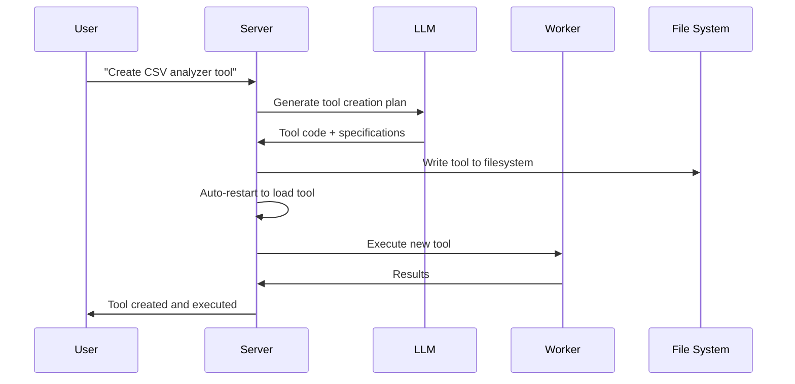

# 🔨 Agentic Forge

### Private, Local AI Agent Alternative


**English** | [Français](#français) | [中文](#中文) | [Español](#español)

A **100% local** autonomous AI agent that forges its own tools, writes code, and executes complex tasks while keeping all data on your device. Tailored for local reasoning models, it runs entirely on your hardware, ensuring complete privacy and zero cloud dependency.

[](LICENSE)
[](https://docker.com)
[](https://github.com/votre-username/agentic-forge)

---

## Why Agentic Forge?

🔒 **Fully Local & Private** - Everything runs on your machine — no cloud, no data sharing. Your files, conversations, and tools stay private.

🛠️ **Self-Forging Tools** - Agentic Forge can create its own tools — when it lacks a capability, it writes the code to build it.

💻 **Autonomous Coding Assistant** - Need code? It can write, debug, and run programs in Python, TypeScript, Bash, and more — all without supervision.

🧠 **Smart Tool Selection** - You ask, it figures out the best tool for the job automatically. Like having a forge of experts ready to help.

📋 **Plans & Executes Complex Tasks** - From file management to web scraping — it can split big tasks into steps and forge the tools to get things done.

🌐 **Smart Web Browsing** - Agentic Forge can browse the internet autonomously — search, read, extract info, automate tasks — all hands-free.

---

## Demo

> **Can you create a tool to analyze my CSV files, then use it to generate a report from sales_data.csv?**

*[Demo showing the agent creating a CSV analysis tool, then using it to process data]*

**Disclaimer**: This demo, including all files shown, are entirely fictional for demonstration purposes.

---

## 🛠️ ⚠️ Active Work in Progress

🙏 This project started as an exploration into self-improving AI agents and has grown beyond expectations. Contributions, feedback, and patience are deeply appreciated as we forge ahead.

---

## Prerequisites

Before you begin, ensure you have the following software installed:

- **Git**: For cloning the repository. [Download Git](https://git-scm.com/)
- **Docker Engine & Docker Compose**: For running bundled services.
  - [Install Docker Desktop](https://www.docker.com/products/docker-desktop/) (includes Docker Compose V2): Windows | Mac | Linux
  - Or install separately: [Docker Engine](https://docs.docker.com/engine/install/) | [Docker Compose](https://docs.docker.com/compose/install/)
- **Node.js 20+**: For the web interface. [Download Node.js](https://nodejs.org/)
- **pnpm**: Package manager. Install with `npm install -g pnpm`

---

## 1. Clone the repository and setup

```bash
git clone https://github.com/votre-username/agentic-forge.git
cd agentic-forge
mv .env.example .env
```

## 2. Configure your environment

Update the `.env` file with your settings:

```env
# Authentication
AUTH_TOKEN="your_strong_auth_token_here"

# Redis Configuration
REDIS_HOST="redis"
REDIS_PORT="6378"
REDIS_PASSWORD="your_redis_password"

# LLM Configuration (for local or API usage)
LLM_API_KEY="your_llm_api_key"  # Optional for local models
LLM_MODEL_NAME="gemini-1.5-pro"  # Or your preferred model
LLM_API_BASE_URL=""  # Optional for custom endpoints

# Workspace
WORK_DIR="/path/to/your/workspace"  # Directory for file operations

# Ports
HOST_PORT="8080"
WEB_PORT="3000"

# Docker Images
PYTHON_SANDBOX_IMAGE="python:3.11-alpine"
BASH_SANDBOX_IMAGE="alpine:latest"

# Optional API Keys
OPENAI_API_KEY=""
GOOGLE_API_KEY=""
ANTHROPIC_API_KEY=""
```

**Important**: 
- Set a strong `AUTH_TOKEN` (32+ characters recommended)
- Update `WORK_DIR` to your desired workspace directory
- API keys are optional if using local models

---

## 3. Start Docker

Make sure Docker is running:

**Linux/macOS:**
```bash
sudo systemctl start docker
# Or launch Docker Desktop
```

**Windows:**
Start Docker Desktop from the Start menu.

Verify Docker is running:
```bash
docker info
```

---

## Setup for Local LLM (Recommended)

### Hardware Requirements

| Model Size | GPU Memory | Performance |
|------------|------------|-------------|
| 7B | 8GB VRAM | ⚠️ Basic tasks only |
| 14B | 12GB VRAM | ✅ Most tasks work well |
| 32B | 24GB VRAM | 🚀 Excellent performance |
| 70B+ | 48GB+ VRAM | 💪 Professional grade |

### Setup with Ollama (Recommended)

1. **Install Ollama**: [Download Ollama](https://ollama.ai/)

2. **Start Ollama**:
```bash
ollama serve
```

3. **Pull a reasoning model**:
```bash
ollama pull deepseek-r1:14b
# or for more power: ollama pull deepseek-r1:32b
```

4. **Update configuration** in `.env`:
```env
LLM_MODEL_NAME="deepseek-r1:14b"
LLM_API_BASE_URL="http://localhost:11434"
```

### Alternative: LM Studio

1. Download and install [LM Studio](https://lmstudio.ai/)
2. Load a model like `deepseek-r1-distill-qwen-14b`
3. Start the local server
4. Update `.env`:
```env
LLM_API_BASE_URL="http://localhost:1234"
```

---

## Setup for API Usage

If you prefer cloud models or lack sufficient hardware:

### 1. Choose an API Provider

| Provider | Model Examples | API Key Link |
|----------|----------------|--------------|
| OpenAI | `gpt-4`, `gpt-3.5-turbo` | [platform.openai.com](https://platform.openai.com/signup) |
| Google | `gemini-1.5-pro`, `gemini-1.5-flash` | [aistudio.google.com](https://aistudio.google.com/keys) |
| Anthropic | `claude-3-sonnet`, `claude-3-haiku` | [console.anthropic.com](https://console.anthropic.com/) |
| DeepSeek | `deepseek-chat`, `deepseek-coder` | [platform.deepseek.com](https://platform.deepseek.com) |

### 2. Set your API key

**Linux/macOS:**
```bash
export LLM_API_KEY="your_api_key_here"
# Add to ~/.bashrc or ~/.zshrc for persistence
```

**Windows:**
```cmd
set LLM_API_KEY=your_api_key_here
```

### 3. Update `.env`:
```env
LLM_API_KEY="your_api_key_here"
LLM_MODEL_NAME="gemini-1.5-pro"
```

---

## Start Services and Run

### Using the Management Console (Recommended)

Make the script executable:
```bash
chmod +x run.sh
```

Launch the interactive console:
```bash
./run.sh
```

From the console menu:
1. **Start** - Launch all services
2. **Status** - Check service health
3. **Logs** - Monitor real-time logs

### Manual Docker Commands

Start all services:
```bash
docker-compose up -d
```

Check status:
```bash
docker-compose ps
```

View logs:
```bash
docker-compose logs -f
```

**⚠️ Warning**: Initial startup may take 10-15 minutes as Docker images are downloaded and services initialize. Wait until you see `backend: "GET /health HTTP/1.1" 200 OK` in the logs.

---

## Access Points

Once services are running:

| Service | URL | Description |
|---------|-----|-------------|
| **Web Interface** | http://localhost:3000 | Main user interface |
| **API Endpoint** | http://localhost:8080/api/v1/agent/stream | Direct API access |
| **Health Check** | http://localhost:8080/health | Service health status |

### Quick Test

```bash
# Health check
curl http://localhost:8080/health

# API test
curl -X POST http://localhost:8080/api/v1/agent/stream \
  -H "Content-Type: application/json" \
  -H "Authorization: Bearer YOUR_AUTH_TOKEN" \
  -d '{"goal": "Create a simple hello world Python script"}'
```

---

## Usage Examples

Once your services are running, try these examples:

### 🔧 Tool Forging
```
"I need a tool to convert CSV files to JSON format. Create it and then use it on my data.csv file."
```

### 💻 Code Generation
```
"Write a Python script that monitors a directory for new files and logs their details."
```

### 🌐 Web Automation
```
"Search for the latest TypeScript best practices online and create a summary document."
```

### 📊 Data Analysis
```
"Analyze the sales_data.csv file in my workspace and create a visualization of trends."
```

### 🛠️ System Tasks
```
"Create a backup script for my important files and schedule it to run daily."
```

**Note**: Be explicit in your requests. Instead of "Do you know about X?", ask "Search online for information about X and summarize it."

---

## Management Console (`run.sh`)

The interactive console provides full control over your Agentic Forge instance:

```
🔨 Agentic Forge - Management Console
────────────────────────────────────────

   Docker & Services
1) 🟢 Start           5) 📊 Logs
2) 🔄 Restart         6) 🐚 Shell
3) 🔴 Stop            7) 🔨 Rebuild
4) ⚡ Status          8) 🧹 Prune

   Development & Quality
10) 🔍 Lint           13) 🧪 Tests
11) ✨ Format         14) 📘 TypeCheck
12) 🧽 Clean          15) 📋 Audit

16) 🚪 Exit
```

### Key Commands

| Option | Description | When to Use |
|--------|-------------|-------------|
| **1** | Start ecosystem | First launch or after stop |
| **2** | Restart services | After configuration changes |
| **4** | Check status | Health diagnostics |
| **5** | Follow logs | Real-time monitoring |
| **7** | Rebuild images | After major code changes |

---

## Architecture Overview

### 🏗️ Distributed Microservices

- **🧠 Server** (Port 8080): Central orchestration, LLM communication, session management
- **⚡ Worker**: Async task processing, code execution, web automation
- **🌐 Web Interface** (Port 3000): Modern React-based UI
- **💾 Redis** (Port 6378): Task queue, session storage, caching

### 🔄 Tool Forging Process



---

## Development

### Project Structure

```
agentic-forge/
├── 📁 src/                    # TypeScript source code
│   ├── 📁 tools/             # Available tools
│   │   ├── 📁 system/        # System tools (creation, restart)
│   │   ├── 📁 fs/            # File system operations
│   │   ├── 📁 code/          # Code execution
│   │   ├── 📁 browser/       # Web automation
│   │   └── 📁 generated/     # Auto-generated tools
│   ├── 📁 prompts/           # LLM prompt templates
│   ├── 📁 utils/             # Utilities and helpers
│   ├── 📄 server.ts          # Main server
│   ├── 📄 worker.ts          # Async worker
│   └── 📄 webServer.ts       # Web interface
├── 📁 workspace/             # Isolated workspace
├── 📄 docker-compose.yml     # Service orchestration
├── 📄 Dockerfile             # Container definition
├── 📄 run.sh                 # Management console
└── 📄 README.md              # This documentation
```

### Adding Custom Tools

```typescript
// src/tools/custom/myTool.tool.ts
import { z } from 'zod';
import type { Tool, Ctx } from '../../types.js';

export const myToolParams = z.object({
  input: z.string().describe('Input parameter'),
  options: z.number().default(1)
});

export const myTool: Tool<typeof myToolParams> = {
  name: 'myCustomTool',
  description: 'Description of what this tool does',
  parameters: myToolParams,
  execute: async (args, ctx: Ctx) => {
    ctx.log.info('Executing custom tool', { args });
    
    // Your tool logic here
    const result = await processInput(args.input, args.options);
    
    return result;
  }
};
```

Don't forget to add it to `src/tools/index.ts`:
```typescript
import { myTool } from './custom/myTool.tool.js';

export const allTools: Tool<any>[] = [
  // ... existing tools
  myTool,
];
```

---

## Troubleshooting

### Common Issues

#### ❌ "Docker not found"
```bash
# Install Docker
curl -fsSL https://get.docker.com -o get-docker.sh
sh get-docker.sh
```

#### ❌ "Permission denied" for run.sh
```bash
chmod +x run.sh
```

#### ❌ "Port already in use"
```bash
# Check what's using the ports
netstat -tulpn | grep :8080
netstat -tulpn | grep :3000

# Kill processes or change ports in docker-compose.yml
```

#### ❌ "Authentication failed"
Check your `.env` file:
- Ensure `AUTH_TOKEN` is set and matches what you're using
- Verify the token has no trailing spaces

#### ❌ "Redis connection failed"
```bash
# Check Redis logs
docker-compose logs redis

# Restart with fresh volumes
docker-compose down -v
docker-compose up -d
```

#### ❌ "LLM connection failed"
- For local models: Ensure Ollama/LM Studio is running
- For API models: Verify your API key is correct
- Check the `LLM_API_BASE_URL` format (include `http://`)

### Getting Help

1. **Check logs**: Use `./run.sh` → Option 5 for real-time logs
2. **Verify configuration**: Ensure `.env` file is properly configured
3. **Test components**: Use health check endpoints
4. **Search issues**: Check existing GitHub issues
5. **Ask for help**: Create a new issue with logs and configuration

---

## FAQ

### Q: What hardware do I need to run locally?

See the hardware requirements table above. For basic usage, 12GB VRAM is sufficient. For professional use, 24GB+ is recommended.

### Q: Can it really run 100% locally?

Yes! With Ollama or LM Studio, all LLM processing, tool creation, and execution happen on your machine. No external API calls required.

### Q: How does tool forging work?

When the agent encounters a task it can't handle with existing tools, it:
1. Analyzes the requirement
2. Generates TypeScript code for a new tool
3. Writes the tool to the filesystem
4. Restarts itself to load the new tool
5. Uses the new tool to complete the task

### Q: Is it secure?

Yes, with built-in security measures:
- Docker sandboxing for code execution
- No external network access for sensitive operations
- Configurable timeouts and resource limits
- Local data processing (when using local models)

### Q: How do I contribute?

We welcome contributions! Please:
1. Fork the repository
2. Create a feature branch
3. Follow the existing code style
4. Add tests for new functionality
5. Submit a pull request

---

## License

This project is licensed under the MIT License. See the [LICENSE](LICENSE) file for details.

---

## Acknowledgments

- **[FastMCP](https://github.com/punkpeye/fastmcp)**: Robust MCP framework foundation
- **[Docker](https://docker.com)**: Containerization and isolation
- **[Redis](https://redis.io)**: High-performance data structures
- **[Playwright](https://playwright.dev)**: Modern web automation
- **Open Source Community**: For inspiration and collaboration

---

## Support

- **Issues**: [GitHub Issues](https://github.com/votre-username/agentic-forge/issues)
- **Discussions**: [GitHub Discussions](https://github.com/votre-username/agentic-forge/discussions)
- **Documentation**: [Project Wiki](https://github.com/votre-username/agentic-forge/wiki)

---

<div align="center">

**🔨 A blacksmith forges their hammers.**  
**🤖 Agentic Forge forges its own capabilities.**

*Forge your technological future.*

[](./run.sh)

</div>