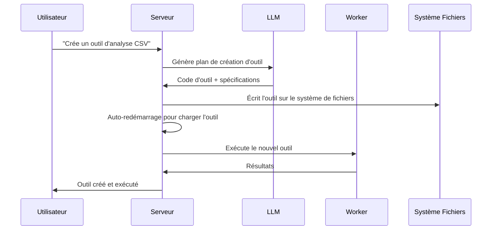

<div align="center">
  
  <h1>AgenticForge</h1>
  <strong>Une alternative à MANUS, privée et locale.</strong>
  <br>
  <strong>Français</strong> | <a href="#english">English</a> | <a href="#中文">中文</a> | <a href="#español">Español</a>
  <p>
    
    
    
    
    
    
  </p>
  <p>
    <a href="LICENSE"></a>
    <a href="https://github.com/your-username/agentic-forge"></a>
  </p>
</div>

<p align="center">
  Un agent IA autonome <strong>100% local</strong> qui forge ses propres outils, écrit du code et exécute des tâches complexes tout en gardant toutes les données sur votre appareil. Basé sur le <strong>protocole MCP (Model Context Protocol)</strong> avec <strong>FastMCP</strong> comme moteur, il est conçu pour les modèles de raisonnement locaux et adaptable à l'API de votre LLM favori, garantissant une confidentialité complète et aucune dépendance au cloud.
</p>

---

## Pourquoi Agentic Forge ?

🔒 **Entièrement Local et Privé** - Tout fonctionne sur votre machine — pas de cloud, pas de partage de données. Vos fichiers, conversations et outils restent privés.

🛠️ **Auto-Forge d'Outils** - Agentic Forge peut créer ses propres outils — quand une capacité lui manque, il écrit le code pour la construire.

💻 **Assistant de Codage Autonome** - Besoin de code ? Il peut écrire, déboguer et exécuter des programmes en Python, TypeScript, Bash et plus — sans supervision.

🧠 **Sélection Intelligente d'Outils** - Vous demandez, il trouve automatiquement le meilleur outil pour le travail. Comme avoir une forge d'experts prêts à aider.

📋 **Planifie et Exécute des Tâches Complexes** - De la gestion de fichiers au scraping web — il peut diviser les grandes tâches en étapes et forger les outils pour accomplir le travail.

🌐 **Navigation Web Intelligente** - Agentic Forge peut naviguer sur internet de manière autonome — rechercher, lire, extraire des infos, automatiser des tâches — le tout sans intervention.

🚀 **Propulsé par FastMCP** - Utilise le protocole MCP (Model Context Protocol) avec FastMCP comme framework ultra-performant — une véritable fusée pour les interactions LLM.

---

## Démo

> **"Peux-tu créer un outil pour analyser mes fichiers CSV, puis l'utiliser pour générer un rapport à partir de donnees_ventes.csv ?"**

---

## 🛠️ ⚠️ Travail Actif en Cours

🙏 Ce projet a commencé pour prouver que MCP etait mieux que API et a grandi au-delà des attentes. Les contributions, commentaires et patience sont profondément appréciés alors que nous forgeons de l'avant.

---

## Prérequis

Avant de commencer, assurez-vous d'avoir les logiciels suivants installés :

- **Git** : Pour cloner le dépôt. [Télécharger Git](https://git-scm.com/)
- **Docker Engine & Docker Compose** : Pour exécuter les services groupés.
  - [Installer Docker Desktop](https://www.docker.com/products/docker-desktop/) (inclut Docker Compose V2) : Windows | Mac | Linux
  - Ou installer séparément : [Docker Engine](https://docs.docker.com/engine/install/) | [Docker Compose](https://docs.docker.com/compose/install/)
- **Node.js 20+** : Pour l'interface web. [Télécharger Node.js](https://nodejs.org/)
- **pnpm** : Gestionnaire de paquets. Installer avec `npm install -g pnpm`

---

## 1. Cloner le dépôt

```bash
git clone [https://github.com/votre-username/agentic-forge.git](https://github.com/votre-username/agentic-forge.git)
cd agentic-forge
```

## 2. Lancer le script d'installation

Rendez le script de gestion exécutable et lancez-le.

```bash
chmod +x run.sh
./run.sh
```

À la première exécution, le script vérifiera si un fichier `.env` existe. S'il n'existe pas, il le créera automatiquement pour vous.

## 3. Configurer votre environnement

Une fois le fichier `.env` créé, ouvrez-le et remplissez les valeurs avec vos propres informations d'identification.

```env
# Copiez ce fichier en .env et remplissez les valeurs.
HOST_PORT=8080
PORT=8080
NODE_ENV=development
LOG_LEVEL=info
AUTH_TOKEN=""
REDIS_HOST=redis
REDIS_PORT=6378
REDIS_HOST_PORT=6378
REDIS_PASSWORD=""
# L'URL de base n'est plus nécessaire pour l'API Google, commentez-la ou supprimez-la.
# LLM_API_BASE_URL=
WEB_PORT=3000
# Utilisez votre clé d'API Google Gemini
LLM_API_KEY=""

# Spécifiez un modèle Gemini, par exemple "gemini-1.5-pro-latest"
LLM_MODEL_NAME=gemini-2.5-flash
PYTHON_SANDBOX_IMAGE="python:3.11-slim"
BASH_SANDBOX_IMAGE="alpine:latest"
CODE_EXECUTION_TIMEOUT_MS=60000
```

**Important** :

- Définissez un `AUTH_TOKEN` fort (32+ caractères recommandés)
- Les clés API sont optionnelles si vous utilisez des modèles locaux

---

## 4. Démarrer Docker

Assurez-vous que Docker est en cours d'exécution avant de continuer.

---

## Configuration pour LLM Local (Recommandé)

### Exigences Matérielles

| Taille Modèle | Mémoire GPU | Performance                                |
| ------------- | ----------- | ------------------------------------------ |
| 7B            | 8GB VRAM    | ⚠️ Tâches basiques seulement               |
| 14B           | 12GB VRAM   | ✅ La plupart des tâches fonctionnent bien |
| 32B           | 24GB VRAM   | 🚀 Excellentes performances                |
| 70B+          | 48GB+ VRAM  | 💪 Qualité professionnelle                 |

### Configuration avec Ollama (Recommandé)

1.  **Installer Ollama** : [Télécharger Ollama](https://ollama.ai/)
2.  **Démarrer Ollama** :
    ```bash
    ollama serve
    ```
3.  **Télécharger un modèle de raisonnement** :
    ```bash
    ollama pull deepseek-r1:14b
    # ou pour plus de puissance : ollama pull deepseek-r1:32b
    ```
4.  **Mettre à jour la configuration** dans `.env` :
    ```env
    LLM_MODEL_NAME="deepseek-r1:14b"
    LLM_API_BASE_URL="http://localhost:11434"
    ```

### Alternative : LM Studio

1.  Téléchargez et installez [LM Studio](https://lmstudio.ai/)
2.  Chargez un modèle comme `deepseek-r1-distill-qwen-14b`
3.  Démarrez le serveur local
4.  Mettez à jour `.env` :
    ```env
    LLM_API_BASE_URL="http://localhost:1234"
    ```

---

## Configuration pour Usage API

Si vous préférez les modèles cloud ou manquez de matériel suffisant :

### 1. Choisir un Fournisseur API

| Fournisseur | Exemples de Modèles                  | Lien Clé API                                              |
| ----------- | ------------------------------------ | --------------------------------------------------------- |
| OpenAI      | `gpt-4`, `o1`                        | [platform.openai.com](https://platform.openai.com/signup) |
| Google      | `gemini-2.5-pro`, `gemini-2.5-flash` | [aistudio.google.com](https://aistudio.google.com/keys)   |
| Anthropic   | `claude-4-sonnet`, `claude-4-opus`   | [console.anthropic.com](https://console.anthropic.com/)   |
| DeepSeek    | `deepseek-chat`, `deepseek-coder`    | [platform.deepseek.com](https://platform.deepseek.com)    |

### 2. Définir votre clé API

**Linux/macOS :**

```bash
export LLM_API_KEY="votre_cle_api_ici"
# Ajoutez à ~/.bashrc ou ~/.zshrc pour la persistance
```

**Windows :**

```cmd
set LLM_API_KEY=votre_cle_api_ici
```

### 3. Mettre à jour `.env` :

```env
LLM_API_KEY="votre_cle_api_ici"
LLM_MODEL_NAME="gemini-1.5-pro"
```

---

## Démarrer les Services et Exécuter

### Utiliser la Console de Gestion (`run.sh`)

Après avoir configuré votre fichier `.env`, utilisez la console de gestion pour démarrer l'application.

Lancez la console interactive :

```bash
./run.sh
```

Depuis le menu de la console :

1.  **Démarrer** - Lancer tous les services
2.  **Statut** - Vérifier la santé des services
3.  **Logs** - Surveiller les logs en temps réel

### Commandes Docker Manuelles

Démarrer tous les services :

```bash
docker-compose up -d
```

Vérifier le statut :

```bash
docker-compose ps
```

Voir les logs :

```bash
docker-compose logs -f
```

**⚠️ Attention** : Le démarrage initial peut prendre 10-15 minutes car les images Docker sont téléchargées et les services s'initialisent. Attendez de voir `backend: "GET /health HTTP/1.1" 200 OK` dans les logs.

---

## Points d'Accès

Une fois les services en marche :

| Service                | URL                                       | Description                      |
| ---------------------- | ----------------------------------------- | -------------------------------- |
| **Interface Web**      | http://localhost:3000                     | Interface utilisateur principale |
| **Point d'API**        | http://localhost:8080/api/v1/agent/stream | Accès API direct                 |
| **Vérification Santé** | http://localhost:8080/health              | Statut de santé des services     |

### Test Rapide

```bash
# Vérification santé
curl http://localhost:8080/health

# Test API
curl -X POST http://localhost:8080/api/v1/agent/stream \
  -H "Content-Type: application/json" \
  -H "Authorization: Bearer VOTRE_AUTH_TOKEN" \
  -d '{"goal": "Crée un simple script Python hello world"}'
```

---

## Exemples d'Usage

Une fois vos services en marche, essayez ces exemples :

### 🔧 Forge d'Outils

```
"J'ai besoin d'un outil pour convertir des fichiers CSV en format JSON. Crée-le puis utilise-le sur mon fichier donnees.csv."
```

### 💻 Génération de Code

```
"Écris un script Python qui surveille un répertoire pour les nouveaux fichiers et enregistre leurs détails."
```

### 🌐 Automatisation Web

```
"Recherche en ligne les dernières bonnes pratiques TypeScript et crée un document de résumé."
```

### 📊 Analyse de Données

```
"Analyse le fichier donnees_ventes.csv dans mon espace de travail et crée une visualisation des tendances."
```

### 🛠️ Tâches Système

```
"Crée un script de sauvegarde pour mes fichiers importants et programme son exécution quotidienne."
```

**Note** : Soyez explicite dans vos demandes. Au lieu de "Est-ce que tu connais X ?", demandez "Recherche en ligne des informations sur X et résume-les."

---

## Console de Gestion (`run.sh`)

La console interactive fournit un contrôle complet sur votre instance Agentic Forge :

```
🔨 Agentic Forge - Console de Gestion
────────────────────────────────────────

   Docker & Services
1) 🟢 Démarrer        5) 📊 Logs
2) 🔄 Redémarrer      6) 🐚 Shell
3) 🔴 Arrêter         7) 🔨 Rebuild
4) ⚡ Statut          8) 🧹 Nettoyer

   Développement & Qualité
10) 🔍 Lint           13) 🧪 Tests
11) ✨ Formater       14) 📘 TypeCheck
12) 🧽 Nettoyer       15) 📋 Audit

16) 🚪 Quitter
```

### Commandes Clés

| Option | Description             | Quand l'Utiliser                   |
| ------ | ----------------------- | ---------------------------------- |
| **1**  | Démarrer l'écosystème   | Premier lancement ou après arrêt   |
| **2**  | Redémarrer les services | Après changements de configuration |
| **4**  | Vérifier le statut      | Diagnostics de santé               |
| **5**  | Suivre les logs         | Surveillance en temps réel         |
| **7**  | Reconstruire les images | Après changements majeurs de code  |

---

## Aperçu de l'Architecture

### 🏗️ Microservices Distribués

- **🧠 Serveur** (Port 8080) : Orchestration centrale, communication LLM, gestion de session
- **⚡ Worker** : Traitement de tâches async, exécution de code, automatisation web
- **🌐 Interface Web** (Port 3000) : UI moderne basée sur React
- **💾 Redis** (Port 6378) : File de tâches, stockage de session, mise en cache

### 🔄 Processus de Forge d'Outils



---

## Développement

### Structure du Projet

```
agentic-forge/
├── 📁 src/                    # Code source TypeScript
│   ├── 📁 tools/             # Outils disponibles
│   │   ├── 📁 system/        # Outils système (création, redémarrage)
│   │   ├── 📁 fs/            # Opérations système de fichiers
│   │   ├── 📁 code/          # Exécution de code
│   │   ├── 📁 browser/       # Automatisation web
│   │   └── 📁 generated/     # Outils auto-générés
│   ├── 📁 prompts/           # Templates de prompts LLM
│   ├── 📁 utils/             # Utilitaires et assistants
│   ├── 📄 server.ts          # Serveur principal
│   ├── 📄 worker.ts          # Worker async
│   └── 📄 webServer.ts       # Interface web
├── 📄 docker-compose.yml     # Orchestration services
├── 📄 Dockerfile             # Définition conteneur
├── 📄 run.sh                 # Console de gestion
└── 📄 README.md              # Cette documentation
```

### Ajouter des Outils Personnalisés

```typescript
// src/tools/custom/monOutil.tool.ts
import { z } from 'zod';
import type { Tool, Ctx } from '../../types.js';

export const monOutilParams = z.object({
  entree: z.string().describe("Paramètre d'entrée"),
  options: z.number().default(1),
});

export const monOutil: Tool<typeof monOutilParams> = {
  name: 'monOutilPersonnalise',
  description: 'Description de ce que fait cet outil',
  parameters: monOutilParams,
  execute: async (args, ctx: Ctx) => {
    ctx.log.info('Exécution outil personnalisé', { args });

    // Votre logique d'outil ici
    const resultat = await traiterEntree(args.entree, args.options);

    return resultat;
  },
};
```

N'oubliez pas de l'ajouter à `src/tools/index.ts` :

```typescript
import { monOutil } from './custom/monOutil.tool.js';

export const allTools: Tool<any>[] = [
  // ... outils existants
  monOutil,
];
```

---

## Licence

Ce projet est sous licence MIT. Voir le fichier [LICENSE](LICENSE) pour les détails.

---

## Remerciements

- **[FastMCP](https://github.com/punkpeye/fastmcp)** : Framework MCP ultra-performant - la fusée qui propulse Agentic Forge 🚀
- **[Model Context Protocol (MCP)](https://modelcontextprotocol.io/)** : Protocole révolutionnaire pour l'interaction avec les LLMs
- **[Docker](https://docker.com)** : Conteneurisation et isolation
- **[Redis](https://redis.io)** : Structures de données haute performance
- **[Playwright](https://playwright.dev)** : Automatisation web moderne
- **Communauté Open Source** : Pour l'inspiration et la collaboration

---

## Support

- **Issues** : [GitHub Issues](https://github.com/votre-username/agentic-forge/issues)
- **Discussions** : [GitHub Discussions](https://github.com/votre-username/agentic-forge/discussions)
- **Documentation** : [Wiki du Projet](https://github.com/votre-username/agentic-forge/wiki)

---

<div align="center">

**🔨 Un forgeron forge ses marteaux.** **🤖 Agentic Forge forge ses propres capacités.**

_Forgez votre avenir technologique._

[](./run.sh)

</div>
