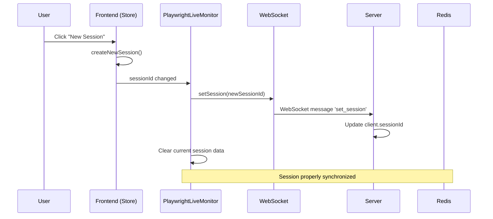

# Synchronisation des Sessions Frontend ↔ Worker

## Problème Résolu

**Avant** : Quand l'utilisateur cliquait sur "New Session", le problème suivant se produisait :
- ✅ Frontend créait une nouvelle session dans le store
- ❌ WebSocket continuait d'utiliser l'ancienne session
- ❌ Worker n'était pas informé du changement de session
- ❌ Événements allaient dans la mauvaise session Redis

## Solution Implémentée

### 🔄 Synchronisation Automatique des Sessions

Le `PlaywrightLiveMonitor` écoute maintenant les changements de session du store et met à jour automatiquement :

1. **Écoute des changements** : `useSessionStore((state) => state.sessionId)`
2. **Mise à jour WebSocket** : Appel automatique de `setSession(newSessionId)`
3. **Nettoyage des données** : Clear des données de session précédente
4. **Re-synchronisation** : Réabonnement aux événements de job si nécessaire

### 📋 Flux de Synchronisation



### 🔧 Code Modifié

#### `PlaywrightLiveMonitor.tsx`
```typescript
// Écoute les changements de session du store
const sessionId = useSessionStore((state) => state.sessionId);

// Met à jour automatiquement la session WebSocket
useEffect(() => {
  if (sessionId) {
    console.log('🔄 Session changed, updating WebSocket:', sessionId);
    setSession(sessionId);

    // Clear current session data when session changes
    setCurrentSession(null);
    setIsVisible(false);
  }
}, [sessionId, setSession]);
```

## ✅ Avantages de la Solution

### 🔄 Synchronisation Transparente
- **Automatique** : Pas besoin d'action manuelle
- **Instantanée** : Changement immédiat lors du clic "New Session"
- **Fiable** : Utilise les mécanismes React existants

### 🧹 Nettoyage Automatique
- **Données obsolètes** : Suppression des données de l'ancienne session
- **État propre** : Interface remise à zéro pour la nouvelle session
- **Mémoire optimisée** : Évite l'accumulation de données anciennes

### 🔍 Debugging Amélioré
- **Logs détaillés** : Suivi des changements de session
- **Visibilité** : Changements tracés dans la console
- **Monitoring** : Événements WebSocket monitorés

## 🧪 Test de la Solution

### Test Automatique
```bash
node test_session_sync.js
```

### Test Manuel
1. Ouvrir l'interface web
2. Observer les logs du navigateur (F12 → Console)
3. Cliquer sur "New Session"
4. Vérifier que les logs montrent :
   ```
   🔄 PlaywrightLiveMonitor - Session changed, updating WebSocket: [new-session-id]
   🔌 Setting session: [new-session-id]
   ```

## 📊 Événements Monitorés

### Avant la Correction
```
Session Store: ✅ Nouvelle session créée
WebSocket: ❌ Ancienne session utilisée
Worker: ❌ Événements dans mauvaise session
```

### Après la Correction
```
Session Store: ✅ Nouvelle session créée
WebSocket: ✅ Session mise à jour automatiquement
Worker: ✅ Événements dans bonne session
```

## 🔧 Configuration

### Variables d'Environnement (Optionnel)
```bash
# Activer les logs détaillés de synchronisation
DEBUG_SESSION_SYNC=true
```

### Personnalisation
Le comportement peut être étendu pour :
- Nettoyer d'autres données lors du changement de session
- Envoyer des notifications à l'utilisateur
- Synchroniser avec d'autres composants

## 🚀 Impact

Cette correction assure que :
- **Clic "New Session"** = Changement complet de session
- **Worker isolé** par session (sécurité)
- **Données organisées** par session dans Redis
- **Interface cohérente** avec l'état serveur

La synchronisation est maintenant **transparente et automatique** ! 🎉